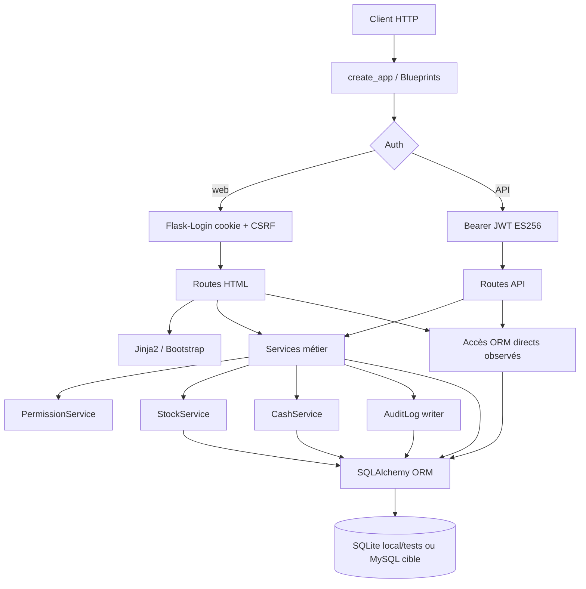

# Bar Manager Pro — Architecture réellement implémentée

État documentaire : ce fichier décrit l'application présente dans le dépôt.
Il ne décrit pas une cible `app/core/`, `app/modules/`, repositories ou
`BarContext` : ces notions sont conservées plus bas comme archive historique.
Pour le détail du schéma, voir [DATA_MODEL.md](DATA_MODEL.md). Pour les routes
générées depuis Flask, voir [ROUTES.md](ROUTES.md). Pour l'état testé et les
limites, voir [PROGRESS.md](PROGRESS.md).

## Vue d'ensemble

L'application est un monolithe Flask à modules plats. Les Blueprints, services,
modèles SQLAlchemy et templates vivent directement sous `app/`. Les services
contiennent la majorité des transitions métier, mais certaines routes lisent
directement l'ORM pour construire des listes, des payloads ou des écrans.

| Chemin | Responsabilité observée |
| --- | --- |
| `app/__init__.py` | Factory `create_app`, configuration, extensions, modèles, Blueprints, handlers, CLI. |
| `app/extensions.py` | Instances non liées : `db`, `migrate`, `login_manager`, `csrf`, `limiter`. |
| `app/config.py` | Config dev/test/prod par environnement, validation production, clés JWT externes. |
| `app/models.py` | Tous les modèles SQLAlchemy et contraintes ORM/DDL connues. |
| `app/permissions.py` | Matrice serveur `ROLE_ACTIONS`, verrou de bar dans `permissions.require` pour écritures. |
| `app/auth.py` | Login web, JWT API ES256, refresh opaque, révocation de famille. |
| `app/errors.py` | Réponses contrôlées HTML/API et rollback sur erreurs applicatives connues. |
| `app/audit.py` | Écriture minimale de `AuditLog` dans la transaction courante. |
| `app/finance_totals.py` | Agrégats paiements/remboursements/retours et statut de paiement. |
| `app/*_services.py`, `app/stock_service.py` | Cas d'usage métier, validations, verrous, `flush`, appels inter-services. |
| `app/*.py` routes | Blueprints HTML/API, adaptation HTTP, commits, quelques lectures ORM directes. |
| `app/templates/` | Templates Jinja2 Bootstrap pour dashboard, catalogue, stock, commandes, finance, inventaires. |
| `app/static/app.css` | Ajustements CSS locaux ; Bootstrap vient du CDN. |
| `migrations/` | Alembic/Flask-Migrate et révisions explicites. |
| `deploy/` | Modèles PythonAnywhere et environnement production, sans secret réel. |
| `wsgi.py` | Point d'entrée WSGI local : `application = create_app()`. |

## Factory et initialisation

`create_app` charge la classe de configuration, lit l'environnement, applique
les overrides de test, valide la configuration, initialise les extensions,
importe `app.models` pour enregistrer la métadonnée Alembic, puis enregistre
Blueprints, erreurs et CLI.

La factory n'exécute ni migration, ni création de table, ni accès réseau métier.
Les migrations restent des commandes d'exploitation via Flask-Migrate. En
production, `app/config.py` exige `mysql+pymysql`, une `SECRET_KEY` suffisante,
des clés JWT ES256 P-256 cohérentes et un stockage de rate limit non `memory://`.

`_init_extensions` exempte `api_bp` et `api_auth_bp` de CSRF. `_register_blueprints`
exempte ensuite les Blueprints API métier. Les formulaires HTML conservent le
CSRF via Flask-WTF.

## Blueprints enregistrés

| Module | Blueprints | Type |
| --- | --- | --- |
| `app/web.py` | `web`, `api` | Accueil, dashboard, health web/API. |
| `app/auth.py` | `auth`, `api_auth` | Login/logout web, tokens API. |
| `app/bars.py` | `bars`, `api_bars` | Liste web simple, bars API, staff API. |
| `app/catalog.py` | `catalog`, `api_catalog` | Catalogue web et produits API. |
| `app/stock.py` | `stock`, `api_stock` | Historique web, mouvements/alertes API. |
| `app/purchases.py` | `suppliers`, `purchases`, `supplier_payments` | Fournisseurs, achats et règlements fournisseur API. |
| `app/inventories.py` | `inventories`, `api_inventories` | Inventaires web/API et impression. |
| `app/orders.py` | `orders`, `orders_web` | Commandes API et commande rapide HTML. |
| `app/finance.py` | `finance` | Paiements, remboursements, caisse, listes API. |
| `app/finance_web.py` | `finance_web` | Bureau finance HTML. |

`app/finance.py` ajoute aussi dynamiquement des routes `GET` par
`bp.add_url_rule` pour `payments`, `refunds`, `returns`, `cash-sessions`,
`cash-movements`, `cash-handovers` et `staff-cash`. Ces routes utilisent une
factory locale `listing(model, permission)`.

Le hook `tenant_web_guard` dans `app/__init__.py` vérifie `bars.read` sur les
requêtes HTML portant un `bar_id`; il ne remplace pas les permissions métier
des routes et services.

## Rendu HTML, formulaires et statique

Les vues sont rendues par Jinja2. `app/templates/layout.html` charge Bootstrap
5.3.3 depuis `cdn.jsdelivr.net` et `app/static/app.css`. Les formulaires web
incluent des champs `csrf_token` et postent vers les routes Flask concernées.

Les écrans présents couvrent dashboard, catalogue, stock, commande rapide,
inventaires et finance. `finance.html` expose des formulaires pour paiement,
remboursement, ouverture/clôture de caisse, mouvements, annulation encaissée et
remise employé. Les paiements carte, mobile money et virement restent des
saisies manuelles ; aucune intégration prestataire n'est appelée.

Les uploads ne sont pas opérationnels : `catalog_services.image_key` lève
`IMAGE_STORAGE_UNAVAILABLE`, et `bar_services.update_bar` refuse `logo_key` par
`LOGO_STORAGE_UNAVAILABLE`.

## Services et modèles

Les modèles sont centralisés dans `app/models.py`; il n'existe pas de couche
repository séparée. Les services appellent directement `db.session`, `select`,
`with_for_update`, `db.session.add` et `db.session.flush`.

| Service | Rôle principal | Appels sortants notables |
| --- | --- | --- |
| `bar_services.py` | Création bar, paramètres, affectation staff. | Copie catalogue et soldes initiaux lors de `copy_from_id`. |
| `catalog_services.py` | Produits et listing paginé. | Refuse les uploads. |
| `purchase_services.py` | Fournisseurs, achats, réception, paiements fournisseur. | `stock_service.move`, `cash_service`, `record`. |
| `inventory_services.py` | Brouillon, comptage, validation, annulation. | `stock_service.move` pour ajustements. |
| `order_services.py` | Commandes, confirmation, service, annulation, retours. | `stock_service.move`, `order_balance`, `record`. |
| `payment_services.py` | Paiements, remboursements, annulation encaissée. | `cash_service`, `order_service.cancel`, `order_balance`, `record`. |
| `cash_services.py` | Caisse, garde, mouvements, remises. | `record`, agrégats caisse/garde. |
| `stock_service.py` | Point central des mutations de stock. | Valide références secondaires et met à jour `StockBalance`. |

Les routes ne sont pas de simples adaptateurs partout. Exemples d'accès ORM
directs observés : dashboard et liste bars, payloads d'inventaire, alertes stock,
listing des règlements fournisseur, détails finance, listes dynamiques finance
et écran `finance_web`.

## Flux HTTP vers persistance

Le diagramme représente les accès directs réellement présents. Il ne crée pas
de couche repository inexistante.

## Transactions, commits, flush, rollback et verrous

La règle dominante observée est : les services composent les changements,
appellent `flush` quand ils ont besoin d'identifiants ou d'état persistant, et
les routes appellent `db.session.commit()`.

| Emplacement | Comportement observé |
| --- | --- |
| Routes API/HTML métier | `commit` après succès : bars, catalogue, achats, inventaires, commandes, finance, stock. |
| Helpers `ok`, `result` | `purchases.py`, `inventories.py`, `finance.py` centralisent certains commits. |
| Services | `flush` pour obtenir des ids ou avant lignes/mouvements/audit ; pas de commit métier profond observé. |
| `auth.py` | `commit` dans émission, refresh et logout API. |
| `cli.py` | `commit` pour création super-admin et données demo. |
| `errors.py` | `rollback` sur `PermissionError`, `LookupError`, `KeyError`, `ValueError`, `TypeError`, `IntegrityError`. |
| Routes locales | Plusieurs `except` font un `rollback` et retournent une erreur métier ou un flash. |

Les verrous sont présents via `with_for_update()` dans `permissions.require`
pour les actions listées comme écritures, et dans plusieurs services sur
commandes, achats, produits, soldes, lignes d'inventaire, caisse, garde,
paiements et remises. Ne pas en déduire une garantie uniforme de concurrence
ou de production : `docs/PROGRESS.md` limite la validation réelle à SQLite/HTTP
et compilation SQL MySQL hors connexion.

Exception importante : `bar_services.py` définit un helper local `require` qui
appelle `permissions.evaluate` puis `db.session.get(Bar, bar_id)`, sans passer
par `permissions.require`. Ses chemins `update_bar` et `assign_staff` ne
bénéficient donc pas du verrou de bar central placé dans `permissions.require`.
`create_bar` vérifie directement `actor.category == "SUPER_ADMIN"` au lieu de
passer par la matrice.

## Authentification, permissions et tenant

Le web utilise Flask-Login, cookie de session signé, `credentials_version` en
session et CSRF sur formulaires. L'API utilise uniquement `Authorization:
Bearer`; `api_required` vérifie signature ES256, issuer, audience, `exp`,
`nbf`, `token_use`, `credentials_version`, session `ApiToken`, révocation et
égalité entre `bar_id` du chemin et `bar_id` du token.

`PermissionService.evaluate` recharge le bar, déduit le rôle effectif :
`SUPER_ADMIN`, `OWNER` si `bar.owner_id == actor.id`, ou rôle local via
`StaffAssignment` active pour un `EMPLOYEE`. Un bar suspendu bloque les
employés et les écritures connues sauf `bars.reactivate`.

Les contrôles tenant sont mixtes :

- les services chargent souvent les objets par `(bar_id, id)` ;
- `stock_service.move` valide produit et références secondaires dans le bar ;
- plusieurs routes filtrent directement par `bar_id` ;
- le hook web empêche l'accès HTML à un `bar_id` illisible, mais ne suffit pas
  aux actions métier.

## Schéma et migrations

Le schéma détaillé appartient à [DATA_MODEL.md](DATA_MODEL.md), généré par
`scripts/schema_document.py`. L'architecture doit seulement rappeler que
`app/models.py` centralise actuellement les 35 tables applicatives et les
types `MONEY`, `QTY`, `DT`, avec variantes SQLite/MySQL.

Alembic est configuré dans `migrations/env.py` via l'extension Flask-Migrate et
masque le mot de passe dans l'URL rendue. Les révisions présentes couvrent le
schéma initial, paramètres bar, champs catalogue, type de mouvement stock, cycle
commande, montants paiement et intégrité. Les migrations ne sont pas exécutées
par la factory ni par `wsgi.py`.

## Intégrations et infrastructure

| Élément | État réel |
| --- | --- |
| SQLAlchemy / Flask-Migrate | Utilisés. |
| Flask-Login / Flask-WTF CSRF | Utilisés pour le web. |
| PyJWT ES256 | Utilisé par l'API auth. |
| Flask-Limiter | Initialisé ; login limité par `LOGIN_RATE_LIMIT`. |
| Bootstrap CDN | Utilisé par `layout.html`. |
| Redis | Dépendance et configuration production prévues pour le rate limit ; service non livré dans le dépôt. |
| PyMySQL/MySQL | Cible production validée par configuration ; pas de déploiement réel revendiqué. |
| PythonAnywhere | Modèles dans `deploy/`; aucune mise en production effectuée. |
| Prestataires paiement | Non intégrés ; références hors espèces saisies manuellement. |
| Uploads/images | Refusés ou non branchés. |
| Clés JWT | Lues depuis env ou fichiers externes ; aucune clé réelle versionnée. |

## Parcours concret : confirmation de commande

1. Requête API `POST /api/v1/bars/<bar_id>/orders/<order_id>/confirm` ou
   formulaire HTML de commande rapide.
2. L'authentification API passe par `api_required`; le web passe par
   Flask-Login et CSRF.
3. `orders.confirm` appelle `order_service.confirm`, puis commit en route.
4. `OrderService.confirm` appelle `permissions.require(actor, "orders.edit",
   bar_id)`, charge la commande par `bar_id` et `id` avec `with_for_update`,
   exige l'état `DRAFT`, charge les lignes, puis appelle `stock_service.move`
   pour chaque ligne avec type `SALE` et quantité négative.
5. `StockService.move` revalide la permission correspondant au type de
   mouvement, verrouille produit et `StockBalance`, refuse le stock négatif,
   crée `StockMovement`, met à jour `StockBalance.quantity` et incrémente
   `version`.
6. La commande passe `CONFIRMED`, `posted_at` est renseigné et `AuditLog` est
   ajouté par `record`.
7. Le commit de route rend commande, mouvements stock, soldes et audit
   atomiques dans la session SQLAlchemy. En cas de `ValueError`, les routes API
   d'ordre font rollback local ; les autres erreurs contrôlées passent par
   `errors.py`.

## Parcours concret : validation d'inventaire

1. Requête web `POST /bars/<bar_id>/inventories/<inventory_id>` avec
   `action=post`, ou API `POST /api/v1/bars/<bar_id>/inventories/<id>/post`.
2. La route récupère l'inventaire via `inventory_service.get` ou appelle
   directement `inventory_service.post`, puis commit via la route ou le helper
   `result`.
3. `InventoryService.post` exige `inventory.adjust`, verrouille l'inventaire,
   charge les lignes avec `with_for_update`, refuse les lignes incomplètes,
   recharge chaque `StockBalance` avec verrou et compare la version courante au
   `balance_version_snapshot`.
4. Pour chaque écart non nul, le service appelle `stock_service.move` avec
   type `INVENTORY_ADJUSTMENT` et référence `inventory_line_id`.
5. `StockService.move` verrouille produit et solde, crée le mouvement, applique
   la quantité delta et incrémente la version.
6. L'inventaire passe `POSTED`, `posted_at` est renseigné et l'audit est ajouté.
7. L'API intercepte `ValueError` sur validation et renvoie `409` après
   rollback. Les autres erreurs contrôlées suivent les handlers globaux.

## Archive documentaire : décisions historiques utiles

Ces décisions restent utiles comme intention ou contrainte, mais ne doivent pas
être présentées comme structure implémentée quand le code la contredit.

| ID | Décision historique | Statut actuel |
| --- | --- | --- |
| DEC-006 | Monolithe Flask, `create_app`, Blueprints, Jinja2, API `/api/v1`, SQLAlchemy. | Implémenté sous forme de modules plats. |
| DEC-007 | Isolation par `bar_id` dans un schéma partagé. | Implémentée dans modèles/services/routes, avec contrôles à vérifier par chemin. |
| DEC-008 | Identifiants internes numériques et décimaux JSON en chaînes. | Observé dans sérialisations principales. |
| DEC-009 | Instants UTC et timezone IANA sur le bar. | `utcnow`, `Bar.timezone`, validation timezone dans `bar_services.update_bar`. |
| DEC-010 | Montants `Decimal`, `MONEY`, devise `XAF` par défaut. | Implémenté dans modèles et validation. |
| DEC-011 | Service de permission central. | Présent, mais certaines routes lisent l'ORM et `bar_services.py` a une exception de verrouillage. |
| DEC-012 | Catégorie globale exclusive et affiliation staff active. | Présent dans `User`, `StaffAssignment`, permissions. |
| DEC-013 | Web cookie/CSRF, API Bearer ES256 sans CSRF. | Implémenté. `UserSession` reste un modèle, pas le moteur de session web. |
| DEC-014 | Transaction par commande et verrous avant mutation. | Partiellement observé ; ne pas revendiquer uniformité ou validation concurrence production. |
| DEC-022 à DEC-025 | Fondations, limiter, secrets environnement, JWT mobile. | Fondations présentes ; infrastructure production préparée, non déployée. |

Les anciennes mentions `app/core/`, `app/modules/<module>/`,
`repositories.py`, `schemas.py` généralisés et `BarContext` sont des cibles
documentaires antérieures. Elles ne correspondent pas à l'arborescence actuelle.

## Points d'extension pour une nouvelle fonctionnalité

1. Identifier le bar, l'acteur, l'action de permission et les objets parents à
   charger par `bar_id`.
2. Ajouter ou réutiliser un service dans le style actuel si la fonctionnalité
   mute l'état ; éviter de placer une transition métier seulement dans une
   route.
3. Si le schéma change, modifier `app/models.py`, créer une migration Alembic
   explicite et régénérer `DATA_MODEL.md` par son script.
4. Ajouter les routes HTML/API nécessaires dans un Blueprint existant ou nouveau,
   avec CSRF web et Bearer API selon le canal.
5. Placer le commit au niveau route/helper de route, garder les services
   composables sans commit profond, et prévoir rollback sur erreurs contrôlées.
6. Utiliser `permissions.require` pour les écritures quand le verrou de bar
   central est attendu ; documenter toute exception.
7. Passer par `StockService`, `CashService`, `PaymentService` ou
   `PurchaseService` quand la fonctionnalité touche leurs journaux ou soldes.
8. Mettre à jour seulement les documents responsables et les tests ciblés du
   parcours modifié.
