# Modèle de données physique implémenté

Ce fichier est généré par [`scripts/schema_document.py`](../scripts/schema_document.py).
Ne pas l'éditer librement : [`tests/test_schema.py`](../tests/test_schema.py) compare exactement
son contenu à `scripts.schema_document.render()`.

Révision Alembic terminale observée : `c3d4e5f6a7b8`. Le dictionnaire décrit les tables,
colonnes, clés, contraintes, index et relations dérivables de `app.models`.
Les types sont compilés pour MySQL et SQLite quand ils diffèrent. Une compilation SQL ou
un test SQLite ne constitue pas une validation sur serveur MySQL.

## Portée et limites

- Le schéma physique est centralisé dans [`app/models.py`](../app/models.py) et migré par
  [`migrations/versions/`](../migrations/versions/).
- Les identifiants utilisent `ID = BigInteger` avec variante `Integer` SQLite.
- Les montants utilisent `MONEY = Numeric(19, 4)` ; les quantités utilisent `QTY = Numeric(20, 6)`.
- Les ressources rattachées à un bar portent `bar_id` et des FK composites quand la cible est
  elle-même isolée par bar. Cette portée SQL ne remplace pas les contrôles de permissions.
- Les defaults listés sont distingués entre defaults ORM Python, defaults serveur et colonnes calculées.
  Un `INSERT` SQL brut doit donc renseigner les colonnes obligatoires sans default serveur.
- Les contraintes SQL listées sont les protections réellement déclarées : PK, FK, UNIQUE, CHECK et INDEX.
  Les validations de service, les permissions, les transitions d'état et les règles inter-lignes
  ne sont pas transformées en contraintes SQL dans ce document.
- L'existence d'une table ne prouve pas qu'un module métier soit livré. Par exemple,
  `user_sessions` et `idempotency_records` documentent un stockage possible, pas un workflow complet.
- Aucun trigger, cascade implicite, immutabilité SQL ou garantie de concurrence n'est ajouté par ce document.

## Chaîne Alembic observée

| Révision | Depuis | Fichier | Objet déclaré |
| --- | --- | --- | --- |
| `6b1599cad0b4` | base | `6b1599cad0b4_initial_schema.py` | initial schema  Revision ID: 6b1599cad0b4 Revises:  Create Date: 2026-09-09 11:55:39.637842 |
| `7c2a1b8d9e10` | `6b1599cad0b4` | `7c2a1b8d9e10_bar_settings.py` | bar settings  Revision ID: 7c2a1b8d9e10 Revises: 6b1599cad0b4 |
| `8d3e2f4a5b6c` | `7c2a1b8d9e10` | `8d3e2f4a5b6c_catalog_product_fields.py` | catalog product fields |
| `9e4f5a6b7c8d` | `8d3e2f4a5b6c` | `9e4f5a6b7c8d_stock_movement_type.py` | stock movement type |
| `a1b2c3d4e5f6` | `9e4f5a6b7c8d` | `a1b2c3d4e5f6_order_lifecycle.py` | order confirmation and service lifecycle |
| `b2c3d4e5f6a7` | `a1b2c3d4e5f6` | `b2c3d4e5f6a7_payment_amounts.py` | payment tender amounts |
| `c3d4e5f6a7b8` | `b2c3d4e5f6a7` | `c3d4e5f6a7b8_integrity.py` | Reconcile tender and tenant source integrity without rewriting history. |

## Migrations structurantes

- Cycle des commandes : la migration `a1b2c3d4e5f6` remplace les anciens états par
  `DRAFT`, `CONFIRMED`, `SERVED`, `CANCELLED`, ajoute `payment_status` et conserve le downgrade destructif refusé.
- Ventilation des paiements : la migration `b2c3d4e5f6a7` ajoute `amount_presented`,
  `amount_applied` et `change_given`, avec reprise des lignes historiques depuis `amount`.
- Renforcement de l'intégrité : la migration terminale observée ajoute des CHECK de paiement,
  stock et mouvement, puis des FK composites vers les journaux financiers et les lignes de retour.

## Variantes SQLite / MySQL

- SQLite sert aux tests locaux et aux migrations vérifiées par la suite de schéma.
- MySQL/PyMySQL est la cible prévue pour la production ; ce document compile les types MySQL,
  mais ne doit pas être cité comme preuve d'une exécution serveur MySQL.
- Les colonnes binaires des jetons et sessions compilent en `BINARY` ou `VARBINARY` MySQL afin
  d'éviter les clés `BLOB` dans les index.
- Les colonnes calculées (`Computed`) sont déclarées dans les modèles ; leur syntaxe effective
  reste à valider sur le moteur cible quand une base MySQL réelle est testée.

## Diagramme relationnel dérivé des FK

Le diagramme ci-dessous ne contient que les relations issues des FK déclarées. Il ne décrit pas
les appels de service, les règles métier ni les écrans disponibles.

```mermaid
erDiagram
    bars ||--o{ api_tokens : "bar_id"
    api_tokens ||--o{ api_tokens : "bar_id, rotated_from_id"
    users ||--o{ api_tokens : "user_id"
    users ||--o{ audit_logs : "actor_id"
    bars ||--o{ audit_logs : "bar_id"
    bars ||--o{ bar_tables : "bar_id"
    users ||--o{ bars : "owner_id"
    bars ||--o{ cash_handovers : "bar_id"
    cash_sessions ||--o{ cash_handovers : "bar_id, cash_session_id"
    staff_assignments ||--o{ cash_handovers : "bar_id, staff_assignment_id"
    users ||--o{ cash_handovers : "received_by_id"
    users ||--o{ cash_handovers : "requested_by_id"
    bars ||--o{ cash_movements : "bar_id"
    cash_sessions ||--o{ cash_movements : "bar_id, cash_session_id"
    users ||--o{ cash_movements : "recorded_by_id"
    cash_handovers ||--o{ cash_movements : "bar_id, cash_handover_id"
    expenses ||--o{ cash_movements : "bar_id, expense_id"
    payments ||--o{ cash_movements : "bar_id, payment_id"
    refunds ||--o{ cash_movements : "bar_id, refund_id"
    cash_movements ||--o{ cash_movements : "bar_id, reversal_of_id"
    supplier_payments ||--o{ cash_movements : "bar_id, supplier_payment_id"
    bars ||--o{ cash_sessions : "bar_id"
    users ||--o{ cash_sessions : "closed_by_id"
    users ||--o{ cash_sessions : "opened_by_id"
    bars ||--o{ customers : "bar_id"
    bars ||--o{ expense_categories : "bar_id"
    bars ||--o{ expenses : "bar_id"
    cash_sessions ||--o{ expenses : "bar_id, cash_session_id"
    expense_categories ||--o{ expenses : "bar_id, expense_category_id"
    users ||--o{ expenses : "recorded_by_id"
    expenses ||--o{ expenses : "bar_id, reversal_of_id"
    users ||--o{ idempotency_records : "actor_id"
    bars ||--o{ idempotency_records : "bar_id"
    bars ||--o{ inventories : "bar_id"
    users ||--o{ inventories : "created_by_id"
    bars ||--o{ inventory_lines : "bar_id"
    inventories ||--o{ inventory_lines : "bar_id, inventory_id"
    products ||--o{ inventory_lines : "bar_id, product_id"
    bars ||--o{ order_lines : "bar_id"
    orders ||--o{ order_lines : "bar_id, order_id"
    products ||--o{ order_lines : "bar_id, product_id"
    bars ||--o{ order_return_lines : "bar_id"
    orders ||--o{ order_return_lines : "bar_id, order_id"
    order_lines ||--o{ order_return_lines : "bar_id, order_line_id"
    order_returns ||--o{ order_return_lines : "bar_id, order_return_id"
    products ||--o{ order_return_lines : "bar_id, product_id"
    order_lines ||--o{ order_return_lines : "bar_id, order_id, order_line_id"
    order_returns ||--o{ order_return_lines : "bar_id, order_id, order_return_id"
    order_lines ||--o{ order_return_lines : "bar_id, order_line_id, product_id"
    bars ||--o{ order_returns : "bar_id"
    orders ||--o{ order_returns : "bar_id, order_id"
    users ||--o{ order_returns : "created_by_id"
    bars ||--o{ orders : "bar_id"
    staff_assignments ||--o{ orders : "bar_id, assigned_staff_id"
    customers ||--o{ orders : "bar_id, customer_id"
    bar_tables ||--o{ orders : "bar_id, table_id"
    users ||--o{ orders : "created_by_id"
    bars ||--o{ payments : "bar_id"
    cash_sessions ||--o{ payments : "bar_id, cash_session_id"
    orders ||--o{ payments : "bar_id, order_id"
    staff_assignments ||--o{ payments : "bar_id, staff_assignment_id"
    users ||--o{ payments : "recorded_by_id"
    bars ||--o{ product_categories : "bar_id"
    bars ||--o{ products : "bar_id"
    product_categories ||--o{ products : "bar_id, category_id"
    bars ||--o{ purchase_lines : "bar_id"
    products ||--o{ purchase_lines : "bar_id, product_id"
    purchases ||--o{ purchase_lines : "bar_id, purchase_id"
    bars ||--o{ purchases : "bar_id"
    suppliers ||--o{ purchases : "bar_id, supplier_id"
    users ||--o{ purchases : "created_by_id"
    bars ||--o{ refunds : "bar_id"
    cash_sessions ||--o{ refunds : "bar_id, cash_session_id"
    orders ||--o{ refunds : "bar_id, order_id"
    order_returns ||--o{ refunds : "bar_id, order_return_id"
    payments ||--o{ refunds : "bar_id, payment_id"
    staff_assignments ||--o{ refunds : "bar_id, staff_assignment_id"
    users ||--o{ refunds : "recorded_by_id"
    bars ||--o{ staff_assignments : "bar_id"
    users ||--o{ staff_assignments : "user_id"
    bars ||--o{ staff_cash_ledgers : "bar_id"
    staff_assignments ||--o{ staff_cash_ledgers : "bar_id, staff_assignment_id"
    users ||--o{ staff_cash_ledgers : "recorded_by_id"
    cash_handovers ||--o{ staff_cash_ledgers : "bar_id, cash_handover_id"
    payments ||--o{ staff_cash_ledgers : "bar_id, payment_id"
    refunds ||--o{ staff_cash_ledgers : "bar_id, refund_id"
    staff_cash_ledgers ||--o{ staff_cash_ledgers : "bar_id, reversal_of_id"
    bars ||--o{ stock_balances : "bar_id"
    products ||--o{ stock_balances : "bar_id, product_id"
    bars ||--o{ stock_movements : "bar_id"
    inventory_lines ||--o{ stock_movements : "bar_id, inventory_line_id"
    order_lines ||--o{ stock_movements : "bar_id, order_line_id"
    order_return_lines ||--o{ stock_movements : "bar_id, order_return_line_id"
    products ||--o{ stock_movements : "bar_id, product_id"
    purchase_lines ||--o{ stock_movements : "bar_id, purchase_line_id"
    stock_movements ||--o{ stock_movements : "bar_id, reversal_of_id"
    users ||--o{ stock_movements : "recorded_by_id"
    bars ||--o{ subscription_payments : "bar_id"
    subscription_payments ||--o{ subscription_payments : "bar_id, reversal_of_id"
    subscriptions ||--o{ subscription_payments : "bar_id, subscription_id"
    users ||--o{ subscription_payments : "recorded_by_id"
    bars ||--o{ subscriptions : "bar_id"
    users ||--o{ subscriptions : "created_by_id"
    plans ||--o{ subscriptions : "plan_id"
    bars ||--o{ supplier_payments : "bar_id"
    cash_sessions ||--o{ supplier_payments : "bar_id, cash_session_id"
    purchases ||--o{ supplier_payments : "bar_id, purchase_id"
    supplier_payments ||--o{ supplier_payments : "bar_id, reversal_of_id"
    users ||--o{ supplier_payments : "recorded_by_id"
    bars ||--o{ suppliers : "bar_id"
    bars ||--o{ token_revocations : "bar_id"
    api_tokens ||--o{ token_revocations : "bar_id, api_token_id"
    users ||--o{ token_revocations : "revoked_by_id"
    users ||--o{ user_sessions : "user_id"
```

## Relations ORM déclarées

| Table | Attribut | Cible | Direction | Cardinalité ORM |
| --- | --- | --- | --- | --- |
| `bars` | `owner` | `users` | `MANYTOONE` | scalaire |
| `staff_assignments` | `user` | `users` | `MANYTOONE` | scalaire |
| `users` | `owned_bars` | `bars` | `ONETOMANY` | liste |

## Relations SQL dérivées des FK

| Table source | Contrainte | Colonnes source | Cible | ON DELETE |
| --- | --- | --- | --- | --- |
| `api_tokens` | `—` | `bar_id` | `bars.id` | `RESTRICT` |
| `api_tokens` | `—` | `bar_id, rotated_from_id` | `api_tokens.bar_id, api_tokens.id` | `RESTRICT` |
| `api_tokens` | `—` | `user_id` | `users.id` | `RESTRICT` |
| `audit_logs` | `—` | `actor_id` | `users.id` | `RESTRICT` |
| `audit_logs` | `—` | `bar_id` | `bars.id` | `RESTRICT` |
| `bar_tables` | `—` | `bar_id` | `bars.id` | `RESTRICT` |
| `bars` | `—` | `owner_id` | `users.id` | `RESTRICT` |
| `cash_handovers` | `—` | `bar_id` | `bars.id` | `RESTRICT` |
| `cash_handovers` | `—` | `bar_id, cash_session_id` | `cash_sessions.bar_id, cash_sessions.id` | `RESTRICT` |
| `cash_handovers` | `—` | `bar_id, staff_assignment_id` | `staff_assignments.bar_id, staff_assignments.id` | `RESTRICT` |
| `cash_handovers` | `—` | `received_by_id` | `users.id` | `RESTRICT` |
| `cash_handovers` | `—` | `requested_by_id` | `users.id` | `RESTRICT` |
| `cash_movements` | `—` | `bar_id` | `bars.id` | `RESTRICT` |
| `cash_movements` | `—` | `bar_id, cash_session_id` | `cash_sessions.bar_id, cash_sessions.id` | `RESTRICT` |
| `cash_movements` | `—` | `recorded_by_id` | `users.id` | `RESTRICT` |
| `cash_movements` | `fk_cash_movements_cash_handover_id` | `bar_id, cash_handover_id` | `cash_handovers.bar_id, cash_handovers.id` | `RESTRICT` |
| `cash_movements` | `fk_cash_movements_expense_id` | `bar_id, expense_id` | `expenses.bar_id, expenses.id` | `RESTRICT` |
| `cash_movements` | `fk_cash_movements_payment_id` | `bar_id, payment_id` | `payments.bar_id, payments.id` | `RESTRICT` |
| `cash_movements` | `fk_cash_movements_refund_id` | `bar_id, refund_id` | `refunds.bar_id, refunds.id` | `RESTRICT` |
| `cash_movements` | `fk_cash_movements_reversal_of_id` | `bar_id, reversal_of_id` | `cash_movements.bar_id, cash_movements.id` | `RESTRICT` |
| `cash_movements` | `fk_cash_movements_supplier_payment_id` | `bar_id, supplier_payment_id` | `supplier_payments.bar_id, supplier_payments.id` | `RESTRICT` |
| `cash_sessions` | `—` | `bar_id` | `bars.id` | `RESTRICT` |
| `cash_sessions` | `—` | `closed_by_id` | `users.id` | `RESTRICT` |
| `cash_sessions` | `—` | `opened_by_id` | `users.id` | `RESTRICT` |
| `customers` | `—` | `bar_id` | `bars.id` | `RESTRICT` |
| `expense_categories` | `—` | `bar_id` | `bars.id` | `RESTRICT` |
| `expenses` | `—` | `bar_id` | `bars.id` | `RESTRICT` |
| `expenses` | `—` | `bar_id, cash_session_id` | `cash_sessions.bar_id, cash_sessions.id` | `RESTRICT` |
| `expenses` | `—` | `bar_id, expense_category_id` | `expense_categories.bar_id, expense_categories.id` | `RESTRICT` |
| `expenses` | `—` | `recorded_by_id` | `users.id` | `RESTRICT` |
| `expenses` | `fk_expenses_reversal_of_id` | `bar_id, reversal_of_id` | `expenses.bar_id, expenses.id` | `RESTRICT` |
| `idempotency_records` | `—` | `actor_id` | `users.id` | `RESTRICT` |
| `idempotency_records` | `—` | `bar_id` | `bars.id` | `RESTRICT` |
| `inventories` | `—` | `bar_id` | `bars.id` | `RESTRICT` |
| `inventories` | `—` | `created_by_id` | `users.id` | `RESTRICT` |
| `inventory_lines` | `—` | `bar_id` | `bars.id` | `RESTRICT` |
| `inventory_lines` | `—` | `bar_id, inventory_id` | `inventories.bar_id, inventories.id` | `RESTRICT` |
| `inventory_lines` | `—` | `bar_id, product_id` | `products.bar_id, products.id` | `RESTRICT` |
| `order_lines` | `—` | `bar_id` | `bars.id` | `RESTRICT` |
| `order_lines` | `—` | `bar_id, order_id` | `orders.bar_id, orders.id` | `RESTRICT` |
| `order_lines` | `—` | `bar_id, product_id` | `products.bar_id, products.id` | `RESTRICT` |
| `order_return_lines` | `—` | `bar_id` | `bars.id` | `RESTRICT` |
| `order_return_lines` | `—` | `bar_id, order_id` | `orders.bar_id, orders.id` | `RESTRICT` |
| `order_return_lines` | `—` | `bar_id, order_line_id` | `order_lines.bar_id, order_lines.id` | `RESTRICT` |
| `order_return_lines` | `—` | `bar_id, order_return_id` | `order_returns.bar_id, order_returns.id` | `RESTRICT` |
| `order_return_lines` | `—` | `bar_id, product_id` | `products.bar_id, products.id` | `RESTRICT` |
| `order_return_lines` | `fk_return_line_order` | `bar_id, order_id, order_line_id` | `order_lines.bar_id, order_lines.order_id, order_lines.id` | `RESTRICT` |
| `order_return_lines` | `fk_return_line_order_return` | `bar_id, order_id, order_return_id` | `order_returns.bar_id, order_returns.order_id, order_returns.id` | `RESTRICT` |
| `order_return_lines` | `fk_return_line_product` | `bar_id, order_line_id, product_id` | `order_lines.bar_id, order_lines.id, order_lines.product_id` | `RESTRICT` |
| `order_returns` | `—` | `bar_id` | `bars.id` | `RESTRICT` |
| `order_returns` | `—` | `bar_id, order_id` | `orders.bar_id, orders.id` | `RESTRICT` |
| `order_returns` | `—` | `created_by_id` | `users.id` | `RESTRICT` |
| `orders` | `—` | `bar_id` | `bars.id` | `RESTRICT` |
| `orders` | `—` | `bar_id, assigned_staff_id` | `staff_assignments.bar_id, staff_assignments.id` | `RESTRICT` |
| `orders` | `—` | `bar_id, customer_id` | `customers.bar_id, customers.id` | `RESTRICT` |
| `orders` | `—` | `bar_id, table_id` | `bar_tables.bar_id, bar_tables.id` | `RESTRICT` |
| `orders` | `—` | `created_by_id` | `users.id` | `RESTRICT` |
| `payments` | `—` | `bar_id` | `bars.id` | `RESTRICT` |
| `payments` | `—` | `bar_id, cash_session_id` | `cash_sessions.bar_id, cash_sessions.id` | `RESTRICT` |
| `payments` | `—` | `bar_id, order_id` | `orders.bar_id, orders.id` | `RESTRICT` |
| `payments` | `—` | `bar_id, staff_assignment_id` | `staff_assignments.bar_id, staff_assignments.id` | `RESTRICT` |
| `payments` | `—` | `recorded_by_id` | `users.id` | `RESTRICT` |
| `product_categories` | `—` | `bar_id` | `bars.id` | `RESTRICT` |
| `products` | `—` | `bar_id` | `bars.id` | `RESTRICT` |
| `products` | `—` | `bar_id, category_id` | `product_categories.bar_id, product_categories.id` | `RESTRICT` |
| `purchase_lines` | `—` | `bar_id` | `bars.id` | `RESTRICT` |
| `purchase_lines` | `—` | `bar_id, product_id` | `products.bar_id, products.id` | `RESTRICT` |
| `purchase_lines` | `—` | `bar_id, purchase_id` | `purchases.bar_id, purchases.id` | `RESTRICT` |
| `purchases` | `—` | `bar_id` | `bars.id` | `RESTRICT` |
| `purchases` | `—` | `bar_id, supplier_id` | `suppliers.bar_id, suppliers.id` | `RESTRICT` |
| `purchases` | `—` | `created_by_id` | `users.id` | `RESTRICT` |
| `refunds` | `—` | `bar_id` | `bars.id` | `RESTRICT` |
| `refunds` | `—` | `bar_id, cash_session_id` | `cash_sessions.bar_id, cash_sessions.id` | `RESTRICT` |
| `refunds` | `—` | `bar_id, order_id` | `orders.bar_id, orders.id` | `RESTRICT` |
| `refunds` | `—` | `bar_id, order_return_id` | `order_returns.bar_id, order_returns.id` | `RESTRICT` |
| `refunds` | `—` | `bar_id, payment_id` | `payments.bar_id, payments.id` | `RESTRICT` |
| `refunds` | `—` | `bar_id, staff_assignment_id` | `staff_assignments.bar_id, staff_assignments.id` | `RESTRICT` |
| `refunds` | `—` | `recorded_by_id` | `users.id` | `RESTRICT` |
| `staff_assignments` | `—` | `bar_id` | `bars.id` | `RESTRICT` |
| `staff_assignments` | `—` | `user_id` | `users.id` | `RESTRICT` |
| `staff_cash_ledgers` | `—` | `bar_id` | `bars.id` | `RESTRICT` |
| `staff_cash_ledgers` | `—` | `bar_id, staff_assignment_id` | `staff_assignments.bar_id, staff_assignments.id` | `RESTRICT` |
| `staff_cash_ledgers` | `—` | `recorded_by_id` | `users.id` | `RESTRICT` |
| `staff_cash_ledgers` | `fk_staff_cash_ledgers_cash_handover_id` | `bar_id, cash_handover_id` | `cash_handovers.bar_id, cash_handovers.id` | `RESTRICT` |
| `staff_cash_ledgers` | `fk_staff_cash_ledgers_payment_id` | `bar_id, payment_id` | `payments.bar_id, payments.id` | `RESTRICT` |
| `staff_cash_ledgers` | `fk_staff_cash_ledgers_refund_id` | `bar_id, refund_id` | `refunds.bar_id, refunds.id` | `RESTRICT` |
| `staff_cash_ledgers` | `fk_staff_cash_ledgers_reversal_of_id` | `bar_id, reversal_of_id` | `staff_cash_ledgers.bar_id, staff_cash_ledgers.id` | `RESTRICT` |
| `stock_balances` | `—` | `bar_id` | `bars.id` | `RESTRICT` |
| `stock_balances` | `—` | `bar_id, product_id` | `products.bar_id, products.id` | `RESTRICT` |
| `stock_movements` | `—` | `bar_id` | `bars.id` | `RESTRICT` |
| `stock_movements` | `—` | `bar_id, inventory_line_id` | `inventory_lines.bar_id, inventory_lines.id` | `RESTRICT` |
| `stock_movements` | `—` | `bar_id, order_line_id` | `order_lines.bar_id, order_lines.id` | `RESTRICT` |
| `stock_movements` | `—` | `bar_id, order_return_line_id` | `order_return_lines.bar_id, order_return_lines.id` | `RESTRICT` |
| `stock_movements` | `—` | `bar_id, product_id` | `products.bar_id, products.id` | `RESTRICT` |
| `stock_movements` | `—` | `bar_id, purchase_line_id` | `purchase_lines.bar_id, purchase_lines.id` | `RESTRICT` |
| `stock_movements` | `—` | `bar_id, reversal_of_id` | `stock_movements.bar_id, stock_movements.id` | `RESTRICT` |
| `stock_movements` | `—` | `recorded_by_id` | `users.id` | `RESTRICT` |
| `subscription_payments` | `—` | `bar_id` | `bars.id` | `RESTRICT` |
| `subscription_payments` | `—` | `bar_id, reversal_of_id` | `subscription_payments.bar_id, subscription_payments.id` | `RESTRICT` |
| `subscription_payments` | `—` | `bar_id, subscription_id` | `subscriptions.bar_id, subscriptions.id` | `RESTRICT` |
| `subscription_payments` | `—` | `recorded_by_id` | `users.id` | `RESTRICT` |
| `subscriptions` | `—` | `bar_id` | `bars.id` | `RESTRICT` |
| `subscriptions` | `—` | `created_by_id` | `users.id` | `RESTRICT` |
| `subscriptions` | `—` | `plan_id` | `plans.id` | `RESTRICT` |
| `supplier_payments` | `—` | `bar_id` | `bars.id` | `RESTRICT` |
| `supplier_payments` | `—` | `bar_id, cash_session_id` | `cash_sessions.bar_id, cash_sessions.id` | `RESTRICT` |
| `supplier_payments` | `—` | `bar_id, purchase_id` | `purchases.bar_id, purchases.id` | `RESTRICT` |
| `supplier_payments` | `—` | `bar_id, reversal_of_id` | `supplier_payments.bar_id, supplier_payments.id` | `RESTRICT` |
| `supplier_payments` | `—` | `recorded_by_id` | `users.id` | `RESTRICT` |
| `suppliers` | `—` | `bar_id` | `bars.id` | `RESTRICT` |
| `token_revocations` | `—` | `bar_id` | `bars.id` | `RESTRICT` |
| `token_revocations` | `—` | `bar_id, api_token_id` | `api_tokens.bar_id, api_tokens.id` | `RESTRICT` |
| `token_revocations` | `—` | `revoked_by_id` | `users.id` | `RESTRICT` |
| `user_sessions` | `—` | `user_id` | `users.id` | `RESTRICT` |

## Dictionnaire physique

### `api_tokens`

| Colonne | Type | NULL | PK | Default ORM | Default serveur | Calcul |
| --- | --- | --- | --- | --- | --- | --- |
| `id` | MySQL `BIGINT` / SQLite `INTEGER` | non | oui | — | — | — |
| `user_id` | MySQL `BIGINT` / SQLite `INTEGER` | non | non | — | — | — |
| `label` | VARCHAR(100) | non | non | — | — | — |
| `token_digest` | MySQL `BINARY(32)` / SQLite `BLOB` | non | non | — | — | — |
| `family_id` | MySQL `BINARY(16)` / SQLite `BLOB` | non | non | — | — | — |
| `rotated_from_id` | MySQL `BIGINT` / SQLite `INTEGER` | oui | non | — | — | — |
| `credentials_version_snapshot` | MySQL `INTEGER UNSIGNED` / SQLite `INTEGER` | non | non | — | — | — |
| `issued_at` | MySQL `DATETIME(6)` / SQLite `DATETIME` | non | non | — | — | — |
| `expires_at` | MySQL `DATETIME(6)` / SQLite `DATETIME` | non | non | — | — | — |
| `last_used_at` | MySQL `DATETIME(6)` / SQLite `DATETIME` | oui | non | — | — | — |
| `bar_id` | MySQL `BIGINT` / SQLite `INTEGER` | non | non | — | — | — |
| `created_at` | MySQL `DATETIME(6)` / SQLite `DATETIME` | non | non | utcnow | — | — |
| `updated_at` | MySQL `DATETIME(6)` / SQLite `DATETIME` | non | non | utcnow | — | — |

- PK : `id`.
- CHECK `ck_api_tokens_dates` : `expires_at > issued_at`.
- FK `—` : `bar_id` → `bars.id` ; ON DELETE `RESTRICT`.
- FK `—` : `bar_id, rotated_from_id` → `api_tokens.bar_id, api_tokens.id` ; ON DELETE `RESTRICT`.
- FK `—` : `user_id` → `users.id` ; ON DELETE `RESTRICT`.
- UNIQUE `—` : `token_digest`.
- UNIQUE `uq_api_tokens_bar_id_id` : `bar_id, id`.
- UNIQUE `uq_api_tokens_id_user` : `bar_id, id, user_id`.
- INDEX `ix_api_tokens_bar_created` : `bar_id, created_at, id`.
- INDEX `ix_api_tokens_bar_id` : `bar_id`.
- INDEX `ix_api_tokens_family` : `bar_id, family_id, expires_at, id`.

### `audit_logs`

| Colonne | Type | NULL | PK | Default ORM | Default serveur | Calcul |
| --- | --- | --- | --- | --- | --- | --- |
| `id` | MySQL `BIGINT` / SQLite `INTEGER` | non | oui | — | — | — |
| `scope` | VARCHAR(16) | non | non | — | — | — |
| `bar_id` | MySQL `BIGINT` / SQLite `INTEGER` | oui | non | — | — | — |
| `actor_id` | MySQL `BIGINT` / SQLite `INTEGER` | non | non | — | — | — |
| `action` | VARCHAR(96) | non | non | — | — | — |
| `target_table` | VARCHAR(64) | oui | non | — | — | — |
| `target_id` | MySQL `BIGINT` / SQLite `INTEGER` | oui | non | — | — | — |
| `outcome` | VARCHAR(16) | non | non | — | — | — |
| `reason` | VARCHAR(500) | non | non | — | — | — |
| `request_id` | MySQL `BINARY(16)` / SQLite `BLOB` | non | non | — | — | — |
| `changes` | JSON | oui | non | — | — | — |
| `occurred_at` | MySQL `DATETIME(6)` / SQLite `DATETIME` | non | non | — | — | — |
| `created_at` | MySQL `DATETIME(6)` / SQLite `DATETIME` | non | non | utcnow | — | — |

- PK : `id`.
- CHECK `ck_audit_outcome` : `outcome IN ('SUCCESS','DENIED')`.
- CHECK `ck_audit_scope` : `(scope = 'BAR' AND bar_id IS NOT NULL) OR (scope = 'PLATFORM' AND bar_id IS NULL)`.
- CHECK `ck_audit_target` : `(target_table IS NULL AND target_id IS NULL) OR (target_table IS NOT NULL AND target_id IS NOT NULL)`.
- FK `—` : `actor_id` → `users.id` ; ON DELETE `RESTRICT`.
- FK `—` : `bar_id` → `bars.id` ; ON DELETE `RESTRICT`.
- INDEX `ix_audit_bar_occurred` : `bar_id, occurred_at, id`.
- INDEX `ix_audit_request` : `request_id`.

### `bar_tables`

| Colonne | Type | NULL | PK | Default ORM | Default serveur | Calcul |
| --- | --- | --- | --- | --- | --- | --- |
| `id` | MySQL `BIGINT` / SQLite `INTEGER` | non | oui | — | — | — |
| `label` | VARCHAR(64) | non | non | — | — | — |
| `capacity` | MySQL `SMALLINT UNSIGNED` / SQLite `SMALLINT` | oui | non | — | — | — |
| `is_active` | MySQL `BOOL` / SQLite `BOOLEAN` | non | non | True | — | — |
| `bar_id` | MySQL `BIGINT` / SQLite `INTEGER` | non | non | — | — | — |
| `created_at` | MySQL `DATETIME(6)` / SQLite `DATETIME` | non | non | utcnow | — | — |
| `updated_at` | MySQL `DATETIME(6)` / SQLite `DATETIME` | non | non | utcnow | — | — |

- PK : `id`.
- CHECK `ck_bar_tables_capacity` : `capacity IS NULL OR capacity > 0`.
- FK `—` : `bar_id` → `bars.id` ; ON DELETE `RESTRICT`.
- UNIQUE `uq_bar_tables_bar_id_id` : `bar_id, id`.
- UNIQUE `uq_bar_tables_label` : `bar_id, label`.
- INDEX `ix_bar_tables_bar_created` : `bar_id, created_at, id`.
- INDEX `ix_bar_tables_bar_id` : `bar_id`.

### `bars`

| Colonne | Type | NULL | PK | Default ORM | Default serveur | Calcul |
| --- | --- | --- | --- | --- | --- | --- |
| `id` | MySQL `BIGINT` / SQLite `INTEGER` | non | oui | — | — | — |
| `owner_id` | MySQL `BIGINT` / SQLite `INTEGER` | non | non | — | — | — |
| `name` | VARCHAR(160) | non | non | — | — | — |
| `address` | VARCHAR(500) | oui | non | — | — | — |
| `phone` | VARCHAR(32) | oui | non | — | — | — |
| `logo_key` | VARCHAR(255) | oui | non | — | — | — |
| `status` | VARCHAR(16) | non | non | 'ACTIVE' | — | — |
| `timezone` | VARCHAR(64) | non | non | — | — | — |
| `currency` | VARCHAR(3) | non | non | 'XAF' | — | — |
| `stock_alert_threshold` | NUMERIC(20, 6) | non | non | Decimal('0') | — | — |
| `credit_sales_enabled` | MySQL `BOOL` / SQLite `BOOLEAN` | non | non | False | — | — |
| `suspended_at` | MySQL `DATETIME(6)` / SQLite `DATETIME` | oui | non | — | — | — |
| `suspension_reason` | VARCHAR(500) | oui | non | — | — | — |
| `created_at` | MySQL `DATETIME(6)` / SQLite `DATETIME` | non | non | utcnow | — | — |
| `updated_at` | MySQL `DATETIME(6)` / SQLite `DATETIME` | non | non | utcnow | — | — |

- PK : `id`.
- CHECK `ck_bars_status` : `status IN ('ACTIVE','SUSPENDED')`.
- FK `—` : `owner_id` → `users.id` ; ON DELETE `RESTRICT`.
- INDEX `ix_bars_owner_id` : `owner_id`.
- INDEX `ix_bars_owner_status` : `owner_id, status, id`.

### `cash_handovers`

| Colonne | Type | NULL | PK | Default ORM | Default serveur | Calcul |
| --- | --- | --- | --- | --- | --- | --- |
| `id` | MySQL `BIGINT` / SQLite `INTEGER` | non | oui | — | — | — |
| `staff_assignment_id` | MySQL `BIGINT` / SQLite `INTEGER` | non | non | — | — | — |
| `cash_session_id` | MySQL `BIGINT` / SQLite `INTEGER` | non | non | — | — | — |
| `reference` | VARCHAR(64) | non | non | — | — | — |
| `amount` | NUMERIC(19, 4) | non | non | — | — | — |
| `currency` | VARCHAR(3) | non | non | — | — | — |
| `status` | VARCHAR(16) | non | non | 'DRAFT' | — | — |
| `requested_by_id` | MySQL `BIGINT` / SQLite `INTEGER` | non | non | — | — | — |
| `received_by_id` | MySQL `BIGINT` / SQLite `INTEGER` | oui | non | — | — | — |
| `posted_at` | MySQL `DATETIME(6)` / SQLite `DATETIME` | oui | non | — | — | — |
| `cancelled_at` | MySQL `DATETIME(6)` / SQLite `DATETIME` | oui | non | — | — | — |
| `bar_id` | MySQL `BIGINT` / SQLite `INTEGER` | non | non | — | — | — |
| `created_at` | MySQL `DATETIME(6)` / SQLite `DATETIME` | non | non | utcnow | — | — |
| `updated_at` | MySQL `DATETIME(6)` / SQLite `DATETIME` | non | non | utcnow | — | — |

- PK : `id`.
- CHECK `ck_cash_handovers_values` : `amount > 0 AND status IN ('DRAFT','POSTED','CANCELLED')`.
- FK `—` : `bar_id` → `bars.id` ; ON DELETE `RESTRICT`.
- FK `—` : `bar_id, cash_session_id` → `cash_sessions.bar_id, cash_sessions.id` ; ON DELETE `RESTRICT`.
- FK `—` : `bar_id, staff_assignment_id` → `staff_assignments.bar_id, staff_assignments.id` ; ON DELETE `RESTRICT`.
- FK `—` : `received_by_id` → `users.id` ; ON DELETE `RESTRICT`.
- FK `—` : `requested_by_id` → `users.id` ; ON DELETE `RESTRICT`.
- UNIQUE `uq_cash_handovers_bar_id_id` : `bar_id, id`.
- UNIQUE `uq_cash_handovers_id_staff` : `bar_id, id, staff_assignment_id`.
- UNIQUE `uq_cash_handovers_reference` : `bar_id, reference`.
- INDEX `ix_cash_handovers_bar_created` : `bar_id, created_at, id`.
- INDEX `ix_cash_handovers_bar_id` : `bar_id`.

### `cash_movements`

| Colonne | Type | NULL | PK | Default ORM | Default serveur | Calcul |
| --- | --- | --- | --- | --- | --- | --- |
| `id` | MySQL `BIGINT` / SQLite `INTEGER` | non | oui | — | — | — |
| `cash_session_id` | MySQL `BIGINT` / SQLite `INTEGER` | non | non | — | — | — |
| `amount_delta` | NUMERIC(19, 4) | non | non | — | — | — |
| `currency` | VARCHAR(3) | non | non | — | — | — |
| `payment_id` | MySQL `BIGINT` / SQLite `INTEGER` | oui | non | — | — | — |
| `refund_id` | MySQL `BIGINT` / SQLite `INTEGER` | oui | non | — | — | — |
| `supplier_payment_id` | MySQL `BIGINT` / SQLite `INTEGER` | oui | non | — | — | — |
| `expense_id` | MySQL `BIGINT` / SQLite `INTEGER` | oui | non | — | — | — |
| `cash_handover_id` | MySQL `BIGINT` / SQLite `INTEGER` | oui | non | — | — | — |
| `reversal_of_id` | MySQL `BIGINT` / SQLite `INTEGER` | oui | non | — | — | — |
| `manual_kind` | VARCHAR(16) | oui | non | — | — | — |
| `reason` | VARCHAR(500) | non | non | — | — | — |
| `occurred_at` | MySQL `DATETIME(6)` / SQLite `DATETIME` | non | non | — | — | — |
| `recorded_by_id` | MySQL `BIGINT` / SQLite `INTEGER` | non | non | — | — | — |
| `bar_id` | MySQL `BIGINT` / SQLite `INTEGER` | non | non | — | — | — |
| `created_at` | MySQL `DATETIME(6)` / SQLite `DATETIME` | non | non | utcnow | — | — |
| `updated_at` | MySQL `DATETIME(6)` / SQLite `DATETIME` | non | non | utcnow | — | — |

- PK : `id`.
- CHECK `ck_cash_movements_amount` : `amount_delta <> 0`.
- FK `—` : `bar_id` → `bars.id` ; ON DELETE `RESTRICT`.
- FK `—` : `bar_id, cash_session_id` → `cash_sessions.bar_id, cash_sessions.id` ; ON DELETE `RESTRICT`.
- FK `—` : `recorded_by_id` → `users.id` ; ON DELETE `RESTRICT`.
- FK `fk_cash_movements_cash_handover_id` : `bar_id, cash_handover_id` → `cash_handovers.bar_id, cash_handovers.id` ; ON DELETE `RESTRICT`.
- FK `fk_cash_movements_expense_id` : `bar_id, expense_id` → `expenses.bar_id, expenses.id` ; ON DELETE `RESTRICT`.
- FK `fk_cash_movements_payment_id` : `bar_id, payment_id` → `payments.bar_id, payments.id` ; ON DELETE `RESTRICT`.
- FK `fk_cash_movements_refund_id` : `bar_id, refund_id` → `refunds.bar_id, refunds.id` ; ON DELETE `RESTRICT`.
- FK `fk_cash_movements_reversal_of_id` : `bar_id, reversal_of_id` → `cash_movements.bar_id, cash_movements.id` ; ON DELETE `RESTRICT`.
- FK `fk_cash_movements_supplier_payment_id` : `bar_id, supplier_payment_id` → `supplier_payments.bar_id, supplier_payments.id` ; ON DELETE `RESTRICT`.
- UNIQUE `uq_cash_movements_bar_id_id` : `bar_id, id`.
- UNIQUE `uq_cash_movements_expense` : `bar_id, expense_id`.
- UNIQUE `uq_cash_movements_handover` : `bar_id, cash_handover_id`.
- UNIQUE `uq_cash_movements_payment` : `bar_id, payment_id`.
- UNIQUE `uq_cash_movements_refund` : `bar_id, refund_id`.
- UNIQUE `uq_cash_movements_reversal` : `bar_id, reversal_of_id`.
- UNIQUE `uq_cash_movements_supplier_payment` : `bar_id, supplier_payment_id`.
- INDEX `ix_cash_movements_bar_created` : `bar_id, created_at, id`.
- INDEX `ix_cash_movements_bar_id` : `bar_id`.

### `cash_sessions`

| Colonne | Type | NULL | PK | Default ORM | Default serveur | Calcul |
| --- | --- | --- | --- | --- | --- | --- |
| `id` | MySQL `BIGINT` / SQLite `INTEGER` | non | oui | — | — | — |
| `reference` | VARCHAR(64) | non | non | — | — | — |
| `status` | VARCHAR(16) | non | non | 'OPEN' | — | — |
| `opened_by_id` | MySQL `BIGINT` / SQLite `INTEGER` | non | non | — | — | — |
| `closed_by_id` | MySQL `BIGINT` / SQLite `INTEGER` | oui | non | — | — | — |
| `opened_at` | MySQL `DATETIME(6)` / SQLite `DATETIME` | non | non | — | — | — |
| `closed_at` | MySQL `DATETIME(6)` / SQLite `DATETIME` | oui | non | — | — | — |
| `currency` | VARCHAR(3) | non | non | — | — | — |
| `opening_amount` | NUMERIC(19, 4) | non | non | — | — | — |
| `expected_closing_amount` | NUMERIC(19, 4) | oui | non | — | — | — |
| `counted_closing_amount` | NUMERIC(19, 4) | oui | non | — | — | — |
| `closing_difference` | NUMERIC(19, 4) | oui | non | — | — | counted_closing_amount - expected_closing_amount |
| `open_bar_id` | MySQL `BIGINT` / SQLite `INTEGER` | oui | non | — | — | CASE WHEN status = 'OPEN' THEN bar_id ELSE NULL END |
| `bar_id` | MySQL `BIGINT` / SQLite `INTEGER` | non | non | — | — | — |
| `created_at` | MySQL `DATETIME(6)` / SQLite `DATETIME` | non | non | utcnow | — | — |
| `updated_at` | MySQL `DATETIME(6)` / SQLite `DATETIME` | non | non | utcnow | — | — |

- PK : `id`.
- CHECK `ck_cash_sessions_amounts` : `opening_amount >= 0 AND (counted_closing_amount IS NULL OR counted_closing_amount >= 0)`.
- CHECK `ck_cash_sessions_status` : `status IN ('OPEN','CLOSED')`.
- FK `—` : `bar_id` → `bars.id` ; ON DELETE `RESTRICT`.
- FK `—` : `closed_by_id` → `users.id` ; ON DELETE `RESTRICT`.
- FK `—` : `opened_by_id` → `users.id` ; ON DELETE `RESTRICT`.
- UNIQUE `uq_cash_sessions_bar_id_id` : `bar_id, id`.
- UNIQUE `uq_cash_sessions_open_bar` : `open_bar_id`.
- UNIQUE `uq_cash_sessions_reference` : `bar_id, reference`.
- INDEX `ix_cash_sessions_bar_created` : `bar_id, created_at, id`.
- INDEX `ix_cash_sessions_bar_id` : `bar_id`.

### `customers`

| Colonne | Type | NULL | PK | Default ORM | Default serveur | Calcul |
| --- | --- | --- | --- | --- | --- | --- |
| `id` | MySQL `BIGINT` / SQLite `INTEGER` | non | oui | — | — | — |
| `display_name` | VARCHAR(160) | non | non | — | — | — |
| `phone` | VARCHAR(32) | oui | non | — | — | — |
| `email` | VARCHAR(254) | oui | non | — | — | — |
| `is_active` | MySQL `BOOL` / SQLite `BOOLEAN` | non | non | True | — | — |
| `bar_id` | MySQL `BIGINT` / SQLite `INTEGER` | non | non | — | — | — |
| `created_at` | MySQL `DATETIME(6)` / SQLite `DATETIME` | non | non | utcnow | — | — |
| `updated_at` | MySQL `DATETIME(6)` / SQLite `DATETIME` | non | non | utcnow | — | — |

- PK : `id`.
- FK `—` : `bar_id` → `bars.id` ; ON DELETE `RESTRICT`.
- UNIQUE `uq_customers_bar_id_id` : `bar_id, id`.
- INDEX `ix_customers_bar_created` : `bar_id, created_at, id`.
- INDEX `ix_customers_bar_id` : `bar_id`.
- INDEX `ix_customers_name` : `bar_id, display_name, id`.

### `expense_categories`

| Colonne | Type | NULL | PK | Default ORM | Default serveur | Calcul |
| --- | --- | --- | --- | --- | --- | --- |
| `id` | MySQL `BIGINT` / SQLite `INTEGER` | non | oui | — | — | — |
| `name` | VARCHAR(100) | non | non | — | — | — |
| `is_active` | MySQL `BOOL` / SQLite `BOOLEAN` | non | non | True | — | — |
| `bar_id` | MySQL `BIGINT` / SQLite `INTEGER` | non | non | — | — | — |
| `created_at` | MySQL `DATETIME(6)` / SQLite `DATETIME` | non | non | utcnow | — | — |
| `updated_at` | MySQL `DATETIME(6)` / SQLite `DATETIME` | non | non | utcnow | — | — |

- PK : `id`.
- FK `—` : `bar_id` → `bars.id` ; ON DELETE `RESTRICT`.
- UNIQUE `uq_expense_categories_bar_id_id` : `bar_id, id`.
- UNIQUE `uq_expense_categories_name` : `bar_id, name`.
- INDEX `ix_expense_categories_bar_created` : `bar_id, created_at, id`.
- INDEX `ix_expense_categories_bar_id` : `bar_id`.

### `expenses`

| Colonne | Type | NULL | PK | Default ORM | Default serveur | Calcul |
| --- | --- | --- | --- | --- | --- | --- |
| `id` | MySQL `BIGINT` / SQLite `INTEGER` | non | oui | — | — | — |
| `expense_category_id` | MySQL `BIGINT` / SQLite `INTEGER` | non | non | — | — | — |
| `reference` | VARCHAR(64) | non | non | — | — | — |
| `description` | VARCHAR(500) | non | non | — | — | — |
| `category_name_snapshot` | VARCHAR(100) | non | non | — | — | — |
| `amount` | NUMERIC(19, 4) | non | non | — | — | — |
| `currency` | VARCHAR(3) | non | non | — | — | — |
| `entry_kind` | VARCHAR(16) | non | non | — | — | — |
| `reversal_of_id` | MySQL `BIGINT` / SQLite `INTEGER` | oui | non | — | — | — |
| `method` | VARCHAR(16) | non | non | — | — | — |
| `provider_code` | VARCHAR(32) | oui | non | — | — | — |
| `provider_transaction_id` | VARCHAR(128) | oui | non | — | — | — |
| `cash_session_id` | MySQL `BIGINT` / SQLite `INTEGER` | oui | non | — | — | — |
| `incurred_at` | MySQL `DATETIME(6)` / SQLite `DATETIME` | non | non | — | — | — |
| `recorded_by_id` | MySQL `BIGINT` / SQLite `INTEGER` | non | non | — | — | — |
| `bar_id` | MySQL `BIGINT` / SQLite `INTEGER` | non | non | — | — | — |
| `created_at` | MySQL `DATETIME(6)` / SQLite `DATETIME` | non | non | utcnow | — | — |
| `updated_at` | MySQL `DATETIME(6)` / SQLite `DATETIME` | non | non | utcnow | — | — |

- PK : `id`.
- CHECK `ck_expenses_values` : `amount > 0 AND entry_kind IN ('EXPENSE','REVERSAL')`.
- FK `—` : `bar_id` → `bars.id` ; ON DELETE `RESTRICT`.
- FK `—` : `bar_id, cash_session_id` → `cash_sessions.bar_id, cash_sessions.id` ; ON DELETE `RESTRICT`.
- FK `—` : `bar_id, expense_category_id` → `expense_categories.bar_id, expense_categories.id` ; ON DELETE `RESTRICT`.
- FK `—` : `recorded_by_id` → `users.id` ; ON DELETE `RESTRICT`.
- FK `fk_expenses_reversal_of_id` : `bar_id, reversal_of_id` → `expenses.bar_id, expenses.id` ; ON DELETE `RESTRICT`.
- UNIQUE `uq_expenses_bar_id_id` : `bar_id, id`.
- UNIQUE `uq_expenses_reference` : `bar_id, reference`.
- UNIQUE `uq_expenses_reversal` : `bar_id, reversal_of_id`.
- INDEX `ix_expenses_bar_created` : `bar_id, created_at, id`.
- INDEX `ix_expenses_bar_id` : `bar_id`.

### `idempotency_records`

| Colonne | Type | NULL | PK | Default ORM | Default serveur | Calcul |
| --- | --- | --- | --- | --- | --- | --- |
| `id` | MySQL `BIGINT` / SQLite `INTEGER` | non | oui | — | — | — |
| `actor_id` | MySQL `BIGINT` / SQLite `INTEGER` | non | non | — | — | — |
| `operation` | VARCHAR(64) | non | non | — | — | — |
| `idempotency_key` | MySQL `VARBINARY(128)` / SQLite `BLOB` | non | non | — | — | — |
| `request_hash` | MySQL `BINARY(32)` / SQLite `BLOB` | non | non | — | — | — |
| `status` | VARCHAR(16) | non | non | — | — | — |
| `response_status` | MySQL `SMALLINT UNSIGNED` / SQLite `SMALLINT` | oui | non | — | — | — |
| `response_body` | JSON | oui | non | — | — | — |
| `completed_at` | MySQL `DATETIME(6)` / SQLite `DATETIME` | oui | non | — | — | — |
| `bar_id` | MySQL `BIGINT` / SQLite `INTEGER` | non | non | — | — | — |
| `created_at` | MySQL `DATETIME(6)` / SQLite `DATETIME` | non | non | utcnow | — | — |
| `updated_at` | MySQL `DATETIME(6)` / SQLite `DATETIME` | non | non | utcnow | — | — |

- PK : `id`.
- CHECK `ck_idempotency_status` : `status IN ('PROCESSING','COMPLETED')`.
- FK `—` : `actor_id` → `users.id` ; ON DELETE `RESTRICT`.
- FK `—` : `bar_id` → `bars.id` ; ON DELETE `RESTRICT`.
- UNIQUE `uq_idempotency_actor_key` : `bar_id, actor_id, operation, idempotency_key`.
- UNIQUE `uq_idempotency_records_bar_id_id` : `bar_id, id`.
- INDEX `ix_idempotency_completed` : `bar_id, completed_at, id`.
- INDEX `ix_idempotency_records_bar_created` : `bar_id, created_at, id`.
- INDEX `ix_idempotency_records_bar_id` : `bar_id`.

### `inventories`

| Colonne | Type | NULL | PK | Default ORM | Default serveur | Calcul |
| --- | --- | --- | --- | --- | --- | --- |
| `id` | MySQL `BIGINT` / SQLite `INTEGER` | non | oui | — | — | — |
| `reference` | VARCHAR(64) | non | non | — | — | — |
| `status` | VARCHAR(16) | non | non | 'DRAFT' | — | — |
| `counted_at` | MySQL `DATETIME(6)` / SQLite `DATETIME` | non | non | — | — | — |
| `posted_at` | MySQL `DATETIME(6)` / SQLite `DATETIME` | oui | non | — | — | — |
| `cancelled_at` | MySQL `DATETIME(6)` / SQLite `DATETIME` | oui | non | — | — | — |
| `created_by_id` | MySQL `BIGINT` / SQLite `INTEGER` | non | non | — | — | — |
| `reason` | VARCHAR(500) | non | non | — | — | — |
| `bar_id` | MySQL `BIGINT` / SQLite `INTEGER` | non | non | — | — | — |
| `created_at` | MySQL `DATETIME(6)` / SQLite `DATETIME` | non | non | utcnow | — | — |
| `updated_at` | MySQL `DATETIME(6)` / SQLite `DATETIME` | non | non | utcnow | — | — |

- PK : `id`.
- CHECK `ck_inventories_status` : `status IN ('DRAFT','POSTED','CANCELLED')`.
- FK `—` : `bar_id` → `bars.id` ; ON DELETE `RESTRICT`.
- FK `—` : `created_by_id` → `users.id` ; ON DELETE `RESTRICT`.
- UNIQUE `uq_inventories_bar_id_id` : `bar_id, id`.
- UNIQUE `uq_inventories_reference` : `bar_id, reference`.
- INDEX `ix_inventories_bar_created` : `bar_id, created_at, id`.
- INDEX `ix_inventories_bar_id` : `bar_id`.

### `inventory_lines`

| Colonne | Type | NULL | PK | Default ORM | Default serveur | Calcul |
| --- | --- | --- | --- | --- | --- | --- |
| `id` | MySQL `BIGINT` / SQLite `INTEGER` | non | oui | — | — | — |
| `inventory_id` | MySQL `BIGINT` / SQLite `INTEGER` | non | non | — | — | — |
| `product_id` | MySQL `BIGINT` / SQLite `INTEGER` | non | non | — | — | — |
| `expected_quantity_snapshot` | NUMERIC(20, 6) | non | non | — | — | — |
| `balance_version_snapshot` | MySQL `BIGINT` / SQLite `INTEGER` | non | non | — | — | — |
| `counted_quantity` | NUMERIC(20, 6) | oui | non | — | — | — |
| `difference_quantity` | NUMERIC(20, 6) | oui | non | — | — | counted_quantity - expected_quantity_snapshot |
| `bar_id` | MySQL `BIGINT` / SQLite `INTEGER` | non | non | — | — | — |
| `created_at` | MySQL `DATETIME(6)` / SQLite `DATETIME` | non | non | utcnow | — | — |
| `updated_at` | MySQL `DATETIME(6)` / SQLite `DATETIME` | non | non | utcnow | — | — |

- PK : `id`.
- CHECK `ck_inventory_lines_counted` : `counted_quantity IS NULL OR counted_quantity >= 0`.
- FK `—` : `bar_id` → `bars.id` ; ON DELETE `RESTRICT`.
- FK `—` : `bar_id, inventory_id` → `inventories.bar_id, inventories.id` ; ON DELETE `RESTRICT`.
- FK `—` : `bar_id, product_id` → `products.bar_id, products.id` ; ON DELETE `RESTRICT`.
- UNIQUE `uq_inventory_lines_bar_id_id` : `bar_id, id`.
- UNIQUE `uq_inventory_lines_id_product` : `bar_id, id, product_id`.
- UNIQUE `uq_inventory_lines_product` : `bar_id, inventory_id, product_id`.
- INDEX `ix_inventory_lines_bar_created` : `bar_id, created_at, id`.
- INDEX `ix_inventory_lines_bar_id` : `bar_id`.

### `order_lines`

| Colonne | Type | NULL | PK | Default ORM | Default serveur | Calcul |
| --- | --- | --- | --- | --- | --- | --- |
| `id` | MySQL `BIGINT` / SQLite `INTEGER` | non | oui | — | — | — |
| `order_id` | MySQL `BIGINT` / SQLite `INTEGER` | non | non | — | — | — |
| `product_id` | MySQL `BIGINT` / SQLite `INTEGER` | non | non | — | — | — |
| `line_no` | MySQL `INTEGER UNSIGNED` / SQLite `INTEGER` | non | non | — | — | — |
| `product_name_snapshot` | VARCHAR(160) | non | non | — | — | — |
| `unit_snapshot` | VARCHAR(16) | non | non | — | — | — |
| `quantity` | NUMERIC(20, 6) | non | non | — | — | — |
| `note` | VARCHAR(500) | oui | non | — | — | — |
| `unit_sale_price_snapshot` | NUMERIC(19, 4) | non | non | — | — | — |
| `unit_cost_snapshot` | NUMERIC(19, 4) | non | non | — | — | — |
| `subtotal_amount` | NUMERIC(19, 4) | non | non | — | — | — |
| `discount_amount` | NUMERIC(19, 4) | non | non | 0 | — | — |
| `tax_amount` | NUMERIC(19, 4) | non | non | 0 | — | — |
| `total_amount` | NUMERIC(19, 4) | non | non | — | — | — |
| `bar_id` | MySQL `BIGINT` / SQLite `INTEGER` | non | non | — | — | — |
| `created_at` | MySQL `DATETIME(6)` / SQLite `DATETIME` | non | non | utcnow | — | — |
| `updated_at` | MySQL `DATETIME(6)` / SQLite `DATETIME` | non | non | utcnow | — | — |

- PK : `id`.
- CHECK `ck_order_lines_amounts` : `line_no > 0 AND quantity > 0 AND unit_sale_price_snapshot >= 0 AND unit_cost_snapshot >= 0 AND subtotal_amount >= 0 AND discount_amount >= 0 AND tax_amount >= 0 AND discount_amount <= subtotal_amount AND total_amount = subtotal_amount-discount_amount+tax_amount`.
- FK `—` : `bar_id` → `bars.id` ; ON DELETE `RESTRICT`.
- FK `—` : `bar_id, order_id` → `orders.bar_id, orders.id` ; ON DELETE `RESTRICT`.
- FK `—` : `bar_id, product_id` → `products.bar_id, products.id` ; ON DELETE `RESTRICT`.
- UNIQUE `uq_order_lines_bar_id_id` : `bar_id, id`.
- UNIQUE `uq_order_lines_id_product` : `bar_id, id, product_id`.
- UNIQUE `uq_order_lines_no` : `bar_id, order_id, line_no`.
- UNIQUE `uq_order_lines_order_id` : `bar_id, order_id, id`.
- INDEX `ix_order_lines_bar_created` : `bar_id, created_at, id`.
- INDEX `ix_order_lines_bar_id` : `bar_id`.

### `order_return_lines`

| Colonne | Type | NULL | PK | Default ORM | Default serveur | Calcul |
| --- | --- | --- | --- | --- | --- | --- |
| `id` | MySQL `BIGINT` / SQLite `INTEGER` | non | oui | — | — | — |
| `order_return_id` | MySQL `BIGINT` / SQLite `INTEGER` | non | non | — | — | — |
| `order_id` | MySQL `BIGINT` / SQLite `INTEGER` | non | non | — | — | — |
| `order_line_id` | MySQL `BIGINT` / SQLite `INTEGER` | non | non | — | — | — |
| `product_id` | MySQL `BIGINT` / SQLite `INTEGER` | non | non | — | — | — |
| `quantity` | NUMERIC(20, 6) | non | non | — | — | — |
| `restock_quantity` | NUMERIC(20, 6) | non | non | — | — | — |
| `credit_amount` | NUMERIC(19, 4) | non | non | — | — | — |
| `bar_id` | MySQL `BIGINT` / SQLite `INTEGER` | non | non | — | — | — |
| `created_at` | MySQL `DATETIME(6)` / SQLite `DATETIME` | non | non | utcnow | — | — |
| `updated_at` | MySQL `DATETIME(6)` / SQLite `DATETIME` | non | non | utcnow | — | — |

- PK : `id`.
- CHECK `ck_order_return_lines_values` : `quantity > 0 AND restock_quantity >= 0 AND restock_quantity <= quantity AND credit_amount >= 0`.
- FK `—` : `bar_id` → `bars.id` ; ON DELETE `RESTRICT`.
- FK `—` : `bar_id, order_id` → `orders.bar_id, orders.id` ; ON DELETE `RESTRICT`.
- FK `—` : `bar_id, order_line_id` → `order_lines.bar_id, order_lines.id` ; ON DELETE `RESTRICT`.
- FK `—` : `bar_id, order_return_id` → `order_returns.bar_id, order_returns.id` ; ON DELETE `RESTRICT`.
- FK `—` : `bar_id, product_id` → `products.bar_id, products.id` ; ON DELETE `RESTRICT`.
- FK `fk_return_line_order` : `bar_id, order_id, order_line_id` → `order_lines.bar_id, order_lines.order_id, order_lines.id` ; ON DELETE `RESTRICT`.
- FK `fk_return_line_order_return` : `bar_id, order_id, order_return_id` → `order_returns.bar_id, order_returns.order_id, order_returns.id` ; ON DELETE `RESTRICT`.
- FK `fk_return_line_product` : `bar_id, order_line_id, product_id` → `order_lines.bar_id, order_lines.id, order_lines.product_id` ; ON DELETE `RESTRICT`.
- UNIQUE `uq_order_return_lines_bar_id_id` : `bar_id, id`.
- UNIQUE `uq_order_return_lines_id_product` : `bar_id, id, product_id`.
- UNIQUE `uq_order_return_lines_source` : `bar_id, order_return_id, order_line_id`.
- INDEX `ix_order_return_lines_bar_created` : `bar_id, created_at, id`.
- INDEX `ix_order_return_lines_bar_id` : `bar_id`.

### `order_returns`

| Colonne | Type | NULL | PK | Default ORM | Default serveur | Calcul |
| --- | --- | --- | --- | --- | --- | --- |
| `id` | MySQL `BIGINT` / SQLite `INTEGER` | non | oui | — | — | — |
| `order_id` | MySQL `BIGINT` / SQLite `INTEGER` | non | non | — | — | — |
| `reference` | VARCHAR(64) | non | non | — | — | — |
| `status` | VARCHAR(16) | non | non | 'DRAFT' | — | — |
| `currency` | VARCHAR(3) | non | non | — | — | — |
| `total_amount` | NUMERIC(19, 4) | non | non | 0 | — | — |
| `reason` | VARCHAR(500) | non | non | — | — | — |
| `posted_at` | MySQL `DATETIME(6)` / SQLite `DATETIME` | oui | non | — | — | — |
| `cancelled_at` | MySQL `DATETIME(6)` / SQLite `DATETIME` | oui | non | — | — | — |
| `created_by_id` | MySQL `BIGINT` / SQLite `INTEGER` | non | non | — | — | — |
| `bar_id` | MySQL `BIGINT` / SQLite `INTEGER` | non | non | — | — | — |
| `created_at` | MySQL `DATETIME(6)` / SQLite `DATETIME` | non | non | utcnow | — | — |
| `updated_at` | MySQL `DATETIME(6)` / SQLite `DATETIME` | non | non | utcnow | — | — |

- PK : `id`.
- CHECK `ck_order_returns_values` : `status IN ('DRAFT','POSTED','CANCELLED') AND total_amount >= 0`.
- FK `—` : `bar_id` → `bars.id` ; ON DELETE `RESTRICT`.
- FK `—` : `bar_id, order_id` → `orders.bar_id, orders.id` ; ON DELETE `RESTRICT`.
- FK `—` : `created_by_id` → `users.id` ; ON DELETE `RESTRICT`.
- UNIQUE `uq_order_returns_bar_id_id` : `bar_id, id`.
- UNIQUE `uq_order_returns_order_id` : `bar_id, order_id, id`.
- UNIQUE `uq_order_returns_reference` : `bar_id, reference`.
- INDEX `ix_order_returns_bar_created` : `bar_id, created_at, id`.
- INDEX `ix_order_returns_bar_id` : `bar_id`.

### `orders`

| Colonne | Type | NULL | PK | Default ORM | Default serveur | Calcul |
| --- | --- | --- | --- | --- | --- | --- |
| `id` | MySQL `BIGINT` / SQLite `INTEGER` | non | oui | — | — | — |
| `reference` | VARCHAR(64) | non | non | — | — | — |
| `table_id` | MySQL `BIGINT` / SQLite `INTEGER` | oui | non | — | — | — |
| `customer_id` | MySQL `BIGINT` / SQLite `INTEGER` | oui | non | — | — | — |
| `assigned_staff_id` | MySQL `BIGINT` / SQLite `INTEGER` | oui | non | — | — | — |
| `status` | VARCHAR(16) | non | non | 'DRAFT' | — | — |
| `payment_status` | VARCHAR(16) | non | non | 'UNPAID' | — | — |
| `notes` | VARCHAR(500) | oui | non | — | — | — |
| `currency` | VARCHAR(3) | non | non | — | — | — |
| `customer_name_snapshot` | VARCHAR(160) | oui | non | — | — | — |
| `table_label_snapshot` | VARCHAR(64) | oui | non | — | — | — |
| `subtotal_amount` | NUMERIC(19, 4) | non | non | 0 | — | — |
| `discount_amount` | NUMERIC(19, 4) | non | non | 0 | — | — |
| `tax_amount` | NUMERIC(19, 4) | non | non | 0 | — | — |
| `total_amount` | NUMERIC(19, 4) | non | non | 0 | — | — |
| `posted_at` | MySQL `DATETIME(6)` / SQLite `DATETIME` | oui | non | — | — | — |
| `closed_at` | MySQL `DATETIME(6)` / SQLite `DATETIME` | oui | non | — | — | — |
| `cancelled_at` | MySQL `DATETIME(6)` / SQLite `DATETIME` | oui | non | — | — | — |
| `created_by_id` | MySQL `BIGINT` / SQLite `INTEGER` | non | non | — | — | — |
| `bar_id` | MySQL `BIGINT` / SQLite `INTEGER` | non | non | — | — | — |
| `created_at` | MySQL `DATETIME(6)` / SQLite `DATETIME` | non | non | utcnow | — | — |
| `updated_at` | MySQL `DATETIME(6)` / SQLite `DATETIME` | non | non | utcnow | — | — |

- PK : `id`.
- CHECK `ck_orders_amounts` : `subtotal_amount >= 0 AND discount_amount >= 0 AND tax_amount >= 0 AND discount_amount <= subtotal_amount AND total_amount = subtotal_amount-discount_amount+tax_amount`.
- CHECK `ck_orders_payment_status` : `payment_status IN ('UNPAID','PARTIAL','PAID')`.
- CHECK `ck_orders_status` : `status IN ('DRAFT','CONFIRMED','SERVED','CANCELLED')`.
- FK `—` : `bar_id` → `bars.id` ; ON DELETE `RESTRICT`.
- FK `—` : `bar_id, assigned_staff_id` → `staff_assignments.bar_id, staff_assignments.id` ; ON DELETE `RESTRICT`.
- FK `—` : `bar_id, customer_id` → `customers.bar_id, customers.id` ; ON DELETE `RESTRICT`.
- FK `—` : `bar_id, table_id` → `bar_tables.bar_id, bar_tables.id` ; ON DELETE `RESTRICT`.
- FK `—` : `created_by_id` → `users.id` ; ON DELETE `RESTRICT`.
- UNIQUE `uq_orders_bar_id_id` : `bar_id, id`.
- UNIQUE `uq_orders_reference` : `bar_id, reference`.
- INDEX `ix_orders_bar_created` : `bar_id, created_at, id`.
- INDEX `ix_orders_bar_id` : `bar_id`.

### `payments`

| Colonne | Type | NULL | PK | Default ORM | Default serveur | Calcul |
| --- | --- | --- | --- | --- | --- | --- |
| `id` | MySQL `BIGINT` / SQLite `INTEGER` | non | oui | — | — | — |
| `order_id` | MySQL `BIGINT` / SQLite `INTEGER` | non | non | — | — | — |
| `reference` | VARCHAR(64) | non | non | — | — | — |
| `amount` | NUMERIC(19, 4) | non | non | — | — | — |
| `amount_presented` | NUMERIC(19, 4) | non | non | — | — | — |
| `amount_applied` | NUMERIC(19, 4) | non | non | — | — | — |
| `change_given` | NUMERIC(19, 4) | non | non | 0 | — | — |
| `currency` | VARCHAR(3) | non | non | — | — | — |
| `method` | VARCHAR(16) | non | non | — | — | — |
| `provider_code` | VARCHAR(32) | oui | non | — | — | — |
| `provider_transaction_id` | VARCHAR(128) | oui | non | — | — | — |
| `cash_session_id` | MySQL `BIGINT` / SQLite `INTEGER` | oui | non | — | — | — |
| `cash_holder` | VARCHAR(16) | oui | non | — | — | — |
| `staff_assignment_id` | MySQL `BIGINT` / SQLite `INTEGER` | oui | non | — | — | — |
| `received_at` | MySQL `DATETIME(6)` / SQLite `DATETIME` | non | non | — | — | — |
| `recorded_by_id` | MySQL `BIGINT` / SQLite `INTEGER` | non | non | — | — | — |
| `bar_id` | MySQL `BIGINT` / SQLite `INTEGER` | non | non | — | — | — |
| `created_at` | MySQL `DATETIME(6)` / SQLite `DATETIME` | non | non | utcnow | — | — |
| `updated_at` | MySQL `DATETIME(6)` / SQLite `DATETIME` | non | non | utcnow | — | — |

- PK : `id`.
- CHECK `ck_payments_tender` : `amount = amount_applied AND amount_applied > 0 AND change_given >= 0 AND amount_presented = amount_applied + change_given`.
- CHECK `ck_payments_values` : `amount > 0 AND method IN ('CASH','MOBILE_MONEY','CARD','BANK_TRANSFER')`.
- FK `—` : `bar_id` → `bars.id` ; ON DELETE `RESTRICT`.
- FK `—` : `bar_id, cash_session_id` → `cash_sessions.bar_id, cash_sessions.id` ; ON DELETE `RESTRICT`.
- FK `—` : `bar_id, order_id` → `orders.bar_id, orders.id` ; ON DELETE `RESTRICT`.
- FK `—` : `bar_id, staff_assignment_id` → `staff_assignments.bar_id, staff_assignments.id` ; ON DELETE `RESTRICT`.
- FK `—` : `recorded_by_id` → `users.id` ; ON DELETE `RESTRICT`.
- UNIQUE `uq_payments_bar_id_id` : `bar_id, id`.
- UNIQUE `uq_payments_order_id` : `bar_id, order_id, id`.
- UNIQUE `uq_payments_provider` : `bar_id, provider_code, provider_transaction_id`.
- UNIQUE `uq_payments_reference` : `bar_id, reference`.
- INDEX `ix_payments_bar_created` : `bar_id, created_at, id`.
- INDEX `ix_payments_bar_id` : `bar_id`.

### `plans`

| Colonne | Type | NULL | PK | Default ORM | Default serveur | Calcul |
| --- | --- | --- | --- | --- | --- | --- |
| `id` | MySQL `BIGINT` / SQLite `INTEGER` | non | oui | — | — | — |
| `code` | VARCHAR(32) | non | non | — | — | — |
| `name` | VARCHAR(100) | non | non | — | — | — |
| `price_amount` | NUMERIC(19, 4) | non | non | — | — | — |
| `currency` | VARCHAR(3) | non | non | 'XAF' | — | — |
| `duration_days` | MySQL `INTEGER UNSIGNED` / SQLite `INTEGER` | non | non | — | — | — |
| `is_active` | MySQL `BOOL` / SQLite `BOOLEAN` | non | non | True | — | — |
| `created_at` | MySQL `DATETIME(6)` / SQLite `DATETIME` | non | non | utcnow | — | — |
| `updated_at` | MySQL `DATETIME(6)` / SQLite `DATETIME` | non | non | utcnow | — | — |

- PK : `id`.
- CHECK `ck_plans_values` : `price_amount >= 0 AND duration_days > 0`.
- UNIQUE `—` : `code`.
- INDEX `ix_plans_active_name` : `is_active, name, id`.

### `product_categories`

| Colonne | Type | NULL | PK | Default ORM | Default serveur | Calcul |
| --- | --- | --- | --- | --- | --- | --- |
| `id` | MySQL `BIGINT` / SQLite `INTEGER` | non | oui | — | — | — |
| `name` | VARCHAR(100) | non | non | — | — | — |
| `is_active` | MySQL `BOOL` / SQLite `BOOLEAN` | non | non | True | — | — |
| `bar_id` | MySQL `BIGINT` / SQLite `INTEGER` | non | non | — | — | — |
| `created_at` | MySQL `DATETIME(6)` / SQLite `DATETIME` | non | non | utcnow | — | — |
| `updated_at` | MySQL `DATETIME(6)` / SQLite `DATETIME` | non | non | utcnow | — | — |

- PK : `id`.
- FK `—` : `bar_id` → `bars.id` ; ON DELETE `RESTRICT`.
- UNIQUE `uq_product_categories_bar_id_id` : `bar_id, id`.
- UNIQUE `uq_product_categories_name` : `bar_id, name`.
- INDEX `ix_product_categories_active_name` : `bar_id, is_active, name, id`.
- INDEX `ix_product_categories_bar_created` : `bar_id, created_at, id`.
- INDEX `ix_product_categories_bar_id` : `bar_id`.

### `products`

| Colonne | Type | NULL | PK | Default ORM | Default serveur | Calcul |
| --- | --- | --- | --- | --- | --- | --- |
| `id` | MySQL `BIGINT` / SQLite `INTEGER` | non | oui | — | — | — |
| `category_id` | MySQL `BIGINT` / SQLite `INTEGER` | non | non | — | — | — |
| `sku` | VARCHAR(64) | non | non | — | — | — |
| `name` | VARCHAR(160) | non | non | — | — | — |
| `base_unit` | VARCHAR(16) | non | non | — | — | — |
| `sale_price` | NUMERIC(19, 4) | non | non | — | — | — |
| `valuation_unit_cost` | NUMERIC(19, 4) | non | non | — | — | — |
| `stock_alert_threshold` | NUMERIC(20, 6) | non | non | Decimal('0') | — | — |
| `units_per_case` | MySQL `INTEGER UNSIGNED` / SQLite `INTEGER` | oui | non | — | — | — |
| `image_key` | VARCHAR(255) | oui | non | — | — | — |
| `is_active` | MySQL `BOOL` / SQLite `BOOLEAN` | non | non | True | — | — |
| `bar_id` | MySQL `BIGINT` / SQLite `INTEGER` | non | non | — | — | — |
| `created_at` | MySQL `DATETIME(6)` / SQLite `DATETIME` | non | non | utcnow | — | — |
| `updated_at` | MySQL `DATETIME(6)` / SQLite `DATETIME` | non | non | utcnow | — | — |

- PK : `id`.
- CHECK `ck_products_prices` : `sale_price >= 0 AND valuation_unit_cost >= 0`.
- FK `—` : `bar_id` → `bars.id` ; ON DELETE `RESTRICT`.
- FK `—` : `bar_id, category_id` → `product_categories.bar_id, product_categories.id` ; ON DELETE `RESTRICT`.
- UNIQUE `uq_products_bar_id_id` : `bar_id, id`.
- UNIQUE `uq_products_sku` : `bar_id, sku`.
- INDEX `ix_products_bar_category_active` : `bar_id, category_id, is_active, id`.
- INDEX `ix_products_bar_created` : `bar_id, created_at, id`.
- INDEX `ix_products_bar_id` : `bar_id`.

### `purchase_lines`

| Colonne | Type | NULL | PK | Default ORM | Default serveur | Calcul |
| --- | --- | --- | --- | --- | --- | --- |
| `id` | MySQL `BIGINT` / SQLite `INTEGER` | non | oui | — | — | — |
| `purchase_id` | MySQL `BIGINT` / SQLite `INTEGER` | non | non | — | — | — |
| `product_id` | MySQL `BIGINT` / SQLite `INTEGER` | non | non | — | — | — |
| `line_no` | MySQL `INTEGER UNSIGNED` / SQLite `INTEGER` | non | non | — | — | — |
| `product_name_snapshot` | VARCHAR(160) | non | non | — | — | — |
| `unit_snapshot` | VARCHAR(16) | non | non | — | — | — |
| `quantity` | NUMERIC(20, 6) | non | non | — | — | — |
| `unit_cost_snapshot` | NUMERIC(19, 4) | non | non | — | — | — |
| `subtotal_amount` | NUMERIC(19, 4) | non | non | — | — | — |
| `discount_amount` | NUMERIC(19, 4) | non | non | 0 | — | — |
| `tax_amount` | NUMERIC(19, 4) | non | non | 0 | — | — |
| `total_amount` | NUMERIC(19, 4) | non | non | — | — | — |
| `bar_id` | MySQL `BIGINT` / SQLite `INTEGER` | non | non | — | — | — |
| `created_at` | MySQL `DATETIME(6)` / SQLite `DATETIME` | non | non | utcnow | — | — |
| `updated_at` | MySQL `DATETIME(6)` / SQLite `DATETIME` | non | non | utcnow | — | — |

- PK : `id`.
- CHECK `ck_purchase_lines_amounts` : `line_no > 0 AND quantity > 0 AND unit_cost_snapshot >= 0 AND subtotal_amount >= 0 AND discount_amount >= 0 AND tax_amount >= 0 AND discount_amount <= subtotal_amount AND total_amount = subtotal_amount-discount_amount+tax_amount`.
- FK `—` : `bar_id` → `bars.id` ; ON DELETE `RESTRICT`.
- FK `—` : `bar_id, product_id` → `products.bar_id, products.id` ; ON DELETE `RESTRICT`.
- FK `—` : `bar_id, purchase_id` → `purchases.bar_id, purchases.id` ; ON DELETE `RESTRICT`.
- UNIQUE `uq_purchase_lines_bar_id_id` : `bar_id, id`.
- UNIQUE `uq_purchase_lines_id_product` : `bar_id, id, product_id`.
- UNIQUE `uq_purchase_lines_no` : `bar_id, purchase_id, line_no`.
- INDEX `ix_purchase_lines_bar_created` : `bar_id, created_at, id`.
- INDEX `ix_purchase_lines_bar_id` : `bar_id`.

### `purchases`

| Colonne | Type | NULL | PK | Default ORM | Default serveur | Calcul |
| --- | --- | --- | --- | --- | --- | --- |
| `id` | MySQL `BIGINT` / SQLite `INTEGER` | non | oui | — | — | — |
| `supplier_id` | MySQL `BIGINT` / SQLite `INTEGER` | non | non | — | — | — |
| `reference` | VARCHAR(64) | non | non | — | — | — |
| `supplier_invoice_reference` | VARCHAR(100) | oui | non | — | — | — |
| `status` | VARCHAR(16) | non | non | 'DRAFT' | — | — |
| `currency` | VARCHAR(3) | non | non | — | — | — |
| `supplier_name_snapshot` | VARCHAR(160) | non | non | — | — | — |
| `subtotal_amount` | NUMERIC(19, 4) | non | non | 0 | — | — |
| `discount_amount` | NUMERIC(19, 4) | non | non | 0 | — | — |
| `tax_amount` | NUMERIC(19, 4) | non | non | 0 | — | — |
| `total_amount` | NUMERIC(19, 4) | non | non | 0 | — | — |
| `posted_at` | MySQL `DATETIME(6)` / SQLite `DATETIME` | oui | non | — | — | — |
| `cancelled_at` | MySQL `DATETIME(6)` / SQLite `DATETIME` | oui | non | — | — | — |
| `created_by_id` | MySQL `BIGINT` / SQLite `INTEGER` | non | non | — | — | — |
| `bar_id` | MySQL `BIGINT` / SQLite `INTEGER` | non | non | — | — | — |
| `created_at` | MySQL `DATETIME(6)` / SQLite `DATETIME` | non | non | utcnow | — | — |
| `updated_at` | MySQL `DATETIME(6)` / SQLite `DATETIME` | non | non | utcnow | — | — |

- PK : `id`.
- CHECK `ck_purchases_amounts` : `subtotal_amount >= 0 AND discount_amount >= 0 AND tax_amount >= 0 AND total_amount = subtotal_amount - discount_amount + tax_amount AND discount_amount <= subtotal_amount`.
- CHECK `ck_purchases_status` : `status IN ('DRAFT','POSTED','CANCELLED')`.
- FK `—` : `bar_id` → `bars.id` ; ON DELETE `RESTRICT`.
- FK `—` : `bar_id, supplier_id` → `suppliers.bar_id, suppliers.id` ; ON DELETE `RESTRICT`.
- FK `—` : `created_by_id` → `users.id` ; ON DELETE `RESTRICT`.
- UNIQUE `uq_purchases_bar_id_id` : `bar_id, id`.
- UNIQUE `uq_purchases_reference` : `bar_id, reference`.
- INDEX `ix_purchases_bar_created` : `bar_id, created_at, id`.
- INDEX `ix_purchases_bar_id` : `bar_id`.

### `refunds`

| Colonne | Type | NULL | PK | Default ORM | Default serveur | Calcul |
| --- | --- | --- | --- | --- | --- | --- |
| `id` | MySQL `BIGINT` / SQLite `INTEGER` | non | oui | — | — | — |
| `payment_id` | MySQL `BIGINT` / SQLite `INTEGER` | non | non | — | — | — |
| `order_id` | MySQL `BIGINT` / SQLite `INTEGER` | non | non | — | — | — |
| `order_return_id` | MySQL `BIGINT` / SQLite `INTEGER` | oui | non | — | — | — |
| `reference` | VARCHAR(64) | non | non | — | — | — |
| `amount` | NUMERIC(19, 4) | non | non | — | — | — |
| `currency` | VARCHAR(3) | non | non | — | — | — |
| `method` | VARCHAR(16) | non | non | — | — | — |
| `provider_code` | VARCHAR(32) | oui | non | — | — | — |
| `provider_transaction_id` | VARCHAR(128) | oui | non | — | — | — |
| `cash_session_id` | MySQL `BIGINT` / SQLite `INTEGER` | oui | non | — | — | — |
| `cash_holder` | VARCHAR(16) | oui | non | — | — | — |
| `staff_assignment_id` | MySQL `BIGINT` / SQLite `INTEGER` | oui | non | — | — | — |
| `reason` | VARCHAR(500) | non | non | — | — | — |
| `refunded_at` | MySQL `DATETIME(6)` / SQLite `DATETIME` | non | non | — | — | — |
| `recorded_by_id` | MySQL `BIGINT` / SQLite `INTEGER` | non | non | — | — | — |
| `bar_id` | MySQL `BIGINT` / SQLite `INTEGER` | non | non | — | — | — |
| `created_at` | MySQL `DATETIME(6)` / SQLite `DATETIME` | non | non | utcnow | — | — |
| `updated_at` | MySQL `DATETIME(6)` / SQLite `DATETIME` | non | non | utcnow | — | — |

- PK : `id`.
- CHECK `ck_refunds_values` : `amount > 0 AND method IN ('CASH','MOBILE_MONEY','CARD','BANK_TRANSFER')`.
- FK `—` : `bar_id` → `bars.id` ; ON DELETE `RESTRICT`.
- FK `—` : `bar_id, cash_session_id` → `cash_sessions.bar_id, cash_sessions.id` ; ON DELETE `RESTRICT`.
- FK `—` : `bar_id, order_id` → `orders.bar_id, orders.id` ; ON DELETE `RESTRICT`.
- FK `—` : `bar_id, order_return_id` → `order_returns.bar_id, order_returns.id` ; ON DELETE `RESTRICT`.
- FK `—` : `bar_id, payment_id` → `payments.bar_id, payments.id` ; ON DELETE `RESTRICT`.
- FK `—` : `bar_id, staff_assignment_id` → `staff_assignments.bar_id, staff_assignments.id` ; ON DELETE `RESTRICT`.
- FK `—` : `recorded_by_id` → `users.id` ; ON DELETE `RESTRICT`.
- UNIQUE `uq_refunds_bar_id_id` : `bar_id, id`.
- UNIQUE `uq_refunds_provider` : `bar_id, provider_code, provider_transaction_id`.
- UNIQUE `uq_refunds_reference` : `bar_id, reference`.
- INDEX `ix_refunds_bar_created` : `bar_id, created_at, id`.
- INDEX `ix_refunds_bar_id` : `bar_id`.

### `staff_assignments`

| Colonne | Type | NULL | PK | Default ORM | Default serveur | Calcul |
| --- | --- | --- | --- | --- | --- | --- |
| `id` | MySQL `BIGINT` / SQLite `INTEGER` | non | oui | — | — | — |
| `user_id` | MySQL `BIGINT` / SQLite `INTEGER` | non | non | — | — | — |
| `role` | VARCHAR(16) | non | non | — | — | — |
| `started_at` | MySQL `DATETIME(6)` / SQLite `DATETIME` | non | non | — | — | — |
| `ended_at` | MySQL `DATETIME(6)` / SQLite `DATETIME` | oui | non | — | — | — |
| `active_user_id` | MySQL `BIGINT` / SQLite `INTEGER` | oui | non | — | — | CASE WHEN ended_at IS NULL THEN user_id ELSE NULL END |
| `bar_id` | MySQL `BIGINT` / SQLite `INTEGER` | non | non | — | — | — |
| `created_at` | MySQL `DATETIME(6)` / SQLite `DATETIME` | non | non | utcnow | — | — |
| `updated_at` | MySQL `DATETIME(6)` / SQLite `DATETIME` | non | non | utcnow | — | — |

- PK : `id`.
- CHECK `ck_staff_dates` : `ended_at IS NULL OR ended_at >= started_at`.
- CHECK `ck_staff_role` : `role IN ('BAR_ADMIN','CASHIER','SERVER')`.
- FK `—` : `bar_id` → `bars.id` ; ON DELETE `RESTRICT`.
- FK `—` : `user_id` → `users.id` ; ON DELETE `RESTRICT`.
- UNIQUE `uq_staff_assignments_active_user` : `active_user_id`.
- UNIQUE `uq_staff_assignments_bar_id_id` : `bar_id, id`.
- INDEX `ix_staff_assignments_bar_created` : `bar_id, created_at, id`.
- INDEX `ix_staff_assignments_bar_id` : `bar_id`.
- INDEX `ix_staff_assignments_user_id` : `user_id`.
- INDEX `ix_staff_bar_role_ended` : `bar_id, role, ended_at, id`.

### `staff_cash_ledgers`

| Colonne | Type | NULL | PK | Default ORM | Default serveur | Calcul |
| --- | --- | --- | --- | --- | --- | --- |
| `id` | MySQL `BIGINT` / SQLite `INTEGER` | non | oui | — | — | — |
| `staff_assignment_id` | MySQL `BIGINT` / SQLite `INTEGER` | non | non | — | — | — |
| `amount_delta` | NUMERIC(19, 4) | non | non | — | — | — |
| `currency` | VARCHAR(3) | non | non | — | — | — |
| `payment_id` | MySQL `BIGINT` / SQLite `INTEGER` | oui | non | — | — | — |
| `refund_id` | MySQL `BIGINT` / SQLite `INTEGER` | oui | non | — | — | — |
| `cash_handover_id` | MySQL `BIGINT` / SQLite `INTEGER` | oui | non | — | — | — |
| `reversal_of_id` | MySQL `BIGINT` / SQLite `INTEGER` | oui | non | — | — | — |
| `occurred_at` | MySQL `DATETIME(6)` / SQLite `DATETIME` | non | non | — | — | — |
| `recorded_by_id` | MySQL `BIGINT` / SQLite `INTEGER` | non | non | — | — | — |
| `reason` | VARCHAR(500) | non | non | — | — | — |
| `bar_id` | MySQL `BIGINT` / SQLite `INTEGER` | non | non | — | — | — |
| `created_at` | MySQL `DATETIME(6)` / SQLite `DATETIME` | non | non | utcnow | — | — |
| `updated_at` | MySQL `DATETIME(6)` / SQLite `DATETIME` | non | non | utcnow | — | — |

- PK : `id`.
- CHECK `ck_staff_ledger_amount` : `amount_delta <> 0`.
- FK `—` : `bar_id` → `bars.id` ; ON DELETE `RESTRICT`.
- FK `—` : `bar_id, staff_assignment_id` → `staff_assignments.bar_id, staff_assignments.id` ; ON DELETE `RESTRICT`.
- FK `—` : `recorded_by_id` → `users.id` ; ON DELETE `RESTRICT`.
- FK `fk_staff_cash_ledgers_cash_handover_id` : `bar_id, cash_handover_id` → `cash_handovers.bar_id, cash_handovers.id` ; ON DELETE `RESTRICT`.
- FK `fk_staff_cash_ledgers_payment_id` : `bar_id, payment_id` → `payments.bar_id, payments.id` ; ON DELETE `RESTRICT`.
- FK `fk_staff_cash_ledgers_refund_id` : `bar_id, refund_id` → `refunds.bar_id, refunds.id` ; ON DELETE `RESTRICT`.
- FK `fk_staff_cash_ledgers_reversal_of_id` : `bar_id, reversal_of_id` → `staff_cash_ledgers.bar_id, staff_cash_ledgers.id` ; ON DELETE `RESTRICT`.
- UNIQUE `uq_staff_cash_ledgers_bar_id_id` : `bar_id, id`.
- UNIQUE `uq_staff_ledger_handover` : `bar_id, cash_handover_id`.
- UNIQUE `uq_staff_ledger_id_staff` : `bar_id, id, staff_assignment_id`.
- UNIQUE `uq_staff_ledger_payment` : `bar_id, payment_id`.
- UNIQUE `uq_staff_ledger_refund` : `bar_id, refund_id`.
- UNIQUE `uq_staff_ledger_reversal` : `bar_id, reversal_of_id`.
- INDEX `ix_staff_cash_ledgers_bar_created` : `bar_id, created_at, id`.
- INDEX `ix_staff_cash_ledgers_bar_id` : `bar_id`.

### `stock_balances`

| Colonne | Type | NULL | PK | Default ORM | Default serveur | Calcul |
| --- | --- | --- | --- | --- | --- | --- |
| `id` | MySQL `BIGINT` / SQLite `INTEGER` | non | oui | — | — | — |
| `product_id` | MySQL `BIGINT` / SQLite `INTEGER` | non | non | — | — | — |
| `quantity` | NUMERIC(20, 6) | non | non | Decimal('0') | — | — |
| `version` | MySQL `BIGINT` / SQLite `INTEGER` | non | non | 0 | — | — |
| `bar_id` | MySQL `BIGINT` / SQLite `INTEGER` | non | non | — | — | — |
| `created_at` | MySQL `DATETIME(6)` / SQLite `DATETIME` | non | non | utcnow | — | — |
| `updated_at` | MySQL `DATETIME(6)` / SQLite `DATETIME` | non | non | utcnow | — | — |

- PK : `id`.
- CHECK `ck_stock_balances_nonnegative` : `quantity >= 0 AND version >= 0`.
- FK `—` : `bar_id` → `bars.id` ; ON DELETE `RESTRICT`.
- FK `—` : `bar_id, product_id` → `products.bar_id, products.id` ; ON DELETE `RESTRICT`.
- UNIQUE `uq_stock_balances_bar_id_id` : `bar_id, id`.
- UNIQUE `uq_stock_balances_product` : `bar_id, product_id`.
- INDEX `ix_stock_balances_bar_created` : `bar_id, created_at, id`.
- INDEX `ix_stock_balances_bar_id` : `bar_id`.

### `stock_movements`

| Colonne | Type | NULL | PK | Default ORM | Default serveur | Calcul |
| --- | --- | --- | --- | --- | --- | --- |
| `id` | MySQL `BIGINT` / SQLite `INTEGER` | non | oui | — | — | — |
| `product_id` | MySQL `BIGINT` / SQLite `INTEGER` | non | non | — | — | — |
| `movement_type` | VARCHAR(24) | non | non | — | — | — |
| `quantity_delta` | NUMERIC(20, 6) | non | non | — | — | — |
| `unit_snapshot` | VARCHAR(16) | non | non | — | — | — |
| `unit_cost_snapshot` | NUMERIC(19, 4) | non | non | — | — | — |
| `purchase_line_id` | MySQL `BIGINT` / SQLite `INTEGER` | oui | non | — | — | — |
| `order_line_id` | MySQL `BIGINT` / SQLite `INTEGER` | oui | non | — | — | — |
| `order_return_line_id` | MySQL `BIGINT` / SQLite `INTEGER` | oui | non | — | — | — |
| `inventory_line_id` | MySQL `BIGINT` / SQLite `INTEGER` | oui | non | — | — | — |
| `reversal_of_id` | MySQL `BIGINT` / SQLite `INTEGER` | oui | non | — | — | — |
| `manual_kind` | VARCHAR(16) | oui | non | — | — | — |
| `reason` | VARCHAR(500) | non | non | — | — | — |
| `occurred_at` | MySQL `DATETIME(6)` / SQLite `DATETIME` | non | non | — | — | — |
| `recorded_by_id` | MySQL `BIGINT` / SQLite `INTEGER` | non | non | — | — | — |
| `bar_id` | MySQL `BIGINT` / SQLite `INTEGER` | non | non | — | — | — |
| `created_at` | MySQL `DATETIME(6)` / SQLite `DATETIME` | non | non | utcnow | — | — |
| `updated_at` | MySQL `DATETIME(6)` / SQLite `DATETIME` | non | non | utcnow | — | — |

- PK : `id`.
- CHECK `ck_stock_movement_type` : `movement_type IN ('INITIAL','PURCHASE','SALE','RETURN','LOSS','ADJUSTMENT','INVENTORY_ADJUSTMENT')`.
- CHECK `ck_stock_movement_values` : `quantity_delta <> 0 AND unit_cost_snapshot >= 0`.
- FK `—` : `bar_id` → `bars.id` ; ON DELETE `RESTRICT`.
- FK `—` : `bar_id, inventory_line_id` → `inventory_lines.bar_id, inventory_lines.id` ; ON DELETE `RESTRICT`.
- FK `—` : `bar_id, order_line_id` → `order_lines.bar_id, order_lines.id` ; ON DELETE `RESTRICT`.
- FK `—` : `bar_id, order_return_line_id` → `order_return_lines.bar_id, order_return_lines.id` ; ON DELETE `RESTRICT`.
- FK `—` : `bar_id, product_id` → `products.bar_id, products.id` ; ON DELETE `RESTRICT`.
- FK `—` : `bar_id, purchase_line_id` → `purchase_lines.bar_id, purchase_lines.id` ; ON DELETE `RESTRICT`.
- FK `—` : `bar_id, reversal_of_id` → `stock_movements.bar_id, stock_movements.id` ; ON DELETE `RESTRICT`.
- FK `—` : `recorded_by_id` → `users.id` ; ON DELETE `RESTRICT`.
- UNIQUE `uq_stock_inventory_line` : `bar_id, inventory_line_id`.
- UNIQUE `uq_stock_movements_bar_id_id` : `bar_id, id`.
- UNIQUE `uq_stock_order_line` : `bar_id, order_line_id`.
- UNIQUE `uq_stock_purchase_line` : `bar_id, purchase_line_id`.
- UNIQUE `uq_stock_return_line` : `bar_id, order_return_line_id`.
- UNIQUE `uq_stock_reversal` : `bar_id, reversal_of_id`.
- INDEX `ix_stock_movements_bar_created` : `bar_id, created_at, id`.
- INDEX `ix_stock_movements_bar_id` : `bar_id`.
- INDEX `ix_stock_movements_product_time` : `bar_id, product_id, occurred_at, id`.

### `subscription_payments`

| Colonne | Type | NULL | PK | Default ORM | Default serveur | Calcul |
| --- | --- | --- | --- | --- | --- | --- |
| `id` | MySQL `BIGINT` / SQLite `INTEGER` | non | oui | — | — | — |
| `subscription_id` | MySQL `BIGINT` / SQLite `INTEGER` | non | non | — | — | — |
| `reference` | VARCHAR(64) | non | non | — | — | — |
| `amount` | NUMERIC(19, 4) | non | non | — | — | — |
| `currency` | VARCHAR(3) | non | non | — | — | — |
| `entry_kind` | VARCHAR(16) | non | non | — | — | — |
| `reversal_of_id` | MySQL `BIGINT` / SQLite `INTEGER` | oui | non | — | — | — |
| `provider_code` | VARCHAR(32) | non | non | — | — | — |
| `provider_transaction_id` | VARCHAR(128) | non | non | — | — | — |
| `paid_at` | MySQL `DATETIME(6)` / SQLite `DATETIME` | non | non | — | — | — |
| `recorded_by_id` | MySQL `BIGINT` / SQLite `INTEGER` | non | non | — | — | — |
| `bar_id` | MySQL `BIGINT` / SQLite `INTEGER` | non | non | — | — | — |
| `created_at` | MySQL `DATETIME(6)` / SQLite `DATETIME` | non | non | utcnow | — | — |
| `updated_at` | MySQL `DATETIME(6)` / SQLite `DATETIME` | non | non | utcnow | — | — |

- PK : `id`.
- CHECK `ck_subscription_payments_values` : `amount > 0 AND entry_kind IN ('PAYMENT','REVERSAL')`.
- FK `—` : `bar_id` → `bars.id` ; ON DELETE `RESTRICT`.
- FK `—` : `bar_id, reversal_of_id` → `subscription_payments.bar_id, subscription_payments.id` ; ON DELETE `RESTRICT`.
- FK `—` : `bar_id, subscription_id` → `subscriptions.bar_id, subscriptions.id` ; ON DELETE `RESTRICT`.
- FK `—` : `recorded_by_id` → `users.id` ; ON DELETE `RESTRICT`.
- UNIQUE `uq_subscription_payments_bar_id_id` : `bar_id, id`.
- UNIQUE `uq_subscription_payments_provider` : `provider_code, provider_transaction_id`.
- UNIQUE `uq_subscription_payments_reference` : `bar_id, reference`.
- UNIQUE `uq_subscription_payments_reversal` : `bar_id, reversal_of_id`.
- INDEX `ix_subscription_payments_bar_created` : `bar_id, created_at, id`.
- INDEX `ix_subscription_payments_bar_id` : `bar_id`.

### `subscriptions`

| Colonne | Type | NULL | PK | Default ORM | Default serveur | Calcul |
| --- | --- | --- | --- | --- | --- | --- |
| `id` | MySQL `BIGINT` / SQLite `INTEGER` | non | oui | — | — | — |
| `plan_id` | MySQL `BIGINT` / SQLite `INTEGER` | non | non | — | — | — |
| `reference` | VARCHAR(64) | non | non | — | — | — |
| `status` | VARCHAR(16) | non | non | 'PENDING' | — | — |
| `plan_code_snapshot` | VARCHAR(32) | non | non | — | — | — |
| `plan_name_snapshot` | VARCHAR(100) | non | non | — | — | — |
| `price_amount_snapshot` | NUMERIC(19, 4) | non | non | — | — | — |
| `duration_days_snapshot` | MySQL `INTEGER UNSIGNED` / SQLite `INTEGER` | non | non | — | — | — |
| `currency` | VARCHAR(3) | non | non | — | — | — |
| `starts_at` | MySQL `DATETIME(6)` / SQLite `DATETIME` | non | non | — | — | — |
| `ends_at` | MySQL `DATETIME(6)` / SQLite `DATETIME` | non | non | — | — | — |
| `activated_at` | MySQL `DATETIME(6)` / SQLite `DATETIME` | oui | non | — | — | — |
| `expired_at` | MySQL `DATETIME(6)` / SQLite `DATETIME` | oui | non | — | — | — |
| `cancelled_at` | MySQL `DATETIME(6)` / SQLite `DATETIME` | oui | non | — | — | — |
| `active_bar_id` | MySQL `BIGINT` / SQLite `INTEGER` | oui | non | — | — | CASE WHEN status = 'ACTIVE' THEN bar_id ELSE NULL END |
| `created_by_id` | MySQL `BIGINT` / SQLite `INTEGER` | non | non | — | — | — |
| `bar_id` | MySQL `BIGINT` / SQLite `INTEGER` | non | non | — | — | — |
| `created_at` | MySQL `DATETIME(6)` / SQLite `DATETIME` | non | non | utcnow | — | — |
| `updated_at` | MySQL `DATETIME(6)` / SQLite `DATETIME` | non | non | utcnow | — | — |

- PK : `id`.
- CHECK `ck_subscriptions_values` : `status IN ('PENDING','ACTIVE','EXPIRED','CANCELLED') AND price_amount_snapshot >= 0 AND duration_days_snapshot > 0 AND ends_at > starts_at`.
- FK `—` : `bar_id` → `bars.id` ; ON DELETE `RESTRICT`.
- FK `—` : `created_by_id` → `users.id` ; ON DELETE `RESTRICT`.
- FK `—` : `plan_id` → `plans.id` ; ON DELETE `RESTRICT`.
- UNIQUE `uq_subscriptions_active_bar` : `active_bar_id`.
- UNIQUE `uq_subscriptions_bar_id_id` : `bar_id, id`.
- UNIQUE `uq_subscriptions_reference` : `bar_id, reference`.
- INDEX `ix_subscriptions_bar_created` : `bar_id, created_at, id`.
- INDEX `ix_subscriptions_bar_id` : `bar_id`.

### `supplier_payments`

| Colonne | Type | NULL | PK | Default ORM | Default serveur | Calcul |
| --- | --- | --- | --- | --- | --- | --- |
| `id` | MySQL `BIGINT` / SQLite `INTEGER` | non | oui | — | — | — |
| `purchase_id` | MySQL `BIGINT` / SQLite `INTEGER` | non | non | — | — | — |
| `reference` | VARCHAR(64) | non | non | — | — | — |
| `amount` | NUMERIC(19, 4) | non | non | — | — | — |
| `currency` | VARCHAR(3) | non | non | — | — | — |
| `entry_kind` | VARCHAR(16) | non | non | — | — | — |
| `reversal_of_id` | MySQL `BIGINT` / SQLite `INTEGER` | oui | non | — | — | — |
| `method` | VARCHAR(16) | non | non | — | — | — |
| `provider_code` | VARCHAR(32) | oui | non | — | — | — |
| `provider_transaction_id` | VARCHAR(128) | oui | non | — | — | — |
| `cash_session_id` | MySQL `BIGINT` / SQLite `INTEGER` | oui | non | — | — | — |
| `paid_at` | MySQL `DATETIME(6)` / SQLite `DATETIME` | non | non | — | — | — |
| `recorded_by_id` | MySQL `BIGINT` / SQLite `INTEGER` | non | non | — | — | — |
| `reason` | VARCHAR(500) | non | non | — | — | — |
| `bar_id` | MySQL `BIGINT` / SQLite `INTEGER` | non | non | — | — | — |
| `created_at` | MySQL `DATETIME(6)` / SQLite `DATETIME` | non | non | utcnow | — | — |
| `updated_at` | MySQL `DATETIME(6)` / SQLite `DATETIME` | non | non | utcnow | — | — |

- PK : `id`.
- CHECK `ck_supplier_payments_values` : `amount > 0 AND entry_kind IN ('PAYMENT','REVERSAL')`.
- FK `—` : `bar_id` → `bars.id` ; ON DELETE `RESTRICT`.
- FK `—` : `bar_id, cash_session_id` → `cash_sessions.bar_id, cash_sessions.id` ; ON DELETE `RESTRICT`.
- FK `—` : `bar_id, purchase_id` → `purchases.bar_id, purchases.id` ; ON DELETE `RESTRICT`.
- FK `—` : `bar_id, reversal_of_id` → `supplier_payments.bar_id, supplier_payments.id` ; ON DELETE `RESTRICT`.
- FK `—` : `recorded_by_id` → `users.id` ; ON DELETE `RESTRICT`.
- UNIQUE `uq_supplier_payments_bar_id_id` : `bar_id, id`.
- UNIQUE `uq_supplier_payments_reference` : `bar_id, reference`.
- UNIQUE `uq_supplier_payments_reversal` : `bar_id, reversal_of_id`.
- INDEX `ix_supplier_payments_bar_created` : `bar_id, created_at, id`.
- INDEX `ix_supplier_payments_bar_id` : `bar_id`.

### `suppliers`

| Colonne | Type | NULL | PK | Default ORM | Default serveur | Calcul |
| --- | --- | --- | --- | --- | --- | --- |
| `id` | MySQL `BIGINT` / SQLite `INTEGER` | non | oui | — | — | — |
| `name` | VARCHAR(160) | non | non | — | — | — |
| `phone` | VARCHAR(32) | oui | non | — | — | — |
| `email` | VARCHAR(254) | oui | non | — | — | — |
| `address` | VARCHAR(500) | oui | non | — | — | — |
| `is_active` | MySQL `BOOL` / SQLite `BOOLEAN` | non | non | True | — | — |
| `bar_id` | MySQL `BIGINT` / SQLite `INTEGER` | non | non | — | — | — |
| `created_at` | MySQL `DATETIME(6)` / SQLite `DATETIME` | non | non | utcnow | — | — |
| `updated_at` | MySQL `DATETIME(6)` / SQLite `DATETIME` | non | non | utcnow | — | — |

- PK : `id`.
- FK `—` : `bar_id` → `bars.id` ; ON DELETE `RESTRICT`.
- UNIQUE `uq_suppliers_bar_id_id` : `bar_id, id`.
- INDEX `ix_suppliers_active_name` : `bar_id, is_active, name, id`.
- INDEX `ix_suppliers_bar_created` : `bar_id, created_at, id`.
- INDEX `ix_suppliers_bar_id` : `bar_id`.

### `token_revocations`

| Colonne | Type | NULL | PK | Default ORM | Default serveur | Calcul |
| --- | --- | --- | --- | --- | --- | --- |
| `id` | MySQL `BIGINT` / SQLite `INTEGER` | non | oui | — | — | — |
| `api_token_id` | MySQL `BIGINT` / SQLite `INTEGER` | non | non | — | — | — |
| `revoked_by_id` | MySQL `BIGINT` / SQLite `INTEGER` | non | non | — | — | — |
| `revoked_at` | MySQL `DATETIME(6)` / SQLite `DATETIME` | non | non | — | — | — |
| `reason` | VARCHAR(500) | non | non | — | — | — |
| `bar_id` | MySQL `BIGINT` / SQLite `INTEGER` | non | non | — | — | — |
| `created_at` | MySQL `DATETIME(6)` / SQLite `DATETIME` | non | non | utcnow | — | — |
| `updated_at` | MySQL `DATETIME(6)` / SQLite `DATETIME` | non | non | utcnow | — | — |

- PK : `id`.
- FK `—` : `bar_id` → `bars.id` ; ON DELETE `RESTRICT`.
- FK `—` : `bar_id, api_token_id` → `api_tokens.bar_id, api_tokens.id` ; ON DELETE `RESTRICT`.
- FK `—` : `revoked_by_id` → `users.id` ; ON DELETE `RESTRICT`.
- UNIQUE `uq_token_revocations_bar_id_id` : `bar_id, id`.
- UNIQUE `uq_token_revocations_token` : `bar_id, api_token_id`.
- INDEX `ix_token_revocations_bar_created` : `bar_id, created_at, id`.
- INDEX `ix_token_revocations_bar_id` : `bar_id`.

### `user_sessions`

| Colonne | Type | NULL | PK | Default ORM | Default serveur | Calcul |
| --- | --- | --- | --- | --- | --- | --- |
| `id` | MySQL `BIGINT` / SQLite `INTEGER` | non | oui | — | — | — |
| `user_id` | MySQL `BIGINT` / SQLite `INTEGER` | oui | non | — | — | — |
| `session_digest` | MySQL `BINARY(32)` / SQLite `BLOB` | non | non | — | — | — |
| `csrf_digest` | MySQL `BINARY(32)` / SQLite `BLOB` | non | non | — | — | — |
| `credentials_version_snapshot` | MySQL `INTEGER UNSIGNED` / SQLite `INTEGER` | oui | non | — | — | — |
| `expires_at` | MySQL `DATETIME(6)` / SQLite `DATETIME` | non | non | — | — | — |
| `last_seen_at` | MySQL `DATETIME(6)` / SQLite `DATETIME` | oui | non | — | — | — |
| `revoked_at` | MySQL `DATETIME(6)` / SQLite `DATETIME` | oui | non | — | — | — |
| `created_at` | MySQL `DATETIME(6)` / SQLite `DATETIME` | non | non | utcnow | — | — |
| `updated_at` | MySQL `DATETIME(6)` / SQLite `DATETIME` | non | non | utcnow | — | — |

- PK : `id`.
- CHECK `ck_user_sessions_auth` : `(user_id IS NULL AND credentials_version_snapshot IS NULL) OR (user_id IS NOT NULL AND credentials_version_snapshot IS NOT NULL)`.
- CHECK `ck_user_sessions_dates` : `expires_at > created_at`.
- FK `—` : `user_id` → `users.id` ; ON DELETE `RESTRICT`.
- UNIQUE `—` : `session_digest`.
- INDEX `ix_user_sessions_expiry` : `expires_at, id`.
- INDEX `ix_user_sessions_user_expiry` : `user_id, expires_at, id`.

### `users`

| Colonne | Type | NULL | PK | Default ORM | Default serveur | Calcul |
| --- | --- | --- | --- | --- | --- | --- |
| `id` | MySQL `BIGINT` / SQLite `INTEGER` | non | oui | — | — | — |
| `email` | VARCHAR(254) | non | non | — | — | — |
| `display_name` | VARCHAR(120) | non | non | — | — | — |
| `password_hash` | VARCHAR(255) | non | non | — | — | — |
| `category` | VARCHAR(16) | non | non | — | — | — |
| `is_active` | MySQL `BOOL` / SQLite `BOOLEAN` | non | non | True | — | — |
| `credentials_version` | MySQL `INTEGER UNSIGNED` / SQLite `INTEGER` | non | non | 1 | — | — |
| `last_login_at` | MySQL `DATETIME(6)` / SQLite `DATETIME` | oui | non | — | — | — |
| `disabled_at` | MySQL `DATETIME(6)` / SQLite `DATETIME` | oui | non | — | — | — |
| `created_at` | MySQL `DATETIME(6)` / SQLite `DATETIME` | non | non | utcnow | — | — |
| `updated_at` | MySQL `DATETIME(6)` / SQLite `DATETIME` | non | non | utcnow | — | — |

- PK : `id`.
- CHECK `ck_users_category` : `category IN ('SUPER_ADMIN','OWNER','EMPLOYEE')`.
- CHECK `ck_users_credentials_version` : `credentials_version > 0`.
- UNIQUE `—` : `email`.
- INDEX `ix_users_category_active` : `category, is_active, id`.

## Contraintes SQL, validations de service et exigences futures

| Nature | Ce qui est couvert ici | Ce qui reste hors schéma |
| --- | --- | --- |
| Contraintes SQL | Types, nullabilité, PK, FK, UNIQUE, CHECK, index et colonnes calculées déclarés dans `app.models`. | Pas de trigger, pas de verrou métier généralisé, pas de cascade implicite non déclarée. |
| Validations de service | Les services peuvent imposer des règles plus fortes : décimaux finis, transitions d'état, plafonds cumulés, stock non négatif, transactions composées. | Ces règles doivent être vérifiées dans les services et les tests fonctionnels, pas déduites des tables seules. |
| Exigences futures | Les tables préparatoires peuvent soutenir idempotence, sessions, abonnements, dépenses ou rapports. | Une table sans route/service/test associé ne constitue pas une fonctionnalité livrée. |
