# Archive de conception — non représentative du schéma installé

Les contraintes et comportements de ce document sont des objectifs historiques. Consulter [DATA_MODEL.md](DATA_MODEL.md) pour le schéma réel et [PROGRESS.md](PROGRESS.md) pour les validations. Les tables ci-dessous ne prouvent pas la présence de services, triggers ou routes.

# Bar Manager Pro — Modèle relationnel MySQL

Version : 0.4 — 2026-09-09. Sources : SRC-003, « PROMPT 03 — Modèle relationnel et diagramme de données » ; SRC-004, « PROMPT 04 — Contrat API /api/v1 ».
Statut : dictionnaire des 35 tables et ERD définis pour les exigences disponibles ; aucun DDL, modèle SQLAlchemy ou test MySQL exécuté. L'exhaustivité du cahier des charges absent EXT-001 reste non vérifiable.

Références : [SPECIFICATIONS.md](SPECIFICATIONS.md), [ARCHITECTURE.md](ARCHITECTURE.md), [BUSINESS_RULES.md](BUSINESS_RULES.md), [API.md](API.md), [PROGRESS.md](PROGRESS.md).

## 1. Périmètre et décisions

Les 34 entités nommées par SRC-003 sont retenues, avec **ApiToken et TokenRevocation séparées**. Une seule table supplémentaire : **UserSession**, nécessaire aux sessions serveur imposées par DEC-013. Aucune table de rôle, de permission, de quota, de warehouse ou de moyen de paiement configurable n'est ajoutée sans règle.

StaffAssignment remplace le nom provisoire StaffMembership. Une colonne calculée et un index unique remplacent la projection ActiveStaffAssignment : pas de table supplémentaire. AuditLog unifie les anciens concepts AuditEvent et PlatformAuditEvent avec une portée obligatoire contrôlée. Plan est un référentiel de tarification plateforme, non une donnée commerciale partagée entre bars. Ces évolutions remplacent explicitement les choix provisoires de la version 0.2.

| Décision | Choix et justification |
| --- | --- |
| DEC-015 | Cible de conception MySQL 8.4, InnoDB, utf8mb4 ; contraintes CHECK actives, clés étrangères vers clés explicitement uniques, mode SQL strict. La version réellement déployée devra être vérifiée (EXT-005). |
| DEC-016 | Quantités DECIMAL(20,6), montants DECIMAL(19,4), identifiants BIGINT UNSIGNED. Précision excédentaire refusée avant SQL ; aucune conversion float. |
| DEC-017 | Unicité conditionnelle par colonne virtuelle calculée et UNIQUE : caisse ouverte par bar, affiliation active par User, abonnement ACTIVE par bar. Aucun index partiel de style PostgreSQL. |
| DEC-018 | Les écritures validées sont conservées ; corrections additives liées à l'origine, journaux immuables. Triggers et privilèges requis à l'implémentation (§6), en plus des services. |
| DEC-019 | Paiements clients, remboursements, règlements fournisseurs, dépenses et règlements d'abonnement séparés ; CashMovement décrit uniquement le tiroir physique, StaffCashLedger la garde de l'employé. |
| DEC-020 | Clés d'idempotence par bar, acteur et opération ; empreinte de requête et résultat minimal persistés atomiquement avec les effets. |
| DEC-021 | StaffAssignment et AuditLog sont les seuls noms canoniques ; UserSession assure les sessions et ApiToken/TokenRevocation préparent une authentification API future sans l'activer. |

Les états ci-dessous sont des **décisions de conception initiales**, pas une extraction d'un cahier des charges absent. Ils donnent une structure cohérente ; l'activation des workflows exige les permissions et règles encore ouvertes. La matrice actuelle n'autorise donc pas implicitement remboursement, retour ou émission de jeton parce qu'une table existe.

## 2. Conventions normatives du dictionnaire

Chaque tableau contient toutes les colonnes, timestamps inclus. N = NOT NULL, O = nullable. Sans défaut explicitement indiqué, une valeur obligatoire est fournie par le service ; jamais inventée par un défaut métier implicite.

- Toutes les tables ont `id BIGINT UNSIGNED AUTO_INCREMENT PRIMARY KEY`, `created_at DATETIME(6) NOT NULL` fixé par le serveur en UTC. Tables modifiables : `updated_at DATETIME(6) NOT NULL`, initialement égal à created_at ; journaux append-only : aucun updated_at trompeur.
- Chaque table de bar possède `bar_id NOT NULL REFERENCES bars(id)`, UNIQUE(bar_id,id) et INDEX(bar_id,created_at,id). AuditLog a une portée mixte expressément contrainte ; Bar est la racine sans bar_id ; User, UserSession et Plan sont globaux.
- Toute FK vers un parent tenant est **composite** : (bar_id,colonne_fk) → parent(bar_id,id). Toutes les références, même optionnelles, utilisent la même portée. Vers User/Plan/Bar : FK simple sur id. Les FK renforcées citées dans les règles s'ajoutent aux FK de base et disposent d'une UNIQUE cible explicite.
- Chaque FK a un index BTREE dans le même ordre de colonnes ; un UNIQUE/index existant ayant ce préfixe le remplace, sans doublon. Les index supplémentaires du tableau complètent ces index communs. Noms physiques snake_case pluriels, évitant les mots réservés User/Order.
- Toutes les FK sont `ON DELETE RESTRICT ON UPDATE RESTRICT`. Aucune cascade de suppression. Aucun identifiant ni bar_id modifiable. Une FK nullable donne 0..1 parent, une FK NOT NULL exactement 1 ; le parent a 0..N enfants sauf UNIQUE explicitement indiqué.
- Codes, références, devises et états utilisent une collation binaire (utf8mb4_bin) ; chaînes de recherche utilisent utf8mb4_0900_ai_ci. Email est normalisé avant UNIQUE. Les clés et empreintes binaires ne sont pas soumises à une comparaison linguistique.
- Pour chaque état/code fermé énuméré dans une colonne, créer un CHECK IN explicite. Pour BOOLEAN, CHECK IN (0,1). Un champ nullable exigé dans un cas impose `IS NOT NULL` : ne pas compter sur un CHECK qui pourrait accepter UNKNOWN. Vérifier aussi les chaînes obligatoires non vides côté service.
- Tous les montants sont en devise de leur document, égale à celle du bar sauf historique explicitement figé. Les dates économiques (`paid_at`, etc.) sont distinctes de created_at ; pas de backdating permettant une écriture dans une caisse fermée.
- Chaque ENUM logique est stocké en VARCHAR + CHECK pour des migrations explicites. Une colonne GENERATED n'est jamais écrite par le client, ni utilisée comme FK cible.

### Cycles et timestamps communs

Purchase, Inventory, OrderReturn, CashHandover : DRAFT exige posted_at/cancelled_at NULL ; POSTED exige posted_at non NULL et cancelled_at NULL ; CANCELLED exige cancelled_at non NULL et posted_at NULL. Dates terminales >= created_at. Parent POSTED/CANCELLED terminal ; aucune ligne modifiable après ce point. Annuler un brouillon conserve parent et lignes.

Order : DRAFT (trois dates NULL), POSTED (posted_at non NULL, autres NULL), CLOSED (posted_at/closed_at non NULL, cancelled_at NULL, closed_at >= posted_at), CANCELLED (cancelled_at non NULL, posted_at/closed_at NULL). Seule transition supplémentaire autorisée après POSTED : CLOSED, sans toucher aux snapshots.

Subscription : PENDING (dates d'état NULL), ACTIVE (activated_at non NULL, autres NULL), EXPIRED (activated_at/expired_at non NULL, cancelled_at NULL), CANCELLED (cancelled_at non NULL, expired_at NULL, activated_at facultatif selon annulation avant/après activation). Dates d'état >= created_at et terminales >= activated_at si présent. Ne pas imposer ends_at = activated_at : période contractuelle et instant d'activation sont distincts.

Les événements Payment, Refund, SupplierPayment, Expense, SubscriptionPayment, StockMovement, CashMovement et StaffCashLedger sont insérés seulement à validation : pas de statut mutable redondant. Les tentatives externes en attente ne sont pas des paiements validés ; leur orchestration reste à définir avant intégration d'un prestataire.

### Politique de suppression et immutabilité

Profils appliqués explicitement à chaque table :
- **M** référentiel/métadonnée modifiable : désactivation ou fin de validité ; pas de suppression applicative des identités/référentiels. Exception UserSession : rétention technique future, aucune dépendance métier.
- **P** projection reconstruisible : aucune suppression dans un parcours métier ; réparation atomique documentée à partir du journal.
- **F** document à cycle de vie : conserver les brouillons annulés ; aucune suppression, corps gelé à validation, seules transitions citées permises.
- **L** ligne : conserver même annulée ; modifications seulement tant que parent DRAFT, puis gel intégral.
- **A** append-only : ni UPDATE ni DELETE après insertion.

Les identifiants répétés pour une FK renforcée ne sont pas des valeurs métier dupliquées mais des clés de contrôle d'intégrité. Les copies de noms/prix/coûts/devise, montants de ligne alloués et totaux validés sont des **snapshots historiques**. StockBalance est la seule projection mutable de quantité, explicitement exigée par SRC-003 : son journal reste la vérité ; §5 explique cette exception et la reconstruction. Les autres soldes sont calculés, non dupliqués.

## 3. Dictionnaire complet

### T01 — User (`users`)

Portée : globale. Politique : **M** (§2).

| Colonne | Type MySQL | NULL | Signification / défaut |
| --- | --- | --- | --- |
| id | BIGINT UNSIGNED | N | PK auto-incrémentée |
| email | VARCHAR(254) | N | Adresse de connexion normalisée, sans valeur par défaut |
| display_name | VARCHAR(120) | N | Nom affiché |
| password_hash | VARCHAR(255) | N | Empreinte adaptative du mot de passe, jamais le mot de passe |
| category | VARCHAR(16) | N | SUPER_ADMIN, OWNER ou EMPLOYEE |
| is_active | BOOLEAN | N | Défaut TRUE |
| credentials_version | INT UNSIGNED | N | Défaut 1 ; incrément lors de révocation globale des sessions |
| last_login_at | DATETIME(6) | O | Dernière connexion UTC |
| disabled_at | DATETIME(6) | O | Date de désactivation |
| created_at | DATETIME(6) | N | Création UTC, valeur serveur |
| updated_at | DATETIME(6) | N | Dernière mutation autorisée UTC ; initialement created_at |

**FK :** aucune. Toutes RESTRICT (§2).

**UNIQUE :** `(email)`.

**Index :** `(category,is_active,id)` ; index de chaque FK selon §2.

**Contraintes et conservation :** CHECK catégorie fermée, credentials_version > 0 et cohérence is_active/disabled_at. Catégorie incompatible avec propriété/affiliation refusée sous verrou User (service). Désactivation uniquement ; conserver les auteurs historiques.

### T02 — Bar (`bars`)

Portée : racine du tenant. Politique : **M** (§2).

| Colonne | Type MySQL | NULL | Signification / défaut |
| --- | --- | --- | --- |
| id | BIGINT UNSIGNED | N | PK auto-incrémentée |
| owner_id | BIGINT UNSIGNED | N | Propriétaire de catégorie OWNER |
| name | VARCHAR(160) | N | Nom du bar |
| address | VARCHAR(500) | O | Adresse descriptive modifiable |
| phone | VARCHAR(32) | O | Téléphone normalisé modifiable |
| logo_key | VARCHAR(255) | O | Clé opaque générée par le serveur ; jamais un chemin fourni par client |
| status | VARCHAR(16) | N | ACTIVE par défaut ; SUSPENDED |
| timezone | VARCHAR(64) | N | Identifiant IANA fourni, sans défaut |
| currency | CHAR(3) | N | XAF par défaut |
| stock_alert_threshold | DECIMAL(20,6) | N | Seuil d'alerte de stock, défaut 0 |
| credit_sales_enabled | BOOLEAN | N | Autorisation de vente à crédit, défaut FALSE ; workflow financier reste à définir |
| suspended_at | DATETIME(6) | O | Instant de suspension courante |
| suspension_reason | VARCHAR(500) | O | Motif de suspension courante |
| created_at | DATETIME(6) | N | Création UTC, valeur serveur |
| updated_at | DATETIME(6) | N | Dernière mutation autorisée UTC ; initialement created_at |

**FK :** `owner_id → users(id)`. Toutes RESTRICT (§2).

**UNIQUE :** aucune hors PK.

**Index :** `(owner_id,status,id)` ; `(status,created_at,id)` ; `(owner_id,name,id)` ; index de chaque FK selon §2.

**Contraintes et conservation :** CHECK status et couple état/date/motif explicite. Validation IANA par service. owner_id non modifiable sans futur transfert autorisé ; devise figée dès première écriture financière. Bar est racine du tenant, donc pas de bar_id redondant.

### T03 — StaffAssignment (`staff_assignments`)

Portée : bar obligatoire. Politique : **M** (§2).

| Colonne | Type MySQL | NULL | Signification / défaut |
| --- | --- | --- | --- |
| id | BIGINT UNSIGNED | N | PK auto-incrémentée |
| bar_id | BIGINT UNSIGNED | N | Tenant obligatoire, injecté côté serveur |
| user_id | BIGINT UNSIGNED | N | Employé, catégorie EMPLOYEE |
| role | VARCHAR(16) | N | BAR_ADMIN, CASHIER ou SERVER |
| started_at | DATETIME(6) | N | Début affiliation |
| ended_at | DATETIME(6) | O | NULL signifie affiliation active |
| active_user_id | BIGINT UNSIGNED | O | GENERATED ALWAYS AS (CASE WHEN ended_at IS NULL THEN user_id ELSE NULL END) VIRTUAL |
| created_at | DATETIME(6) | N | Création UTC, valeur serveur |
| updated_at | DATETIME(6) | N | Dernière mutation autorisée UTC ; initialement created_at |

**FK :** `bar_id → bars(id)` ; `user_id → users(id)`. Toutes RESTRICT (§2).

**UNIQUE :** `(bar_id,id)` ; `(active_user_id)` ; `(bar_id,id,user_id)`.

**Index :** `(bar_id,created_at,id)` ; `(bar_id,role,ended_at,id)` ; `(user_id,started_at,id)` ; index de chaque FK selon §2.

**Contraintes et conservation :** CHECK rôle fermé et ended_at IS NULL OR ended_at >= started_at. UNIQUE actif GLOBAL sur active_user_id, donc pas une affiliation active par bar mais une seule au total. Changement de rôle : terminer puis créer une affiliation en une transaction ; conserver le rôle historique. Remplace StaffMembership et ActiveStaffAssignment, sans table de projection.

### T04 — ProductCategory (`product_categories`)

Portée : bar obligatoire. Politique : **M** (§2).

| Colonne | Type MySQL | NULL | Signification / défaut |
| --- | --- | --- | --- |
| id | BIGINT UNSIGNED | N | PK auto-incrémentée |
| bar_id | BIGINT UNSIGNED | N | Tenant obligatoire, injecté côté serveur |
| name | VARCHAR(100) | N | Nom de catégorie |
| is_active | BOOLEAN | N | Défaut TRUE |
| created_at | DATETIME(6) | N | Création UTC, valeur serveur |
| updated_at | DATETIME(6) | N | Dernière mutation autorisée UTC ; initialement created_at |

**FK :** `bar_id → bars(id)`. Toutes RESTRICT (§2).

**UNIQUE :** `(bar_id,id)` ; `(bar_id,name)`.

**Index :** `(bar_id,created_at,id)` ; `(bar_id,is_active,name,id)` ; index de chaque FK selon §2.

**Contraintes et conservation :** Désactivation sans suppression. Pas de hiérarchie de catégories non demandée.

### T05 — Product (`products`)

Portée : bar obligatoire. Politique : **M** (§2).

| Colonne | Type MySQL | NULL | Signification / défaut |
| --- | --- | --- | --- |
| id | BIGINT UNSIGNED | N | PK auto-incrémentée |
| bar_id | BIGINT UNSIGNED | N | Tenant obligatoire, injecté côté serveur |
| category_id | BIGINT UNSIGNED | N | Catégorie du même bar |
| sku | VARCHAR(64) | N | Code article stable dans le bar |
| name | VARCHAR(160) | N | Nom courant |
| base_unit | VARCHAR(16) | N | Unité canonique fournie, p. ex. pièce ou litre ; pas de conversion implicite |
| sale_price | DECIMAL(19,4) | N | Prix de vente courant >= 0 |
| valuation_unit_cost | DECIMAL(19,4) | N | Coût de référence courant >= 0 ; méthode de valorisation à valider |
| stock_alert_threshold | DECIMAL(20,6) | N | Seuil d'alerte propre au produit, défaut 0 |
| units_per_case | INT UNSIGNED | O | Nombre d'unités par casier, strictement positif si renseigné |
| image_key | VARCHAR(255) | O | Clé opaque d'image générée côté serveur, jamais chemin client |
| is_active | BOOLEAN | N | Défaut TRUE |
| created_at | DATETIME(6) | N | Création UTC, valeur serveur |
| updated_at | DATETIME(6) | N | Dernière mutation autorisée UTC ; initialement created_at |

**FK :** `bar_id → bars(id)` ; `(bar_id,category_id) → product_categories(bar_id,id)`. Toutes RESTRICT (§2).

**UNIQUE :** `(bar_id,id)` ; `(bar_id,sku)`.

**Index :** `(bar_id,created_at,id)` ; `(bar_id,is_active,name,id)` ; `(bar_id,category_id,is_active,id)` ; index de chaque FK selon §2.

**Contraintes et conservation :** CHECK prix/coût >= 0. Une unité canonique par produit ; immuable dès premier mouvement. Tous les produits sont suivis en stock dans ce modèle initial. Changement de nom/prix/coût ne modifie aucun snapshot historique. Les coûts ne sont pas exposés par les vues de catalogue de vente aux rôles sans droit financier.

### T06 — StockBalance (`stock_balances`)

Portée : bar obligatoire. Politique : **P** (§2).

| Colonne | Type MySQL | NULL | Signification / défaut |
| --- | --- | --- | --- |
| id | BIGINT UNSIGNED | N | PK auto-incrémentée |
| bar_id | BIGINT UNSIGNED | N | Tenant obligatoire, injecté côté serveur |
| product_id | BIGINT UNSIGNED | N | Produit |
| quantity | DECIMAL(20,6) | N | Défaut 0 ; projection du cumul des mouvements validés |
| version | BIGINT UNSIGNED | N | Défaut 0 ; compteur de mutation |
| created_at | DATETIME(6) | N | Création UTC, valeur serveur |
| updated_at | DATETIME(6) | N | Dernière mutation autorisée UTC ; initialement created_at |

**FK :** `bar_id → bars(id)` ; `(bar_id,product_id) → products(bar_id,id)`. Toutes RESTRICT (§2).

**UNIQUE :** `(bar_id,id)` ; `(bar_id,product_id)`.

**Index :** `(bar_id,created_at,id)` ; index de chaque FK selon §2.

**Contraintes et conservation :** Une ligne créée avec le produit, quantité initiale 0. Projection volontaire, non snapshot : doit égaler SUM(StockMovement.quantity_delta). Mise à jour atomique sous verrou avec ajout du mouvement ; pas de modification arbitraire. Politique sur stock négatif encore ouverte, donc pas de CHECK quantity >= 0 inventé.

### T07 — StockMovement (`stock_movements`)

Portée : bar obligatoire. Politique : **A** (§2).

| Colonne | Type MySQL | NULL | Signification / défaut |
| --- | --- | --- | --- |
| id | BIGINT UNSIGNED | N | PK auto-incrémentée |
| bar_id | BIGINT UNSIGNED | N | Tenant obligatoire, injecté côté serveur |
| product_id | BIGINT UNSIGNED | N | Produit concerné |
| movement_type | VARCHAR(24) | N | INITIAL, PURCHASE, SALE, RETURN, LOSS, ADJUSTMENT ou INVENTORY_ADJUSTMENT |
| quantity_delta | DECIMAL(20,6) | N | Signé, non nul |
| unit_snapshot | VARCHAR(16) | N | Unité historique du produit |
| unit_cost_snapshot | DECIMAL(19,4) | N | Coût de valorisation retenu >= 0 |
| purchase_line_id | BIGINT UNSIGNED | O | Réception achat |
| order_line_id | BIGINT UNSIGNED | O | Sortie vente |
| order_return_line_id | BIGINT UNSIGNED | O | Part retournée réellement remise en stock |
| inventory_line_id | BIGINT UNSIGNED | O | Écart inventaire |
| reversal_of_id | BIGINT UNSIGNED | O | Contre-mouvement exact |
| manual_kind | VARCHAR(16) | O | INITIAL ou ADJUSTMENT |
| reason | VARCHAR(500) | N | Justificatif |
| occurred_at | DATETIME(6) | N | Instant mouvement |
| recorded_by_id | BIGINT UNSIGNED | N | Auteur |
| created_at | DATETIME(6) | N | Création UTC, valeur serveur |

**FK :** `bar_id → bars(id)` ; `(bar_id,product_id) → products(bar_id,id)` ; `(bar_id,purchase_line_id) → purchase_lines(bar_id,id)` ; `(bar_id,order_line_id) → order_lines(bar_id,id)` ; `(bar_id,order_return_line_id) → order_return_lines(bar_id,id)` ; `(bar_id,inventory_line_id) → inventory_lines(bar_id,id)` ; `(bar_id,reversal_of_id) → stock_movements(bar_id,id)` ; `recorded_by_id → users(id)`. Toutes RESTRICT (§2).

**UNIQUE :** `(bar_id,id)` ; `(bar_id,purchase_line_id)` ; `(bar_id,order_line_id)` ; `(bar_id,order_return_line_id)` ; `(bar_id,inventory_line_id)` ; `(bar_id,reversal_of_id)` ; `(bar_id,id,product_id)`.

**Index :** `(bar_id,created_at,id)` ; `(bar_id,product_id,occurred_at,id)` ; `(bar_id,occurred_at,id)` ; index de chaque FK selon §2.

**Contraintes et conservation :** CHECK delta <> 0, coût >= 0 et exactement une des six origines non NULL ; manual_kind NULL ou INITIAL/ADJUSTMENT. Pour chacune des cinq FK de ligne/self, renforcer en (bar_id,source_id,product_id) → source(bar_id,id,product_id). Entrée achat = quantité ligne ; vente = -quantité ; retour = restock_quantity > 0 ; inventaire = différence non nulle. Contre-écriture unique = opposé exact avec mêmes coût/unité, origine non contre-écriture. Journal append-only ; aucun UPDATE/DELETE. StockBalance mis à jour atomiquement, y compris corrections. INITIAL n'est permis que sans historique produit (service verrouillé).

### T08 — Supplier (`suppliers`)

Portée : bar obligatoire. Politique : **M** (§2).

| Colonne | Type MySQL | NULL | Signification / défaut |
| --- | --- | --- | --- |
| id | BIGINT UNSIGNED | N | PK auto-incrémentée |
| bar_id | BIGINT UNSIGNED | N | Tenant obligatoire, injecté côté serveur |
| name | VARCHAR(160) | N | Nom fournisseur |
| phone | VARCHAR(32) | O | Numéro normalisé |
| email | VARCHAR(254) | O | Adresse contact |
| address | VARCHAR(500) | O | Adresse descriptive |
| is_active | BOOLEAN | N | Défaut TRUE |
| created_at | DATETIME(6) | N | Création UTC, valeur serveur |
| updated_at | DATETIME(6) | N | Dernière mutation autorisée UTC ; initialement created_at |

**FK :** `bar_id → bars(id)`. Toutes RESTRICT (§2).

**UNIQUE :** `(bar_id,id)`.

**Index :** `(bar_id,created_at,id)` ; `(bar_id,is_active,name,id)` ; `(bar_id,phone,id)` ; index de chaque FK selon §2.

**Contraintes et conservation :** Homonymes autorisés ; ni téléphone ni nom imposés uniques. Désactivation, conservation des références achats.

### T09 — Purchase (`purchases`)

Portée : bar obligatoire. Politique : **F** (§2).

| Colonne | Type MySQL | NULL | Signification / défaut |
| --- | --- | --- | --- |
| id | BIGINT UNSIGNED | N | PK auto-incrémentée |
| bar_id | BIGINT UNSIGNED | N | Tenant obligatoire, injecté côté serveur |
| supplier_id | BIGINT UNSIGNED | N | Fournisseur |
| reference | VARCHAR(64) | N | Référence interne unique du bar |
| supplier_invoice_reference | VARCHAR(100) | O | Référence externe, non présumée unique |
| status | VARCHAR(16) | N | DRAFT, POSTED ou CANCELLED ; défaut DRAFT |
| currency | CHAR(3) | N | Snapshot devise du bar |
| supplier_name_snapshot | VARCHAR(160) | N | Identité fournisseur au document |
| subtotal_amount | DECIMAL(19,4) | N | Snapshot somme bases lignes, >= 0 |
| discount_amount | DECIMAL(19,4) | N | Snapshot somme remises lignes, >= 0 |
| tax_amount | DECIMAL(19,4) | N | Snapshot somme taxes lignes, >= 0 |
| total_amount | DECIMAL(19,4) | N | subtotal - discount + tax |
| posted_at | DATETIME(6) | O | Date de validation |
| cancelled_at | DATETIME(6) | O | Annulation avant validation |
| created_by_id | BIGINT UNSIGNED | N | Auteur |
| created_at | DATETIME(6) | N | Création UTC, valeur serveur |
| updated_at | DATETIME(6) | N | Dernière mutation autorisée UTC ; initialement created_at |

**FK :** `bar_id → bars(id)` ; `(bar_id,supplier_id) → suppliers(bar_id,id)` ; `created_by_id → users(id)`. Toutes RESTRICT (§2).

**UNIQUE :** `(bar_id,id)` ; `(bar_id,reference)`.

**Index :** `(bar_id,created_at,id)` ; `(bar_id,status,created_at,id)` ; `(bar_id,supplier_id,posted_at,id)` ; `(bar_id,supplier_invoice_reference,id)` ; index de chaque FK selon §2.

**Contraintes et conservation :** Validation atomique des lignes et mouvements de réception. Au moins une ligne à POSTED ; totaux égaux aux lignes sous verrou. Réception en une fois par achat, sans livraison partielle implicite (MODEL-003). CHECK états, montants >= 0 et discount <= subtotal. DRAFT → POSTED ou CANCELLED ; POSTED immuable ; correction additive, pas retour à DRAFT.

### T10 — PurchaseLine (`purchase_lines`)

Portée : bar obligatoire. Politique : **L** (§2).

| Colonne | Type MySQL | NULL | Signification / défaut |
| --- | --- | --- | --- |
| id | BIGINT UNSIGNED | N | PK auto-incrémentée |
| bar_id | BIGINT UNSIGNED | N | Tenant obligatoire, injecté côté serveur |
| purchase_id | BIGINT UNSIGNED | N | Achat parent |
| product_id | BIGINT UNSIGNED | N | Produit reçu |
| line_no | INT UNSIGNED | N | Position > 0 |
| product_name_snapshot | VARCHAR(160) | N | Nom historique |
| unit_snapshot | VARCHAR(16) | N | Unité canonique historique |
| quantity | DECIMAL(20,6) | N | Quantité > 0 |
| unit_cost_snapshot | DECIMAL(19,4) | N | Coût unitaire convenu >= 0 |
| subtotal_amount | DECIMAL(19,4) | N | Base de la ligne >= 0 |
| discount_amount | DECIMAL(19,4) | N | Remise de ligne >= 0 |
| tax_amount | DECIMAL(19,4) | N | Taxe de ligne >= 0 |
| total_amount | DECIMAL(19,4) | N | subtotal - discount + tax |
| created_at | DATETIME(6) | N | Création UTC, valeur serveur |
| updated_at | DATETIME(6) | N | Dernière mutation autorisée UTC ; initialement created_at |

**FK :** `bar_id → bars(id)` ; `(bar_id,purchase_id) → purchases(bar_id,id)` ; `(bar_id,product_id) → products(bar_id,id)`. Toutes RESTRICT (§2).

**UNIQUE :** `(bar_id,id)` ; `(bar_id,purchase_id,line_no)` ; `(bar_id,id,product_id)`.

**Index :** `(bar_id,created_at,id)` ; `(bar_id,product_id,created_at,id)` ; index de chaque FK selon §2.

**Contraintes et conservation :** CHECK quantité > 0, montants >= 0, discount <= subtotal et total = subtotal - discount + tax. Arrondi de quantity × coût vers subtotal à définir avant validation financière ; résultat stocké comme snapshot. Éditable seulement avec parent DRAFT, sinon immuable. Produit répété autorisé avec line_no distinct.

### T11 — SupplierPayment (`supplier_payments`)

Portée : bar obligatoire. Politique : **A** (§2).

| Colonne | Type MySQL | NULL | Signification / défaut |
| --- | --- | --- | --- |
| id | BIGINT UNSIGNED | N | PK auto-incrémentée |
| bar_id | BIGINT UNSIGNED | N | Tenant obligatoire, injecté côté serveur |
| purchase_id | BIGINT UNSIGNED | N | Achat payé |
| reference | VARCHAR(64) | N | Référence règlement |
| amount | DECIMAL(19,4) | N | Montant positif |
| currency | CHAR(3) | N | Devise achat |
| entry_kind | VARCHAR(16) | N | PAYMENT ou REVERSAL |
| reversal_of_id | BIGINT UNSIGNED | O | Règlement original si REVERSAL |
| method | VARCHAR(16) | N | CASH, MOBILE_MONEY, CARD ou BANK_TRANSFER |
| provider_code | VARCHAR(32) | O | Prestataire externe |
| provider_transaction_id | VARCHAR(128) | O | Référence externe |
| cash_session_id | BIGINT UNSIGNED | O | Session ouverte pour espèces, garde DRAWER uniquement |
| paid_at | DATETIME(6) | N | Instant règlement ou contre-écriture |
| recorded_by_id | BIGINT UNSIGNED | N | Auteur |
| reason | VARCHAR(500) | N | Justificatif |
| created_at | DATETIME(6) | N | Création UTC, valeur serveur |

**FK :** `bar_id → bars(id)` ; `(bar_id,purchase_id) → purchases(bar_id,id)` ; `(bar_id,reversal_of_id) → supplier_payments(bar_id,id)` ; `(bar_id,cash_session_id) → cash_sessions(bar_id,id)` ; `recorded_by_id → users(id)`. Toutes RESTRICT (§2).

**UNIQUE :** `(bar_id,id)` ; `(bar_id,reference)` ; `(bar_id,provider_code,provider_transaction_id)` ; `(bar_id,reversal_of_id)` ; `(bar_id,purchase_id,id)`.

**Index :** `(bar_id,created_at,id)` ; `(bar_id,purchase_id,paid_at,id)` ; `(bar_id,paid_at,id)` ; index de chaque FK selon §2.

**Contraintes et conservation :** CHECK amount > 0, REVERSAL ssi reversal_of_id non NULL ; méthode connue ; CASH exige session et références prestataire NULL ; non-CASH exige les deux références et session NULL. FK self renforcée (bar_id,purchase_id,reversal_of_id) → (bar_id,purchase_id,id). REVERSAL inverse une seule fois le montant exact d'un PAYMENT même devise/achat ; en caisse, contre-mouvement dans la session courante, pas modification ancienne. Net payé calculé ; dépassement achat interdit par politique initiale. Pas d'acompte sans achat ni ventilation multi-achats.

### T12 — Inventory (`inventories`)

Portée : bar obligatoire. Politique : **F** (§2).

| Colonne | Type MySQL | NULL | Signification / défaut |
| --- | --- | --- | --- |
| id | BIGINT UNSIGNED | N | PK auto-incrémentée |
| bar_id | BIGINT UNSIGNED | N | Tenant obligatoire, injecté côté serveur |
| reference | VARCHAR(64) | N | Référence inventaire du bar |
| status | VARCHAR(16) | N | DRAFT, POSTED ou CANCELLED ; défaut DRAFT |
| counted_at | DATETIME(6) | N | Instant de comptage déclaré |
| posted_at | DATETIME(6) | O | Instant de validation |
| cancelled_at | DATETIME(6) | O | Annulation avant validation |
| created_by_id | BIGINT UNSIGNED | N | Auteur |
| reason | VARCHAR(500) | N | Motif inventaire |
| created_at | DATETIME(6) | N | Création UTC, valeur serveur |
| updated_at | DATETIME(6) | N | Dernière mutation autorisée UTC ; initialement created_at |

**FK :** `bar_id → bars(id)` ; `created_by_id → users(id)`. Toutes RESTRICT (§2).

**UNIQUE :** `(bar_id,id)` ; `(bar_id,reference)`.

**Index :** `(bar_id,created_at,id)` ; `(bar_id,status,counted_at,id)` ; index de chaque FK selon §2.

**Contraintes et conservation :** Inventaire partiel de produits explicitement listés, pas de remise à zéro implicite des absents. POSTED exige au moins une ligne comptée. Verrou bar puis balances ; rejeter tout comptage dont balance_version_snapshot a changé, demander recomptage. Lignes et mouvements atomiques.

### T13 — InventoryLine (`inventory_lines`)

Portée : bar obligatoire. Politique : **L** (§2).

| Colonne | Type MySQL | NULL | Signification / défaut |
| --- | --- | --- | --- |
| id | BIGINT UNSIGNED | N | PK auto-incrémentée |
| bar_id | BIGINT UNSIGNED | N | Tenant obligatoire, injecté côté serveur |
| inventory_id | BIGINT UNSIGNED | N | Inventaire parent |
| product_id | BIGINT UNSIGNED | N | Produit compté |
| expected_quantity_snapshot | DECIMAL(20,6) | N | Solde au début du comptage |
| balance_version_snapshot | BIGINT UNSIGNED | N | Version de balance capturée avec la quantité |
| counted_quantity | DECIMAL(20,6) | O | NULL tant que non compté ; >= 0 si renseigné |
| difference_quantity | DECIMAL(20,6) | O | GENERATED ALWAYS AS (counted_quantity - expected_quantity_snapshot) VIRTUAL |
| created_at | DATETIME(6) | N | Création UTC, valeur serveur |
| updated_at | DATETIME(6) | N | Dernière mutation autorisée UTC ; initialement created_at |

**FK :** `bar_id → bars(id)` ; `(bar_id,inventory_id) → inventories(bar_id,id)` ; `(bar_id,product_id) → products(bar_id,id)`. Toutes RESTRICT (§2).

**UNIQUE :** `(bar_id,id)` ; `(bar_id,inventory_id,product_id)` ; `(bar_id,id,product_id)`.

**Index :** `(bar_id,created_at,id)` ; index de chaque FK selon §2.

**Contraintes et conservation :** CHECK counted_quantity IS NULL OR counted_quantity >= 0. Écart calculé non stocké ; NULL distinct de zéro. POSTED interdit les NULL ; delta nul ne produit aucun mouvement. Snapshot et version lus ensemble sous verrou ; immuable après validation.

### T14 — BarTable (`bar_tables`)

Portée : bar obligatoire. Politique : **M** (§2).

| Colonne | Type MySQL | NULL | Signification / défaut |
| --- | --- | --- | --- |
| id | BIGINT UNSIGNED | N | PK auto-incrémentée |
| bar_id | BIGINT UNSIGNED | N | Tenant obligatoire, injecté côté serveur |
| label | VARCHAR(64) | N | Nom ou numéro de table |
| capacity | SMALLINT UNSIGNED | O | Places si connues, > 0 |
| is_active | BOOLEAN | N | Défaut TRUE |
| created_at | DATETIME(6) | N | Création UTC, valeur serveur |
| updated_at | DATETIME(6) | N | Dernière mutation autorisée UTC ; initialement created_at |

**FK :** `bar_id → bars(id)`. Toutes RESTRICT (§2).

**UNIQUE :** `(bar_id,id)` ; `(bar_id,label)`.

**Index :** `(bar_id,created_at,id)` ; `(bar_id,is_active,label,id)` ; index de chaque FK selon §2.

**Contraintes et conservation :** CHECK capacité NULL ou > 0. Pas de statut d'occupation dupliqué : déduit des commandes ouvertes ; plusieurs commandes sur une table autorisées structurellement. Désactivation seulement.

### T15 — Customer (`customers`)

Portée : bar obligatoire. Politique : **M** (§2).

| Colonne | Type MySQL | NULL | Signification / défaut |
| --- | --- | --- | --- |
| id | BIGINT UNSIGNED | N | PK auto-incrémentée |
| bar_id | BIGINT UNSIGNED | N | Tenant obligatoire, injecté côté serveur |
| display_name | VARCHAR(160) | N | Nom du client |
| phone | VARCHAR(32) | O | Numéro normalisé |
| email | VARCHAR(254) | O | Adresse contact |
| is_active | BOOLEAN | N | Défaut TRUE |
| created_at | DATETIME(6) | N | Création UTC, valeur serveur |
| updated_at | DATETIME(6) | N | Dernière mutation autorisée UTC ; initialement created_at |

**FK :** `bar_id → bars(id)`. Toutes RESTRICT (§2).

**UNIQUE :** `(bar_id,id)`.

**Index :** `(bar_id,created_at,id)` ; `(bar_id,display_name,id)` ; `(bar_id,phone,id)` ; index de chaque FK selon §2.

**Contraintes et conservation :** Client propre au bar, noms/téléphones non uniques. Commande anonyme possible par FK NULL. Aucun solde générique ou crédit accordé implicitement. Désactivation ; anonymisation éventuelle à définir sans casser les références.

### T16 — Order (`orders`)

Portée : bar obligatoire. Politique : **F** (§2).

| Colonne | Type MySQL | NULL | Signification / défaut |
| --- | --- | --- | --- |
| id | BIGINT UNSIGNED | N | PK auto-incrémentée |
| bar_id | BIGINT UNSIGNED | N | Tenant obligatoire, injecté côté serveur |
| reference | VARCHAR(64) | N | Référence interne |
| table_id | BIGINT UNSIGNED | O | Table si service à table |
| customer_id | BIGINT UNSIGNED | O | Client identifié |
| assigned_staff_id | BIGINT UNSIGNED | O | Affiliation responsable de service |
| status | VARCHAR(16) | N | DRAFT, POSTED, CLOSED ou CANCELLED ; défaut DRAFT |
| currency | CHAR(3) | N | Snapshot devise |
| customer_name_snapshot | VARCHAR(160) | O | Nom client au document ; NULL pour anonyme |
| table_label_snapshot | VARCHAR(64) | O | Libellé historique de table |
| subtotal_amount | DECIMAL(19,4) | N | Somme des bases de lignes |
| discount_amount | DECIMAL(19,4) | N | Somme des remises de lignes |
| tax_amount | DECIMAL(19,4) | N | Somme des taxes de lignes |
| total_amount | DECIMAL(19,4) | N | subtotal - discount + tax |
| posted_at | DATETIME(6) | O | Validation figeant lignes et sortie de stock |
| closed_at | DATETIME(6) | O | Clôture administrative après validation |
| cancelled_at | DATETIME(6) | O | Annulation d'un brouillon |
| created_by_id | BIGINT UNSIGNED | N | Auteur réel |
| created_at | DATETIME(6) | N | Création UTC, valeur serveur |
| updated_at | DATETIME(6) | N | Dernière mutation autorisée UTC ; initialement created_at |

**FK :** `bar_id → bars(id)` ; `(bar_id,table_id) → bar_tables(bar_id,id)` ; `(bar_id,customer_id) → customers(bar_id,id)` ; `(bar_id,assigned_staff_id) → staff_assignments(bar_id,id)` ; `created_by_id → users(id)`. Toutes RESTRICT (§2).

**UNIQUE :** `(bar_id,id)` ; `(bar_id,reference)`.

**Index :** `(bar_id,created_at,id)` ; `(bar_id,status,created_at,id)` ; `(bar_id,table_id,status,id)` ; `(bar_id,customer_id,created_at,id)` ; `(bar_id,assigned_staff_id,status,id)` ; `(bar_id,posted_at,id)` ; index de chaque FK selon §2.

**Contraintes et conservation :** DRAFT → POSTED ou CANCELLED ; POSTED → CLOSED. POSTED/CLOSED : lignes et totaux immuables ; statut de paiement dérivé, pas confondu avec état de commande. CHECK montants non négatifs, remise <= base, total exact. Au moins une ligne à validation, snapshots cohérents ; date closed >= posted. Les critères de clôture, crédit et arrondis restent ouverts ; pas d'autorisation nouvelle implicite.

### T17 — OrderLine (`order_lines`)

Portée : bar obligatoire. Politique : **L** (§2).

| Colonne | Type MySQL | NULL | Signification / défaut |
| --- | --- | --- | --- |
| id | BIGINT UNSIGNED | N | PK auto-incrémentée |
| bar_id | BIGINT UNSIGNED | N | Tenant obligatoire, injecté côté serveur |
| order_id | BIGINT UNSIGNED | N | Commande |
| product_id | BIGINT UNSIGNED | N | Produit |
| line_no | INT UNSIGNED | N | Position > 0 |
| product_name_snapshot | VARCHAR(160) | N | Nom historique |
| unit_snapshot | VARCHAR(16) | N | Unité historique |
| quantity | DECIMAL(20,6) | N | Quantité vendue > 0 |
| unit_sale_price_snapshot | DECIMAL(19,4) | N | Prix de vente unitaire retenu >= 0 |
| unit_cost_snapshot | DECIMAL(19,4) | N | Coût unitaire retenu pour marge >= 0 |
| subtotal_amount | DECIMAL(19,4) | N | Base de ligne |
| discount_amount | DECIMAL(19,4) | N | Remise allouée à cette ligne |
| tax_amount | DECIMAL(19,4) | N | Taxe allouée à cette ligne |
| total_amount | DECIMAL(19,4) | N | subtotal - discount + tax |
| created_at | DATETIME(6) | N | Création UTC, valeur serveur |
| updated_at | DATETIME(6) | N | Dernière mutation autorisée UTC ; initialement created_at |

**FK :** `bar_id → bars(id)` ; `(bar_id,order_id) → orders(bar_id,id)` ; `(bar_id,product_id) → products(bar_id,id)`. Toutes RESTRICT (§2).

**UNIQUE :** `(bar_id,id)` ; `(bar_id,order_id,line_no)` ; `(bar_id,order_id,id)` ; `(bar_id,id,product_id)`.

**Index :** `(bar_id,created_at,id)` ; `(bar_id,product_id,created_at,id)` ; index de chaque FK selon §2.

**Contraintes et conservation :** Snapshots obligatoires figés à POSTED, source des marges historiques ; jamais relire prix/coût courant pour recalculer l'historique. CHECK quantity > 0, montants >= 0, discount <= subtotal, total exact. Répartition/arrondi des remises/taxes à confirmer ; ne pas ajouter de second total de remise au parent. Une ligne validée n'est ni éditée ni supprimée, même si produit désactivé.

### T18 — OrderReturn (`order_returns`)

Portée : bar obligatoire. Politique : **F** (§2).

| Colonne | Type MySQL | NULL | Signification / défaut |
| --- | --- | --- | --- |
| id | BIGINT UNSIGNED | N | PK auto-incrémentée |
| bar_id | BIGINT UNSIGNED | N | Tenant obligatoire, injecté côté serveur |
| order_id | BIGINT UNSIGNED | N | Commande d'origine |
| reference | VARCHAR(64) | N | Référence de retour |
| status | VARCHAR(16) | N | DRAFT, POSTED ou CANCELLED ; défaut DRAFT |
| currency | CHAR(3) | N | Devise historique de la commande |
| total_amount | DECIMAL(19,4) | N | Valeur commerciale du retour, somme des lignes >= 0 |
| reason | VARCHAR(500) | N | Motif |
| posted_at | DATETIME(6) | O | Validation du retour |
| cancelled_at | DATETIME(6) | O | Annulation avant validation |
| created_by_id | BIGINT UNSIGNED | N | Auteur |
| created_at | DATETIME(6) | N | Création UTC, valeur serveur |
| updated_at | DATETIME(6) | N | Dernière mutation autorisée UTC ; initialement created_at |

**FK :** `bar_id → bars(id)` ; `(bar_id,order_id) → orders(bar_id,id)` ; `created_by_id → users(id)`. Toutes RESTRICT (§2).

**UNIQUE :** `(bar_id,id)` ; `(bar_id,reference)` ; `(bar_id,order_id,id)`.

**Index :** `(bar_id,created_at,id)` ; `(bar_id,order_id,posted_at,id)` ; `(bar_id,status,created_at,id)` ; index de chaque FK selon §2.

**Contraintes et conservation :** Retour d'une commande POSTED/CLOSED, au moins une ligne. Un retour commercial ne rembourse pas automatiquement ; Refund est distinct. Plafonds par ligne source sous verrou commande. Aucun droit returns.* ajouté par ce schéma ; workflow non activable tant que permission et conditions ne sont pas définies.

### T19 — OrderReturnLine (`order_return_lines`)

Portée : bar obligatoire. Politique : **L** (§2).

| Colonne | Type MySQL | NULL | Signification / défaut |
| --- | --- | --- | --- |
| id | BIGINT UNSIGNED | N | PK auto-incrémentée |
| bar_id | BIGINT UNSIGNED | N | Tenant obligatoire, injecté côté serveur |
| order_return_id | BIGINT UNSIGNED | N | Retour parent |
| order_id | BIGINT UNSIGNED | N | Clé de cohérence parent/ligne d'origine |
| order_line_id | BIGINT UNSIGNED | N | Ligne vendue à retourner |
| product_id | BIGINT UNSIGNED | N | Clé de cohérence du produit historique |
| quantity | DECIMAL(20,6) | N | Quantité retournée > 0 |
| restock_quantity | DECIMAL(20,6) | N | Part remise en stock, entre 0 et quantity |
| credit_amount | DECIMAL(19,4) | N | Montant commercial crédité pour cette ligne >= 0 |
| created_at | DATETIME(6) | N | Création UTC, valeur serveur |
| updated_at | DATETIME(6) | N | Dernière mutation autorisée UTC ; initialement created_at |

**FK :** `bar_id → bars(id)` ; `(bar_id,order_return_id) → order_returns(bar_id,id)` ; `(bar_id,order_id) → orders(bar_id,id)` ; `(bar_id,order_line_id) → order_lines(bar_id,id)` ; `(bar_id,product_id) → products(bar_id,id)`. Toutes RESTRICT (§2).

**UNIQUE :** `(bar_id,id)` ; `(bar_id,order_return_id,order_line_id)` ; `(bar_id,id,product_id)`.

**Index :** `(bar_id,created_at,id)` ; `(bar_id,order_line_id,id)` ; index de chaque FK selon §2.

**Contraintes et conservation :** FK renforcées : (bar_id,order_id,order_return_id) → OrderReturn(bar_id,order_id,id) ; (bar_id,order_id,order_line_id) → OrderLine(bar_id,order_id,id) ; (bar_id,order_line_id,product_id) → OrderLine(bar_id,id,product_id). order_id/product_id ne sont pas des snapshots : duplication de clé justifiée pour intégrité SQL. CHECK 0 <= restock_quantity <= quantity et quantity > 0. Sommes des retours POSTED <= quantité et montant de la ligne vendue ; contrôle transactionnel. Montant est snapshot d'allocation, pas prix produit courant.

### T20 — Payment (`payments`)

Portée : bar obligatoire. Politique : **A** (§2).

| Colonne | Type MySQL | NULL | Signification / défaut |
| --- | --- | --- | --- |
| id | BIGINT UNSIGNED | N | PK auto-incrémentée |
| bar_id | BIGINT UNSIGNED | N | Tenant obligatoire, injecté côté serveur |
| order_id | BIGINT UNSIGNED | N | Commande encaissée |
| reference | VARCHAR(64) | N | Référence encaissement interne |
| amount | DECIMAL(19,4) | N | Montant encaissé > 0 |
| currency | CHAR(3) | N | Devise de la commande |
| method | VARCHAR(16) | N | CASH, MOBILE_MONEY, CARD ou BANK_TRANSFER |
| provider_code | VARCHAR(32) | O | Prestataire normalisé pour paiement externe |
| provider_transaction_id | VARCHAR(128) | O | Référence externe stable |
| cash_session_id | BIGINT UNSIGNED | O | Session de caisse pour espèces uniquement |
| cash_holder | VARCHAR(16) | O | DRAWER ou STAFF si CASH ; NULL sinon |
| staff_assignment_id | BIGINT UNSIGNED | O | Détenteur des espèces si cash_holder=STAFF |
| received_at | DATETIME(6) | N | Instant d'encaissement effectif |
| recorded_by_id | BIGINT UNSIGNED | N | Acteur ayant enregistré le paiement |
| created_at | DATETIME(6) | N | Création UTC, valeur serveur |

**FK :** `bar_id → bars(id)` ; `(bar_id,order_id) → orders(bar_id,id)` ; `(bar_id,cash_session_id) → cash_sessions(bar_id,id)` ; `(bar_id,staff_assignment_id) → staff_assignments(bar_id,id)` ; `recorded_by_id → users(id)`. Toutes RESTRICT (§2).

**UNIQUE :** `(bar_id,id)` ; `(bar_id,reference)` ; `(bar_id,provider_code,provider_transaction_id)` ; `(bar_id,order_id,id)`.

**Index :** `(bar_id,created_at,id)` ; `(bar_id,order_id,received_at,id)` ; `(bar_id,method,received_at,id)` ; `(bar_id,cash_session_id,received_at,id)` ; index de chaque FK selon §2.

**Contraintes et conservation :** Ligne créée seulement pour un encaissement validé, immuable ; aucun PENDING ambigu. CHECK amount > 0 ; couple provider NULL ensemble ou renseigné ensemble ; CASH exige session et holder ; STAFF exige affiliation, DRAWER l'interdit ; non-CASH interdit les trois champs de caisse. Paiement externe exige les deux références. Devise identique commande. Caisse ouverte au moment de comptabilisation. Plusieurs paiements par commande possibles ; conditions du paiement partiel/plafond à préciser. staff_assignment_id désigne la garde, recorded_by_id l'acteur ; ne donne aucun droit d'encaisser au rôle SERVER.

### T21 — Refund (`refunds`)

Portée : bar obligatoire. Politique : **A** (§2).

| Colonne | Type MySQL | NULL | Signification / défaut |
| --- | --- | --- | --- |
| id | BIGINT UNSIGNED | N | PK auto-incrémentée |
| bar_id | BIGINT UNSIGNED | N | Tenant obligatoire, injecté côté serveur |
| payment_id | BIGINT UNSIGNED | N | Paiement remboursé |
| order_id | BIGINT UNSIGNED | N | Clé de cohérence commande/paiement/retour |
| order_return_id | BIGINT UNSIGNED | O | Retour motivant le remboursement, si applicable |
| reference | VARCHAR(64) | N | Référence remboursement |
| amount | DECIMAL(19,4) | N | Montant remboursé > 0 |
| currency | CHAR(3) | N | Devise du paiement |
| method | VARCHAR(16) | N | CASH, MOBILE_MONEY, CARD ou BANK_TRANSFER |
| provider_code | VARCHAR(32) | O | Prestataire externe |
| provider_transaction_id | VARCHAR(128) | O | Référence externe |
| cash_session_id | BIGINT UNSIGNED | O | Session pour espèces |
| cash_holder | VARCHAR(16) | O | DRAWER ou STAFF si CASH |
| staff_assignment_id | BIGINT UNSIGNED | O | Affiliation détenant les espèces sorties si STAFF |
| reason | VARCHAR(500) | N | Motif précis |
| refunded_at | DATETIME(6) | N | Instant de remboursement effectif |
| recorded_by_id | BIGINT UNSIGNED | N | Auteur |
| created_at | DATETIME(6) | N | Création UTC, valeur serveur |

**FK :** `bar_id → bars(id)` ; `(bar_id,payment_id) → payments(bar_id,id)` ; `(bar_id,order_id) → orders(bar_id,id)` ; `(bar_id,order_return_id) → order_returns(bar_id,id)` ; `(bar_id,cash_session_id) → cash_sessions(bar_id,id)` ; `(bar_id,staff_assignment_id) → staff_assignments(bar_id,id)` ; `recorded_by_id → users(id)`. Toutes RESTRICT (§2).

**UNIQUE :** `(bar_id,id)` ; `(bar_id,reference)` ; `(bar_id,provider_code,provider_transaction_id)`.

**Index :** `(bar_id,created_at,id)` ; `(bar_id,payment_id,refunded_at,id)` ; `(bar_id,order_return_id,refunded_at,id)` ; `(bar_id,refunded_at,id)` ; index de chaque FK selon §2.

**Contraintes et conservation :** FK renforcées (bar_id,order_id,payment_id) → Payment(bar_id,order_id,id) et (bar_id,order_id,order_return_id) → OrderReturn(bar_id,order_id,id). Mêmes CHECK de méthode/garde que Payment. SUM(Refund.amount) <= Payment.amount sous verrou, et remboursements liés à un retour <= retour.total_amount ; ordre de verrou stable. Pas de montant négatif dans Payment ; aucun effacement du paiement original. Retour facultatif pour permettre correction d'encaissement sans retour physique ; autorisation/motif de ce cas à définir avant activation.

### T22 — CashSession (`cash_sessions`)

Portée : bar obligatoire. Politique : **F** (§2).

| Colonne | Type MySQL | NULL | Signification / défaut |
| --- | --- | --- | --- |
| id | BIGINT UNSIGNED | N | PK auto-incrémentée |
| bar_id | BIGINT UNSIGNED | N | Tenant obligatoire, injecté côté serveur |
| reference | VARCHAR(64) | N | Référence de session |
| status | VARCHAR(16) | N | OPEN ou CLOSED ; défaut OPEN |
| opened_by_id | BIGINT UNSIGNED | N | Acteur ouvrant |
| closed_by_id | BIGINT UNSIGNED | O | Acteur clôturant |
| opened_at | DATETIME(6) | N | Date ouverture |
| closed_at | DATETIME(6) | O | Date clôture |
| currency | CHAR(3) | N | Snapshot devise du bar |
| opening_amount | DECIMAL(19,4) | N | Fond de caisse physique initial >= 0 |
| expected_closing_amount | DECIMAL(19,4) | O | Snapshot du fond + mouvements, renseigné seulement à clôture |
| counted_closing_amount | DECIMAL(19,4) | O | Montant physique compté >= 0, à clôture |
| closing_difference | DECIMAL(19,4) | O | GENERATED ALWAYS AS (counted_closing_amount - expected_closing_amount) VIRTUAL |
| open_bar_id | BIGINT UNSIGNED | O | GENERATED ALWAYS AS (CASE WHEN status = 'OPEN' THEN bar_id ELSE NULL END) VIRTUAL |
| created_at | DATETIME(6) | N | Création UTC, valeur serveur |
| updated_at | DATETIME(6) | N | Dernière mutation autorisée UTC ; initialement created_at |

**FK :** `bar_id → bars(id)` ; `opened_by_id → users(id)` ; `closed_by_id → users(id)`. Toutes RESTRICT (§2).

**UNIQUE :** `(bar_id,id)` ; `(bar_id,reference)` ; `(open_bar_id)`.

**Index :** `(bar_id,created_at,id)` ; `(bar_id,status,opened_at,id)` ; `(bar_id,closed_at,id)` ; index de chaque FK selon §2.

**Contraintes et conservation :** UNIQUE open_bar_id protège réellement une seule session OPEN, y compris appels concurrents et SQL direct. OPEN exige dates/auteur/totaux de clôture NULL ; CLOSED exige tous non NULL, closed_at >= opened_at. CHECK ouverture/compté >= 0. Après fermeture, aucune réouverture ni mouvement tardif. Clôture fige snapshot attendu = opening + SUM(CashMovement.amount_delta). Les écarts sont conservés, pas résolus par modification historique.

### T23 — CashMovement (`cash_movements`)

Portée : bar obligatoire. Politique : **A** (§2).

| Colonne | Type MySQL | NULL | Signification / défaut |
| --- | --- | --- | --- |
| id | BIGINT UNSIGNED | N | PK auto-incrémentée |
| bar_id | BIGINT UNSIGNED | N | Tenant obligatoire, injecté côté serveur |
| cash_session_id | BIGINT UNSIGNED | N | Session de caisse recevant le mouvement |
| amount_delta | DECIMAL(19,4) | N | Signé : entrée positive, sortie négative |
| currency | CHAR(3) | N | Devise session |
| payment_id | BIGINT UNSIGNED | O | Encaissement CASH/DRAWER |
| refund_id | BIGINT UNSIGNED | O | Remboursement CASH/DRAWER |
| supplier_payment_id | BIGINT UNSIGNED | O | Règlement fournisseur cash |
| expense_id | BIGINT UNSIGNED | O | Dépense cash |
| cash_handover_id | BIGINT UNSIGNED | O | Remise reçue |
| reversal_of_id | BIGINT UNSIGNED | O | Contre-mouvement manuel ou de remise |
| manual_kind | VARCHAR(16) | O | DEPOSIT ou WITHDRAWAL pour mouvement manuel justifié |
| reason | VARCHAR(500) | N | Motif obligatoire |
| occurred_at | DATETIME(6) | N | Instant économique |
| recorded_by_id | BIGINT UNSIGNED | N | Auteur |
| created_at | DATETIME(6) | N | Création UTC, valeur serveur |

**FK :** `bar_id → bars(id)` ; `(bar_id,cash_session_id) → cash_sessions(bar_id,id)` ; `(bar_id,payment_id) → payments(bar_id,id)` ; `(bar_id,refund_id) → refunds(bar_id,id)` ; `(bar_id,supplier_payment_id) → supplier_payments(bar_id,id)` ; `(bar_id,expense_id) → expenses(bar_id,id)` ; `(bar_id,cash_handover_id) → cash_handovers(bar_id,id)` ; `(bar_id,reversal_of_id) → cash_movements(bar_id,id)` ; `recorded_by_id → users(id)`. Toutes RESTRICT (§2).

**UNIQUE :** `(bar_id,id)` ; `(bar_id,payment_id)` ; `(bar_id,refund_id)` ; `(bar_id,supplier_payment_id)` ; `(bar_id,expense_id)` ; `(bar_id,cash_handover_id)` ; `(bar_id,reversal_of_id)`.

**Index :** `(bar_id,created_at,id)` ; `(bar_id,cash_session_id,occurred_at,id)` ; `(bar_id,occurred_at,id)` ; index de chaque FK selon §2.

**Contraintes et conservation :** CHECK amount_delta <> 0 et exactement une des sept origines non NULL. Dépôt positif/retrait négatif ; signes et valeurs des autres origines vérifiés par service. Origine CASH/DRAWER et session identique pour paiement/remboursement ; source non-cash interdite. SupplierPayment/Expense REVERSAL créent leur propre mouvement inverse lié à cette écriture, pas un second reversal_of du même mouvement. reversal_of réservé aux origines manuelles et remises ; montant exact opposé, même bar/devise, origine non contre-écriture, une seule inversion. Session source peut être ancienne : nouveau mouvement uniquement dans session courante ouverte. Audit et correction jumelée du ledger pour remise.

### T24 — StaffCashLedger (`staff_cash_ledgers`)

Portée : bar obligatoire. Politique : **A** (§2).

| Colonne | Type MySQL | NULL | Signification / défaut |
| --- | --- | --- | --- |
| id | BIGINT UNSIGNED | N | PK auto-incrémentée |
| bar_id | BIGINT UNSIGNED | N | Tenant obligatoire, injecté côté serveur |
| staff_assignment_id | BIGINT UNSIGNED | N | Garde de cet employé dans ce bar |
| amount_delta | DECIMAL(19,4) | N | Signé : positif augmente la garde, négatif la diminue |
| currency | CHAR(3) | N | Devise bar |
| payment_id | BIGINT UNSIGNED | O | Encaissement CASH/STAFF |
| refund_id | BIGINT UNSIGNED | O | Remboursement CASH/STAFF |
| cash_handover_id | BIGINT UNSIGNED | O | Remise validée |
| reversal_of_id | BIGINT UNSIGNED | O | Contre-écriture exacte d'une entrée antérieure |
| occurred_at | DATETIME(6) | N | Instant économique |
| recorded_by_id | BIGINT UNSIGNED | N | Auteur |
| reason | VARCHAR(500) | N | Motif explicite |
| created_at | DATETIME(6) | N | Création UTC, valeur serveur |

**FK :** `bar_id → bars(id)` ; `(bar_id,staff_assignment_id) → staff_assignments(bar_id,id)` ; `(bar_id,payment_id) → payments(bar_id,id)` ; `(bar_id,refund_id) → refunds(bar_id,id)` ; `(bar_id,cash_handover_id) → cash_handovers(bar_id,id)` ; `(bar_id,reversal_of_id) → staff_cash_ledgers(bar_id,id)` ; `recorded_by_id → users(id)`. Toutes RESTRICT (§2).

**UNIQUE :** `(bar_id,id)` ; `(bar_id,payment_id)` ; `(bar_id,refund_id)` ; `(bar_id,cash_handover_id)` ; `(bar_id,reversal_of_id)` ; `(bar_id,id,staff_assignment_id)`.

**Index :** `(bar_id,created_at,id)` ; `(bar_id,staff_assignment_id,occurred_at,id)` ; index de chaque FK selon §2.

**Contraintes et conservation :** CHECK exactement une des quatre origines non NULL, amount_delta <> 0. Paiement +amount, remboursement/remise -amount ; garde et devise identiques à l'origine (service sous verrou). FK renforcée self (bar_id,reversal_of_id,staff_assignment_id) → (bar_id,id,staff_assignment_id). Contre-écriture = opposé exact, une seule par entrée, pas de chaîne de contre-écritures. Solde calculé, pas de champ staff_balance divergent. Correction de remise doit inverser aussi CashMovement atomiquement, sans recréer une origine.

### T25 — CashHandover (`cash_handovers`)

Portée : bar obligatoire. Politique : **F** (§2).

| Colonne | Type MySQL | NULL | Signification / défaut |
| --- | --- | --- | --- |
| id | BIGINT UNSIGNED | N | PK auto-incrémentée |
| bar_id | BIGINT UNSIGNED | N | Tenant obligatoire, injecté côté serveur |
| staff_assignment_id | BIGINT UNSIGNED | N | Employé remettant sa garde |
| cash_session_id | BIGINT UNSIGNED | N | Caisse recevant les espèces |
| reference | VARCHAR(64) | N | Référence remise |
| amount | DECIMAL(19,4) | N | Montant remis > 0 |
| currency | CHAR(3) | N | Devise du bar |
| status | VARCHAR(16) | N | DRAFT, POSTED ou CANCELLED ; défaut DRAFT |
| requested_by_id | BIGINT UNSIGNED | N | Initiateur |
| received_by_id | BIGINT UNSIGNED | O | Acteur réceptionnant, obligatoire à POSTED |
| posted_at | DATETIME(6) | O | Confirmation effective |
| cancelled_at | DATETIME(6) | O | Annulation avant confirmation |
| created_at | DATETIME(6) | N | Création UTC, valeur serveur |
| updated_at | DATETIME(6) | N | Dernière mutation autorisée UTC ; initialement created_at |

**FK :** `bar_id → bars(id)` ; `(bar_id,staff_assignment_id) → staff_assignments(bar_id,id)` ; `(bar_id,cash_session_id) → cash_sessions(bar_id,id)` ; `requested_by_id → users(id)` ; `received_by_id → users(id)`. Toutes RESTRICT (§2).

**UNIQUE :** `(bar_id,id)` ; `(bar_id,reference)` ; `(bar_id,id,staff_assignment_id)`.

**Index :** `(bar_id,created_at,id)` ; `(bar_id,staff_assignment_id,status,id)` ; `(bar_id,cash_session_id,posted_at,id)` ; index de chaque FK selon §2.

**Contraintes et conservation :** POSTED exige session ouverte, reçu par acteur autorisé, solde de garde >= amount. POSTED ajoute exactement un débit StaffCashLedger et un crédit CashMovement dans la même transaction ; pas une nouvelle vente ni un nouveau Payment. Une remise peut solder une garde née dans une ancienne session ; affiliation historique conservée même si finie. Correction après validation : contre-écritures liées, jamais réédition.

### T26 — ExpenseCategory (`expense_categories`)

Portée : bar obligatoire. Politique : **M** (§2).

| Colonne | Type MySQL | NULL | Signification / défaut |
| --- | --- | --- | --- |
| id | BIGINT UNSIGNED | N | PK auto-incrémentée |
| bar_id | BIGINT UNSIGNED | N | Tenant obligatoire, injecté côté serveur |
| name | VARCHAR(100) | N | Catégorie dépense |
| is_active | BOOLEAN | N | Défaut TRUE |
| created_at | DATETIME(6) | N | Création UTC, valeur serveur |
| updated_at | DATETIME(6) | N | Dernière mutation autorisée UTC ; initialement created_at |

**FK :** `bar_id → bars(id)`. Toutes RESTRICT (§2).

**UNIQUE :** `(bar_id,id)` ; `(bar_id,name)`.

**Index :** `(bar_id,created_at,id)` ; `(bar_id,is_active,name,id)` ; index de chaque FK selon §2.

**Contraintes et conservation :** Désactivation, jamais suppression des catégories référencées.

### T27 — Expense (`expenses`)

Portée : bar obligatoire. Politique : **A** (§2).

| Colonne | Type MySQL | NULL | Signification / défaut |
| --- | --- | --- | --- |
| id | BIGINT UNSIGNED | N | PK auto-incrémentée |
| bar_id | BIGINT UNSIGNED | N | Tenant obligatoire, injecté côté serveur |
| expense_category_id | BIGINT UNSIGNED | N | Catégorie |
| reference | VARCHAR(64) | N | Référence dépense |
| description | VARCHAR(500) | N | Objet concret de la dépense |
| category_name_snapshot | VARCHAR(100) | N | Nom de catégorie historique |
| amount | DECIMAL(19,4) | N | Montant décaissé > 0 |
| currency | CHAR(3) | N | Devise bar |
| entry_kind | VARCHAR(16) | N | EXPENSE ou REVERSAL |
| reversal_of_id | BIGINT UNSIGNED | O | Dépense compensée |
| method | VARCHAR(16) | N | CASH, MOBILE_MONEY, CARD ou BANK_TRANSFER |
| provider_code | VARCHAR(32) | O | Prestataire externe |
| provider_transaction_id | VARCHAR(128) | O | Référence externe |
| cash_session_id | BIGINT UNSIGNED | O | Caisse pour espèces, garde DRAWER uniquement |
| incurred_at | DATETIME(6) | N | Date effective de dépense ou compensation |
| recorded_by_id | BIGINT UNSIGNED | N | Auteur |
| created_at | DATETIME(6) | N | Création UTC, valeur serveur |

**FK :** `bar_id → bars(id)` ; `(bar_id,expense_category_id) → expense_categories(bar_id,id)` ; `(bar_id,reversal_of_id) → expenses(bar_id,id)` ; `(bar_id,cash_session_id) → cash_sessions(bar_id,id)` ; `recorded_by_id → users(id)`. Toutes RESTRICT (§2).

**UNIQUE :** `(bar_id,id)` ; `(bar_id,reference)` ; `(bar_id,provider_code,provider_transaction_id)` ; `(bar_id,reversal_of_id)`.

**Index :** `(bar_id,created_at,id)` ; `(bar_id,expense_category_id,incurred_at,id)` ; `(bar_id,incurred_at,id)` ; index de chaque FK selon §2.

**Contraintes et conservation :** Écriture de dépense effectivement réglée, pas de dette à payer générique. CHECK amount > 0, REVERSAL ssi lien non NULL, méthode/présence caisse comme SupplierPayment. Contre-écriture exacte unique, catégorie/devise conservées, origine non REVERSAL (service). Les dépenses à paiement différé nécessiteraient une règle et un modèle complémentaire, non inventés.

### T28 — Plan (`plans`)

Portée : globale. Politique : **M** (§2).

| Colonne | Type MySQL | NULL | Signification / défaut |
| --- | --- | --- | --- |
| id | BIGINT UNSIGNED | N | PK auto-incrémentée |
| code | VARCHAR(32) | N | Code offre versionné |
| name | VARCHAR(100) | N | Libellé |
| price_amount | DECIMAL(19,4) | N | Prix proposé >= 0 |
| currency | CHAR(3) | N | XAF par défaut |
| duration_days | INT UNSIGNED | N | Durée contractuelle en jours, valeur externe au schéma |
| is_active | BOOLEAN | N | Défaut TRUE |
| created_at | DATETIME(6) | N | Création UTC, valeur serveur |
| updated_at | DATETIME(6) | N | Dernière mutation autorisée UTC ; initialement created_at |

**FK :** aucune. Toutes RESTRICT (§2).

**UNIQUE :** `(code)`.

**Index :** `(is_active,name,id)` ; index de chaque FK selon §2.

**Contraintes et conservation :** Catalogue plateforme de tarification, pas donnée commerciale d'un bar. CHECK prix >= 0 et durée > 0. Pas de tarif ni durée inventés. Pas de changement rétroactif d'abonnement ; snapshots figés. Aucune table de features/quota faute de règle. Modifier durée en mois/calendrier exigerait une décision explicite.

### T29 — Subscription (`subscriptions`)

Portée : bar obligatoire. Politique : **F** (§2).

| Colonne | Type MySQL | NULL | Signification / défaut |
| --- | --- | --- | --- |
| id | BIGINT UNSIGNED | N | PK auto-incrémentée |
| bar_id | BIGINT UNSIGNED | N | Tenant obligatoire, injecté côté serveur |
| plan_id | BIGINT UNSIGNED | N | Offre plateforme |
| reference | VARCHAR(64) | N | Référence contrat du bar |
| status | VARCHAR(16) | N | PENDING, ACTIVE, EXPIRED ou CANCELLED ; défaut PENDING |
| plan_code_snapshot | VARCHAR(32) | N | Code historique de l'offre |
| plan_name_snapshot | VARCHAR(100) | N | Nom historique |
| price_amount_snapshot | DECIMAL(19,4) | N | Prix contractuel >= 0 |
| duration_days_snapshot | INT UNSIGNED | N | Durée contractuelle > 0 |
| currency | CHAR(3) | N | Devise contractuelle |
| starts_at | DATETIME(6) | N | Début prévu de période UTC inclusif |
| ends_at | DATETIME(6) | N | Fin prévue UTC exclusive |
| activated_at | DATETIME(6) | O | Activation effective |
| expired_at | DATETIME(6) | O | Expiration actée |
| cancelled_at | DATETIME(6) | O | Annulation actée |
| active_bar_id | BIGINT UNSIGNED | O | GENERATED ALWAYS AS (CASE WHEN status = 'ACTIVE' THEN bar_id ELSE NULL END) VIRTUAL |
| created_by_id | BIGINT UNSIGNED | N | Auteur plateforme |
| created_at | DATETIME(6) | N | Création UTC, valeur serveur |
| updated_at | DATETIME(6) | N | Dernière mutation autorisée UTC ; initialement created_at |

**FK :** `bar_id → bars(id)` ; `plan_id → plans(id)` ; `created_by_id → users(id)`. Toutes RESTRICT (§2).

**UNIQUE :** `(bar_id,id)` ; `(bar_id,reference)` ; `(active_bar_id)`.

**Index :** `(bar_id,created_at,id)` ; `(bar_id,status,ends_at,id)` ; `(bar_id,starts_at,ends_at,id)` ; `(plan_id,status,id)` ; index de chaque FK selon §2.

**Contraintes et conservation :** CHECK ends_at > starts_at, prix >= 0, durée > 0 et état fermé ; PENDING → ACTIVE/CANCELLED, ACTIVE → EXPIRED/CANCELLED. Dates d'état cohérentes (§2). Un abonnement ACTIVE max par bar ; chevauchement des périodes non annulées contrôlé sous verrou bar. Snapshots figés dès création ; changement d'offre = nouvelle ligne. Pas de durée calculée depuis horloge dans colonne générée. Activation/expiration ne suspendent/réactivent pas automatiquement le bar. Règles d'impayé à définir.

### T30 — SubscriptionPayment (`subscription_payments`)

Portée : bar obligatoire. Politique : **A** (§2).

| Colonne | Type MySQL | NULL | Signification / défaut |
| --- | --- | --- | --- |
| id | BIGINT UNSIGNED | N | PK auto-incrémentée |
| bar_id | BIGINT UNSIGNED | N | Tenant obligatoire, injecté côté serveur |
| subscription_id | BIGINT UNSIGNED | N | Contrat payé |
| reference | VARCHAR(64) | N | Référence de paiement plateforme |
| amount | DECIMAL(19,4) | N | Montant > 0 |
| currency | CHAR(3) | N | Devise contrat |
| entry_kind | VARCHAR(16) | N | PAYMENT ou REVERSAL |
| reversal_of_id | BIGINT UNSIGNED | O | Paiement compensé |
| provider_code | VARCHAR(32) | N | Prestataire ou système de reçu plateforme identifié |
| provider_transaction_id | VARCHAR(128) | N | Référence réelle du reçu externe |
| paid_at | DATETIME(6) | N | Instant réel |
| recorded_by_id | BIGINT UNSIGNED | N | Auteur |
| created_at | DATETIME(6) | N | Création UTC, valeur serveur |

**FK :** `bar_id → bars(id)` ; `(bar_id,subscription_id) → subscriptions(bar_id,id)` ; `(bar_id,reversal_of_id) → subscription_payments(bar_id,id)` ; `recorded_by_id → users(id)`. Toutes RESTRICT (§2).

**UNIQUE :** `(bar_id,id)` ; `(bar_id,reference)` ; `(provider_code,provider_transaction_id)` ; `(bar_id,reversal_of_id)` ; `(bar_id,subscription_id,id)`.

**Index :** `(bar_id,created_at,id)` ; `(bar_id,subscription_id,paid_at,id)` ; `(bar_id,paid_at,id)` ; index de chaque FK selon §2.

**Contraintes et conservation :** CHECK montant > 0, entry_kind fermé et REVERSAL ssi lien non NULL. FK self renforcée (bar_id,subscription_id,reversal_of_id) → (bar_id,subscription_id,id). Contre-écriture exacte unique du PAYMENT, même devise. Net payé calculé, pas de solde dupliqué. Pas de CashMovement : facturation plateforme distincte de la caisse du bar. Écriture reste interdite sur bar suspendu selon TEN-005 ; réactivation explicite préalable si nécessaire.

### T31 — AuditLog (`audit_logs`)

Portée : BAR ou PLATFORM, CHECK obligatoire. Politique : **A** (§2).

| Colonne | Type MySQL | NULL | Signification / défaut |
| --- | --- | --- | --- |
| id | BIGINT UNSIGNED | N | PK auto-incrémentée |
| scope | VARCHAR(16) | N | BAR ou PLATFORM |
| bar_id | BIGINT UNSIGNED | O | Obligatoire pour scope BAR, interdit pour PLATFORM |
| actor_id | BIGINT UNSIGNED | N | Acteur réel, jamais identité usurpée |
| action | VARCHAR(96) | N | Code d'action dans le registre de politique/audit |
| target_table | VARCHAR(64) | O | Nom physique autorisé d'une table cible du dictionnaire |
| target_id | BIGINT UNSIGNED | O | Identifiant journalisé ; pas une FK métier |
| outcome | VARCHAR(16) | N | SUCCESS ou DENIED |
| reason | VARCHAR(500) | N | Motif d'intervention ou de refus |
| request_id | BINARY(16) | N | Identifiant de corrélation non secret |
| changes | JSON | O | Diff structuré de champs autorisés, expurgé de secrets |
| occurred_at | DATETIME(6) | N | Instant événement UTC |
| created_at | DATETIME(6) | N | Création UTC, valeur serveur |

**FK :** `bar_id → bars(id)` ; `actor_id → users(id)`. Toutes RESTRICT (§2).

**UNIQUE :** aucune hors PK.

**Index :** `(bar_id,occurred_at,id)` ; `(bar_id,actor_id,occurred_at,id)` ; `(scope,occurred_at,id)` ; `(target_table,target_id,occurred_at,id)` ; `(request_id)` ; index de chaque FK selon §2.

**Contraintes et conservation :** CHECK (scope=BAR AND bar_id IS NOT NULL) OR (scope=PLATFORM AND bar_id IS NULL) ; target_table et target_id tous deux NULL ou tous deux renseignés ; outcome fermé. Cible descriptive explicitement non relationnelle pour journaliser aussi les refus visant un identifiant inexistant ; jamais utilisée pour autoriser ou faire une jointure métier. Plan/identité/supervision uniquement en PLATFORM, toute donnée de bar exige BAR. Un seul journal remplace AuditEvent et PlatformAuditEvent ; aucune donnée commerciale de bar sous scope PLATFORM. Append-only et liste blanche pour changes.

### T32 — ApiToken (`api_tokens`)

Portée : bar obligatoire. Politique : **M** (§2).

| Colonne | Type MySQL | NULL | Signification / défaut |
| --- | --- | --- | --- |
| id | BIGINT UNSIGNED | N | PK auto-incrémentée |
| bar_id | BIGINT UNSIGNED | N | Tenant obligatoire, injecté côté serveur |
| user_id | BIGINT UNSIGNED | N | Identité propriétaire du jeton |
| label | VARCHAR(100) | N | Nom de connexion |
| token_digest | BINARY(32) | N | SHA-256 d'un jeton opaque à forte entropie ; jamais le jeton brut |
| family_id | BINARY(16) | N | UUID binaire de famille de refresh tokens, identique après rotation |
| rotated_from_id | BIGINT UNSIGNED | O | Refresh token remplacé par ce token, dans le même bar |
| credentials_version_snapshot | INT UNSIGNED | N | Version de révocation globale de User à émission |
| issued_at | DATETIME(6) | N | Émission UTC |
| expires_at | DATETIME(6) | N | Expiration obligatoire |
| last_used_at | DATETIME(6) | O | Dernier usage, télémétrie de sécurité |
| created_at | DATETIME(6) | N | Création UTC, valeur serveur |
| updated_at | DATETIME(6) | N | Dernière mutation autorisée UTC ; initialement created_at |

**FK :** `bar_id → bars(id)` ; `user_id → users(id)` ; `(bar_id,rotated_from_id) → api_tokens(bar_id,id)`. Toutes RESTRICT (§2).

**UNIQUE :** `(bar_id,id)` ; `(token_digest)` ; `(bar_id,id,user_id)`.

**Index :** `(bar_id,created_at,id)` ; `(user_id,expires_at,id)` ; `(bar_id,user_id,expires_at,id)` ; `(bar_id,family_id,expires_at,id)` ; `(expires_at,id)` ; index de chaque FK selon §2.

**Contraintes et conservation :** CHECK expires_at > issued_at. ApiToken stocke un refresh token opaque mobile, lié à UN bar et un User ; id est son jti serveur, aucun rôle ni permission autonome stocké. family_id est généré à l'émission racine ; rotated_from_id est NULL pour la racine ou désigne une ligne non révoquée de même bar/famille/utilisateur vérifiée sous verrou. À chaque access API : identité active, propriété/affiliation actuelle, version courante, expiration, absence de TokenRevocation, puis PermissionService. À la rotation, insérer successeur et révocation de prédécesseur atomiquement ; à la réutilisation, révoquer toutes les lignes de family_id. Table préparée par SRC-003/004 ; aucune route d'émission ou permission nouvelle. Pas de jeton global super-admin dans ce modèle initial.

### T33 — TokenRevocation (`token_revocations`)

Portée : bar obligatoire. Politique : **A** (§2).

| Colonne | Type MySQL | NULL | Signification / défaut |
| --- | --- | --- | --- |
| id | BIGINT UNSIGNED | N | PK auto-incrémentée |
| bar_id | BIGINT UNSIGNED | N | Tenant obligatoire, injecté côté serveur |
| api_token_id | BIGINT UNSIGNED | N | Jeton révoqué |
| revoked_by_id | BIGINT UNSIGNED | N | Auteur de révocation |
| revoked_at | DATETIME(6) | N | Date de révocation |
| reason | VARCHAR(500) | N | Motif |
| created_at | DATETIME(6) | N | Création UTC, valeur serveur |

**FK :** `bar_id → bars(id)` ; `(bar_id,api_token_id) → api_tokens(bar_id,id)` ; `revoked_by_id → users(id)`. Toutes RESTRICT (§2).

**UNIQUE :** `(bar_id,id)` ; `(bar_id,api_token_id)`.

**Index :** `(bar_id,created_at,id)` ; `(bar_id,revoked_at,id)` ; index de chaque FK selon §2.

**Contraintes et conservation :** Une révocation au plus par jeton, immuable ; pas de remise en service en supprimant la ligne. Réémission = nouveau jeton. Opération de sécurité possible même sur bar suspendu, sans écriture commerciale. La révocation est effective si ligne présente, pas seulement si l'horloge a atteint revoked_at ; empêcher les dates futures par service.

### T34 — IdempotencyRecord (`idempotency_records`)

Portée : bar obligatoire. Politique : **F** (§2).

| Colonne | Type MySQL | NULL | Signification / défaut |
| --- | --- | --- | --- |
| id | BIGINT UNSIGNED | N | PK auto-incrémentée |
| bar_id | BIGINT UNSIGNED | N | Tenant obligatoire, injecté côté serveur |
| actor_id | BIGINT UNSIGNED | N | Identité stable, non identifiant du jeton |
| operation | VARCHAR(64) | N | Code de commande stable autorisé |
| idempotency_key | VARBINARY(128) | N | Clé opaque fournie, non vide, sans secret |
| request_hash | BINARY(32) | N | Empreinte de méthode, cible, bar et payload canonique |
| status | VARCHAR(16) | N | PROCESSING ou COMPLETED |
| response_status | SMALLINT UNSIGNED | O | Code HTTP final |
| response_body | JSON | O | Réponse minimale autorisée sans secret |
| completed_at | DATETIME(6) | O | Fin de transaction réussie |
| created_at | DATETIME(6) | N | Création UTC, valeur serveur |
| updated_at | DATETIME(6) | N | Dernière mutation autorisée UTC ; initialement created_at |

**FK :** `bar_id → bars(id)` ; `actor_id → users(id)`. Toutes RESTRICT (§2).

**UNIQUE :** `(bar_id,id)` ; `(bar_id,actor_id,operation,idempotency_key)`.

**Index :** `(bar_id,created_at,id)` ; `(bar_id,completed_at,id)` ; `(actor_id,created_at,id)` ; index de chaque FK selon §2.

**Contraintes et conservation :** CHECK état fermé ; PROCESSING exige réponse/date NULL ; COMPLETED exige code 200..299 et completed_at non NULL, body facultatif si sans corps. Insérer PROCESSING et effets puis COMPLETED dans UNE transaction ; aucune ligne PROCESSING ne doit être commit. Conflit unique : attendre transaction gagnante, comparer hash ; différent → 409, identique → même résultat sans effet répété, après contrôle des droits actuels. Pas de purge ni réutilisation de clé tant que politique de rétention non définie. Une réponse de connexion contenant un jeton n'est jamais stockée ici. Opérations externes exigent en plus idempotence fournisseur et rapprochement.

### T35 — UserSession (`user_sessions`)

Portée : globale. Politique : **M** (§2).

| Colonne | Type MySQL | NULL | Signification / défaut |
| --- | --- | --- | --- |
| id | BIGINT UNSIGNED | N | PK auto-incrémentée |
| user_id | BIGINT UNSIGNED | O | NULL seulement session pré-authentification pour login/CSRF |
| session_digest | BINARY(32) | N | Empreinte d'identifiant opaque, jamais cookie brut |
| csrf_digest | BINARY(32) | N | Empreinte de jeton CSRF, pas le jeton brut |
| credentials_version_snapshot | INT UNSIGNED | O | Obligatoire si authentifié |
| expires_at | DATETIME(6) | N | Expiration UTC obligatoire |
| last_seen_at | DATETIME(6) | O | Dernier usage |
| revoked_at | DATETIME(6) | O | Révocation explicite |
| created_at | DATETIME(6) | N | Création UTC, valeur serveur |
| updated_at | DATETIME(6) | N | Dernière mutation autorisée UTC ; initialement created_at |

**FK :** `user_id → users(id)`. Toutes RESTRICT (§2).

**UNIQUE :** `(session_digest)`.

**Index :** `(user_id,expires_at,id)` ; `(expires_at,id)` ; index de chaque FK selon §2.

**Contraintes et conservation :** Table supplémentaire exigée par DEC-013 pour sessions serveur ; aucune donnée de bar ou rôle figé. CHECK expires_at > created_at et user_id/version tous deux NULL ou renseignés. Rotation session et CSRF à connexion ; révoquer ancien identifiant. User actif et version relus. Métadonnées expirées supprimables par rétention technique documentée ultérieurement, hors parcours métier et jamais en cascade vers données métier.

## 4. Garantie d'une seule caisse ouverte

La garantie combine une contrainte de base et une transaction ; un simple « SELECT puis INSERT » est insuffisant.

Extrait normatif à intégrer dans la future migration (non exécuté) :

```sql
-- Complément à cash_sessions tel que décrit dans T22 :
open_bar_id BIGINT UNSIGNED
  GENERATED ALWAYS AS
    (CASE WHEN status = 'OPEN' THEN bar_id ELSE NULL END) VIRTUAL,
CONSTRAINT uq_cash_sessions_open_bar UNIQUE (open_bar_id)
```

L'index unique s'applique au bar uniquement pour les lignes OPEN. Toutes les sessions CLOSED portent NULL dans la colonne virtuelle ; plusieurs sessions fermées restent possibles. Les deux propriétés sont documentées par MySQL : [index sur colonnes générées](https://dev.mysql.com/doc/refman/8.4/en/create-table-secondary-indexes.html) et [UNIQUE autorisant plusieurs NULL](https://dev.mysql.com/doc/refman/8.4/en/create-index.html).

Ouverture : BEGIN → verrou identité → SELECT Bar FOR UPDATE → PermissionService et statut ACTIVE → INSERT OPEN → audit/idempotence → COMMIT. Deux requêtes simultanées pour B1 : la seconde attend le verrou puis reçoit le conflit de caisse déjà ouverte ; si elle contourne le service, UNIQUE rejette encore la seconde ligne OPEN. B2 reste indépendant. Une erreur d'unicité devient 409 CASH_SESSION_ALREADY_OPEN, jamais succès simulé.

Clôture : même verrou bar, puis CashSession FOR UPDATE ; vérifier OPEN, agréger les mouvements du tiroir, capturer attendu/compté, fixer CLOSED/date/auteur, audit et commit unique. Une ouverture concurrente attend la clôture ; elle peut ensuite créer une nouvelle OPEN. Une clôture rollback laisse l'ancienne OPEN et empêche une seconde ouverture. Aucun mouvement n'est ajouté après CLOSED. Les [lectures verrouillantes InnoDB](https://dev.mysql.com/doc/refman/8.4/en/innodb-locking-reads.html) sont utilisées dans une transaction explicite.

StaffAssignment applique le même principe avec CASE WHEN ended_at IS NULL THEN user_id ELSE NULL : unicité globale par utilisateur. Subscription utilise CASE WHEN status='ACTIVE' THEN bar_id ELSE NULL ; les chevauchements de périodes nécessitent en plus un contrôle sous verrou.

## 5. Invariants transversaux et snapshots

| Règle | Invariant et niveau de contrôle |
| --- | --- |
| MODEL-001 | Toutes les FK tenant et les sources de lignes restent dans le bar ; SQL composite et PermissionService. Les références de commande/retour et produit sont renforcées, pas seulement vérifiées par leur existence. |
| MODEL-002 | Les snapshots d'OrderLine (nom, unité, vente, coût, allocations et totaux) sont figés à POSTED. Modifier Product ne réécrit ni marge ni document historique. Les snapshots PurchaseLine, fournisseurs, clients, tables, Plan et devise ont la même finalité. |
| MODEL-003 | Une validation de Purchase/Order produit au plus un mouvement initial par ligne ; réception/sortie complète, pas fractionnée. Les retours partiels sont des lignes OrderReturnLine distinctes ; les UNIQUE d'origine empêchent un second effet identique. Pas de réservation de stock à DRAFT dans cette politique initiale. |
| MODEL-004 | StockBalance.quantity = somme de tous StockMovement.quantity_delta du produit. Chaque commande met à jour projection et journal dans une transaction ; reconstruction contrôlée possible, pas de seconde source de vérité. Coût unitaire de mouvement est un snapshot ; la méthode de valorisation reste à confirmer. |
| MODEL-005 | L'inventaire fige quantité attendue et version au comptage ; version différente à validation = conflit, aucun ajustement silencieux sur une base périmée. Seuls produits explicitement comptés sont ajustés. |
| MODEL-006 | Retour POSTED : quantités et crédits cumulés par ligne <= quantités et total de vente d'origine. Refund : somme par Payment <= montant encaissé ; si lié à un retour, somme par retour <= total commercial du retour. Ces agrégats sont contrôlés sous verrou Order puis objets associés, pas par un CHECK inter-table fictif. |
| MODEL-007 | Net vente = Order.total_amount − somme retours POSTED. Net encaissé = somme Payment − somme Refund. Reste à régler = net vente − net encaissé ; un résultat négatif est un montant à restituer, pas un montant effacé par max(0,...). Ce sont des vues calculées, pas des soldes dupliqués. |
| MODEL-008 | Tiroir attendu = CashSession.opening_amount + somme CashMovement.amount_delta. Garde employé = somme StaffCashLedger.amount_delta par affiliation. Un paiement CASH/STAFF alimente uniquement la garde ; sa remise POSTED diminue la garde et augmente le tiroir, sans nouveau revenu. |
| MODEL-009 | Chaque origine cash/stock validée produit exactement les effets requis ; UNIQUE empêche les doublons, le service garantit leur présence à commit. Les FK seules n'assurent pas cette présence inverse. Source, montant, signe, devise, produit/session/garde sont comparés sous verrou. |
| MODEL-010 | Aucun paiement/remboursement/journal validé supprimé. Une correction est additive : Refund pour retour d'argent client ; entrée REVERSAL pour SupplierPayment/Expense/SubscriptionPayment ; contre-mouvement lié pour correction stock/manuelle/remise. Une contre-écriture ne peut viser une autre contre-écriture ; une seule inversion exacte par original. |
| MODEL-011 | Remise corrigée : inverser CashMovement et StaffCashLedger atomiquement, avec même montant opposé, et conserver CashHandover original. Un compteur « remis net » est dérivé, jamais remplacé dans la ligne d'origine. |
| MODEL-012 | La fermeture fige le snapshot attendu et le compté ; l'écart calculé reste visible. La garde non remise est distincte du tiroir : elle n'est pas ajoutée au compté, peut être remise dans une session ultérieure et n'est pas effacée par désactivation de l'employé. |
| MODEL-013 | Paiement abonnement appartient au bar, mais concerne la plateforme : pas de ligne cash de bar implicite. Plan est global, Subscription garde ses conditions en snapshots. Gel TEN-005 inchangé, y compris pour SubscriptionPayment. |
| MODEL-014 | Idempotence : UNIQUE(bar,acteur,opération,clé), hash identique et droits actuels avant restitution. Une transaction rollback ne laisse ni effet ni clé COMPLETED ; aucune clé persistée PROCESSING. Une action externe impose aussi une clé fournisseur et un rapprochement, non couverts par l'unicité locale seule. |

Seuls les CHECK de ligne peuvent être imposés directement en SQL. Les comparaisons de totaux inter-tables, plafonds et sources requièrent les transactions de service ; les [contraintes CHECK MySQL](https://dev.mysql.com/doc/refman/8.4/en/create-table-check-constraints.html) ne doivent pas être utilisées comme des assertions inter-tables.

### Origines exclusives

StockMovement : exactement une origine parmi purchase_line_id, order_line_id, order_return_line_id, inventory_line_id, reversal_of_id, manual_kind. CashMovement : exactement une parmi payment_id, refund_id, supplier_payment_id, expense_id, cash_handover_id, reversal_of_id, manual_kind. StaffCashLedger : exactement une parmi payment_id, refund_id, cash_handover_id, reversal_of_id.

L'implémentation SQL utilisera la somme des expressions `(col IS NOT NULL)` égale à 1. Les raisons ne remplacent jamais une FK d'origine existante. Aucun champ financier générique `source_type/source_id` ou `balance` sans signification n'est utilisé. AuditLog.target_table/target_id constitue la seule référence descriptive : elle décrit une observation, ne porte aucun invariant financier et peut viser une tentative inexistante.

### Protocole transactionnel et concurrence

Ordre : identités concernées par id croissant → Bar → IdempotencyRecord éventuel → documents parents (commande avant paiement/retour/remboursement ; achat avant règlement) → CashSession si nécessaire → StockBalance par product_id croissant → effets/journaux. Les opérations d'un bar sont déjà sérialisées par le verrou Bar ; conserver cet ordre lors de futures optimisations. Aucun réseau prestataire sous verrou prolongé ; ne pas activer une intégration externe sans stratégie de rapprochement après résultat incertain.

La validation fige les snapshots, compare les agrégats et insère tous les effets avant commit. Aucune lecture de reporting ne met à jour une balance. Les opérations de correction restent soumises aux permissions et au gel du bar ; aucun mode « maintenance » implicite ne les dispense d'audit.

## 6. Suppressions et protection de l'historique

| Opération critique | Alternative non destructrice |
| --- | --- |
| Désactivation produit/fournisseur/client/catégorie/employé | is_active=FALSE ou ended_at ; références et snapshots conservés |
| Annulation d'un document DRAFT | CANCELLED/date ; lignes conservées |
| Erreur dans une vente validée | Retour commercial et/ou remboursement selon règles autorisées ; nouvelle vente si nécessaire |
| Erreur dans règlement fournisseur/dépense/abonnement | Contre-écriture exacte liée, puis nouvelle écriture correcte ; pas de DELETE |
| Erreur dans stock | Contre-mouvement exact puis nouveau mouvement justifié ; balance reconstruisible |
| Erreur de remise | Contre-écritures jumelées tiroir/garde dans session ouverte |
| Erreur de caisse fermée | Conserver clôture ; nouvelle correction justifiée dans la session ouverte |
| Révocation API/session | TokenRevocation ou revoked_at ; aucune suppression de journal |
| Répétition d'une commande HTTP | Rejouer le résultat autorisé, pas insérer un doublon puis le supprimer |

À implémenter dans les migrations : triggers BEFORE UPDATE/DELETE rejetant les mutations des tables A ; triggers sur lignes L interdisant INSERT/UPDATE/DELETE si le parent n'est plus DRAFT (y compris ajout tardif) ; triggers des documents F gelant le corps après validation et limitant les transitions autorisées. IdempotencyRecord : seule transition PROCESSING → COMPLETED et aucun changement après commit. Les clés, origines, timestamps de création et snapshots validés sont immuables.

Le compte applicatif n'a ni DDL ni droit de contourner les triggers ; pas de DELETE sur tables métier. Pour les insertions/mutations dépendant d'une caisse, le service exige OPEN sous verrou ; un trigger de garde de session sur CashMovement rejette aussi une insertion visant CLOSED. Les triggers ne remplacent ni les permissions ni les contrôles transactionnels de montants. Compte de migration séparé, secrets externes. Ces protections sont **spécifiées, non installées ni testées**.

Aucune purge financière/audit n'est planifiée tant que la durée de conservation et la politique d'archivage ne sont pas définies. Les éventuelles suppressions techniques UserSession ne sont pas des opérations financières et ne déclenchent aucune cascade.

## 7. Index et cardinalités : revue

Chaque table tenant dispose d'un préfixe bar_id pour la portée et la chronologie ; chaque FK est indexée et chaque référence interne est unique par bar quand elle est définie. Les listings fréquents utilisent :
- documents : (bar_id,status,date,id), références internes et fournisseur ;
- ventes : (bar_id,table_id,status,id), (bar_id,customer_id,created_at,id), (bar_id,assigned_staff_id,status,id) ;
- stock : (bar_id,product_id,occurred_at,id), UNIQUE(bar_id,product_id) pour solde ;
- caisse et garde : (bar_id,cash_session_id,occurred_at,id), (bar_id,staff_assignment_id,occurred_at,id) ;
- abonnements : (bar_id,status,ends_at,id), index global plan_id et statut ;
- audit : bar/date, bar/acteur/date, cible/date et request_id ;
- recherche : bar + nom/libellé, téléphone normalisé, sku et référence exacte ;
- sécurité : empreinte token/session UNIQUE, expiration ; idempotence : clé composée UNIQUE.

Les index de nom servent égalité/préfixe ; aucune promesse d'accélération de LIKE '%texte%' ni de recherche globale non autorisée. Aucun index de statut isolé à faible sélectivité sans besoin identifié. EXPLAIN et volumétrie réelle restent à vérifier après implémentation.

Les relations 1..N de document sont 0..N en SQL pour permettre un brouillon vide ; le service impose au moins une ligne à validation. Relations 0..1 notables : StockBalance par produit (créée obligatoirement par service), une contre-écriture par origine, une révocation par jeton, un mouvement initial par ligne source, un effet de tiroir/garde par source. Les gardes OPEN/ACTIVE limitent seulement les lignes courantes, pas les historiques.

## 8. ERD Mermaid

Le diagramme contient les 35 tables et chaque FK simple/composite de base ; les FK renforcées vers une même cible sont détaillées dans le dictionnaire. Les attributs sont abrégés pour lecture ; §3 contient la liste complète. Les connexions à Bar indiquent la portée, celles à User l'auteur ou titulaire, sans accorder de permission.

```mermaid
erDiagram
    User {
        bigint id PK
    }
    Bar {
        bigint id PK
        bigint owner_id FK
        varchar status
    }
    StaffAssignment {
        bigint id PK
        bigint bar_id FK
        bigint user_id FK
    }
    ProductCategory {
        bigint id PK
        bigint bar_id FK
    }
    Product {
        bigint id PK
        bigint bar_id FK
        bigint category_id FK
    }
    StockBalance {
        bigint id PK
        bigint bar_id FK
        bigint product_id FK
    }
    StockMovement {
        bigint id PK
        bigint bar_id FK
        bigint product_id FK
        bigint purchase_line_id FK
        bigint order_line_id FK
        bigint order_return_line_id FK
        bigint inventory_line_id FK
        bigint reversal_of_id FK
        bigint recorded_by_id FK
    }
    Supplier {
        bigint id PK
        bigint bar_id FK
    }
    Purchase {
        bigint id PK
        bigint bar_id FK
        bigint supplier_id FK
        bigint created_by_id FK
        varchar status
    }
    PurchaseLine {
        bigint id PK
        bigint bar_id FK
        bigint purchase_id FK
        bigint product_id FK
    }
    SupplierPayment {
        bigint id PK
        bigint bar_id FK
        bigint purchase_id FK
        bigint reversal_of_id FK
        bigint cash_session_id FK
        bigint recorded_by_id FK
    }
    Inventory {
        bigint id PK
        bigint bar_id FK
        bigint created_by_id FK
        varchar status
    }
    InventoryLine {
        bigint id PK
        bigint bar_id FK
        bigint inventory_id FK
        bigint product_id FK
    }
    BarTable {
        bigint id PK
        bigint bar_id FK
    }
    Customer {
        bigint id PK
        bigint bar_id FK
    }
    Order {
        bigint id PK
        bigint bar_id FK
        bigint table_id FK
        bigint customer_id FK
        bigint assigned_staff_id FK
        bigint created_by_id FK
        varchar status
    }
    OrderLine {
        bigint id PK
        bigint bar_id FK
        bigint order_id FK
        bigint product_id FK
    }
    OrderReturn {
        bigint id PK
        bigint bar_id FK
        bigint order_id FK
        bigint created_by_id FK
        varchar status
    }
    OrderReturnLine {
        bigint id PK
        bigint bar_id FK
        bigint order_return_id FK
        bigint order_id FK
        bigint order_line_id FK
        bigint product_id FK
    }
    Payment {
        bigint id PK
        bigint bar_id FK
        bigint order_id FK
        bigint cash_session_id FK
        bigint staff_assignment_id FK
        bigint recorded_by_id FK
    }
    Refund {
        bigint id PK
        bigint bar_id FK
        bigint payment_id FK
        bigint order_id FK
        bigint order_return_id FK
        bigint cash_session_id FK
        bigint staff_assignment_id FK
        bigint recorded_by_id FK
    }
    CashSession {
        bigint id PK
        bigint bar_id FK
        bigint opened_by_id FK
        bigint closed_by_id FK
        varchar status
    }
    CashMovement {
        bigint id PK
        bigint bar_id FK
        bigint cash_session_id FK
        bigint payment_id FK
        bigint refund_id FK
        bigint supplier_payment_id FK
        bigint expense_id FK
        bigint cash_handover_id FK
        bigint reversal_of_id FK
        bigint recorded_by_id FK
    }
    StaffCashLedger {
        bigint id PK
        bigint bar_id FK
        bigint staff_assignment_id FK
        bigint payment_id FK
        bigint refund_id FK
        bigint cash_handover_id FK
        bigint reversal_of_id FK
        bigint recorded_by_id FK
    }
    CashHandover {
        bigint id PK
        bigint bar_id FK
        bigint staff_assignment_id FK
        bigint cash_session_id FK
        bigint requested_by_id FK
        bigint received_by_id FK
        varchar status
    }
    ExpenseCategory {
        bigint id PK
        bigint bar_id FK
    }
    Expense {
        bigint id PK
        bigint bar_id FK
        bigint expense_category_id FK
        bigint reversal_of_id FK
        bigint cash_session_id FK
        bigint recorded_by_id FK
    }
    Plan {
        bigint id PK
    }
    Subscription {
        bigint id PK
        bigint bar_id FK
        bigint plan_id FK
        bigint created_by_id FK
        varchar status
    }
    SubscriptionPayment {
        bigint id PK
        bigint bar_id FK
        bigint subscription_id FK
        bigint reversal_of_id FK
        bigint recorded_by_id FK
    }
    AuditLog {
        bigint id PK
        bigint bar_id FK
        bigint actor_id FK
    }
    ApiToken {
        bigint id PK
        bigint bar_id FK
        bigint user_id FK
    }
    TokenRevocation {
        bigint id PK
        bigint bar_id FK
        bigint api_token_id FK
        bigint revoked_by_id FK
    }
    IdempotencyRecord {
        bigint id PK
        bigint bar_id FK
        bigint actor_id FK
        varchar status
    }
    UserSession {
        bigint id PK
        bigint user_id FK
    }
    User ||--o{ Bar : "owner_id"
    Bar ||--o{ StaffAssignment : "bar_id"
    User ||--o{ StaffAssignment : "user_id"
    Bar ||--o{ ProductCategory : "bar_id"
    Bar ||--o{ Product : "bar_id"
    ProductCategory ||--o{ Product : "category_id"
    Bar ||--o{ StockBalance : "bar_id"
    Product ||--o| StockBalance : "product_id"
    Bar ||--o{ StockMovement : "bar_id"
    Product ||--o{ StockMovement : "product_id"
    PurchaseLine |o--o| StockMovement : "purchase_line_id"
    OrderLine |o--o| StockMovement : "order_line_id"
    OrderReturnLine |o--o| StockMovement : "order_return_line_id"
    InventoryLine |o--o| StockMovement : "inventory_line_id"
    StockMovement |o--o| StockMovement : "reversal_of_id"
    User ||--o{ StockMovement : "recorded_by_id"
    Bar ||--o{ Supplier : "bar_id"
    Bar ||--o{ Purchase : "bar_id"
    Supplier ||--o{ Purchase : "supplier_id"
    User ||--o{ Purchase : "created_by_id"
    Bar ||--o{ PurchaseLine : "bar_id"
    Purchase ||--o{ PurchaseLine : "purchase_id"
    Product ||--o{ PurchaseLine : "product_id"
    Bar ||--o{ SupplierPayment : "bar_id"
    Purchase ||--o{ SupplierPayment : "purchase_id"
    SupplierPayment |o--o| SupplierPayment : "reversal_of_id"
    CashSession |o--o{ SupplierPayment : "cash_session_id"
    User ||--o{ SupplierPayment : "recorded_by_id"
    Bar ||--o{ Inventory : "bar_id"
    User ||--o{ Inventory : "created_by_id"
    Bar ||--o{ InventoryLine : "bar_id"
    Inventory ||--o{ InventoryLine : "inventory_id"
    Product ||--o{ InventoryLine : "product_id"
    Bar ||--o{ BarTable : "bar_id"
    Bar ||--o{ Customer : "bar_id"
    Bar ||--o{ Order : "bar_id"
    BarTable |o--o{ Order : "table_id"
    Customer |o--o{ Order : "customer_id"
    StaffAssignment |o--o{ Order : "assigned_staff_id"
    User ||--o{ Order : "created_by_id"
    Bar ||--o{ OrderLine : "bar_id"
    Order ||--o{ OrderLine : "order_id"
    Product ||--o{ OrderLine : "product_id"
    Bar ||--o{ OrderReturn : "bar_id"
    Order ||--o{ OrderReturn : "order_id"
    User ||--o{ OrderReturn : "created_by_id"
    Bar ||--o{ OrderReturnLine : "bar_id"
    OrderReturn ||--o{ OrderReturnLine : "order_return_id"
    Order ||--o{ OrderReturnLine : "order_id"
    OrderLine ||--o{ OrderReturnLine : "order_line_id"
    Product ||--o{ OrderReturnLine : "product_id"
    Bar ||--o{ Payment : "bar_id"
    Order ||--o{ Payment : "order_id"
    CashSession |o--o{ Payment : "cash_session_id"
    StaffAssignment |o--o{ Payment : "staff_assignment_id"
    User ||--o{ Payment : "recorded_by_id"
    Bar ||--o{ Refund : "bar_id"
    Payment ||--o{ Refund : "payment_id"
    Order ||--o{ Refund : "order_id"
    OrderReturn |o--o{ Refund : "order_return_id"
    CashSession |o--o{ Refund : "cash_session_id"
    StaffAssignment |o--o{ Refund : "staff_assignment_id"
    User ||--o{ Refund : "recorded_by_id"
    Bar ||--o{ CashSession : "bar_id"
    User ||--o{ CashSession : "opened_by_id"
    User |o--o{ CashSession : "closed_by_id"
    Bar ||--o{ CashMovement : "bar_id"
    CashSession ||--o{ CashMovement : "cash_session_id"
    Payment |o--o| CashMovement : "payment_id"
    Refund |o--o| CashMovement : "refund_id"
    SupplierPayment |o--o| CashMovement : "supplier_payment_id"
    Expense |o--o| CashMovement : "expense_id"
    CashHandover |o--o| CashMovement : "cash_handover_id"
    CashMovement |o--o| CashMovement : "reversal_of_id"
    User ||--o{ CashMovement : "recorded_by_id"
    Bar ||--o{ StaffCashLedger : "bar_id"
    StaffAssignment ||--o{ StaffCashLedger : "staff_assignment_id"
    Payment |o--o| StaffCashLedger : "payment_id"
    Refund |o--o| StaffCashLedger : "refund_id"
    CashHandover |o--o| StaffCashLedger : "cash_handover_id"
    StaffCashLedger |o--o| StaffCashLedger : "reversal_of_id"
    User ||--o{ StaffCashLedger : "recorded_by_id"
    Bar ||--o{ CashHandover : "bar_id"
    StaffAssignment ||--o{ CashHandover : "staff_assignment_id"
    CashSession ||--o{ CashHandover : "cash_session_id"
    User ||--o{ CashHandover : "requested_by_id"
    User |o--o{ CashHandover : "received_by_id"
    Bar ||--o{ ExpenseCategory : "bar_id"
    Bar ||--o{ Expense : "bar_id"
    ExpenseCategory ||--o{ Expense : "expense_category_id"
    Expense |o--o| Expense : "reversal_of_id"
    CashSession |o--o{ Expense : "cash_session_id"
    User ||--o{ Expense : "recorded_by_id"
    Bar ||--o{ Subscription : "bar_id"
    Plan ||--o{ Subscription : "plan_id"
    User ||--o{ Subscription : "created_by_id"
    Bar ||--o{ SubscriptionPayment : "bar_id"
    Subscription ||--o{ SubscriptionPayment : "subscription_id"
    SubscriptionPayment |o--o| SubscriptionPayment : "reversal_of_id"
    User ||--o{ SubscriptionPayment : "recorded_by_id"
    Bar |o--o{ AuditLog : "bar_id"
    User ||--o{ AuditLog : "actor_id"
    Bar ||--o{ ApiToken : "bar_id"
    User ||--o{ ApiToken : "user_id"
    Bar ||--o{ TokenRevocation : "bar_id"
    ApiToken ||--o| TokenRevocation : "api_token_id"
    User ||--o{ TokenRevocation : "revoked_by_id"
    Bar ||--o{ IdempotencyRecord : "bar_id"
    User ||--o{ IdempotencyRecord : "actor_id"
    User |o--o{ UserSession : "user_id"
```



### Registre exhaustif des cardinalités de FK

« Parents/enfant » exprime le nombre de parents pour une ligne enfant ; « Enfants/parent » le nombre de références à un parent. Les conditions d'état et les gardes d'unicité active s'ajoutent à ces cardinalités historiques.

| FK enfant | Parent | Parents/enfant | Enfants/parent |
| --- | --- | --- | --- |
| Bar.owner_id | User | 1 | 0..N |
| StaffAssignment.bar_id | Bar | 1 | 0..N |
| StaffAssignment.user_id | User | 1 | 0..N |
| ProductCategory.bar_id | Bar | 1 | 0..N |
| Product.bar_id | Bar | 1 | 0..N |
| Product.category_id | ProductCategory | 1 | 0..N |
| StockBalance.bar_id | Bar | 1 | 0..N |
| StockBalance.product_id | Product | 1 | 0..1 |
| StockMovement.bar_id | Bar | 1 | 0..N |
| StockMovement.product_id | Product | 1 | 0..N |
| StockMovement.purchase_line_id | PurchaseLine | 0..1 | 0..1 |
| StockMovement.order_line_id | OrderLine | 0..1 | 0..1 |
| StockMovement.order_return_line_id | OrderReturnLine | 0..1 | 0..1 |
| StockMovement.inventory_line_id | InventoryLine | 0..1 | 0..1 |
| StockMovement.reversal_of_id | StockMovement | 0..1 | 0..1 |
| StockMovement.recorded_by_id | User | 1 | 0..N |
| Supplier.bar_id | Bar | 1 | 0..N |
| Purchase.bar_id | Bar | 1 | 0..N |
| Purchase.supplier_id | Supplier | 1 | 0..N |
| Purchase.created_by_id | User | 1 | 0..N |
| PurchaseLine.bar_id | Bar | 1 | 0..N |
| PurchaseLine.purchase_id | Purchase | 1 | 0..N |
| PurchaseLine.product_id | Product | 1 | 0..N |
| SupplierPayment.bar_id | Bar | 1 | 0..N |
| SupplierPayment.purchase_id | Purchase | 1 | 0..N |
| SupplierPayment.reversal_of_id | SupplierPayment | 0..1 | 0..1 |
| SupplierPayment.cash_session_id | CashSession | 0..1 | 0..N |
| SupplierPayment.recorded_by_id | User | 1 | 0..N |
| Inventory.bar_id | Bar | 1 | 0..N |
| Inventory.created_by_id | User | 1 | 0..N |
| InventoryLine.bar_id | Bar | 1 | 0..N |
| InventoryLine.inventory_id | Inventory | 1 | 0..N |
| InventoryLine.product_id | Product | 1 | 0..N |
| BarTable.bar_id | Bar | 1 | 0..N |
| Customer.bar_id | Bar | 1 | 0..N |
| Order.bar_id | Bar | 1 | 0..N |
| Order.table_id | BarTable | 0..1 | 0..N |
| Order.customer_id | Customer | 0..1 | 0..N |
| Order.assigned_staff_id | StaffAssignment | 0..1 | 0..N |
| Order.created_by_id | User | 1 | 0..N |
| OrderLine.bar_id | Bar | 1 | 0..N |
| OrderLine.order_id | Order | 1 | 0..N |
| OrderLine.product_id | Product | 1 | 0..N |
| OrderReturn.bar_id | Bar | 1 | 0..N |
| OrderReturn.order_id | Order | 1 | 0..N |
| OrderReturn.created_by_id | User | 1 | 0..N |
| OrderReturnLine.bar_id | Bar | 1 | 0..N |
| OrderReturnLine.order_return_id | OrderReturn | 1 | 0..N |
| OrderReturnLine.order_id | Order | 1 | 0..N |
| OrderReturnLine.order_line_id | OrderLine | 1 | 0..N |
| OrderReturnLine.product_id | Product | 1 | 0..N |
| Payment.bar_id | Bar | 1 | 0..N |
| Payment.order_id | Order | 1 | 0..N |
| Payment.cash_session_id | CashSession | 0..1 | 0..N |
| Payment.staff_assignment_id | StaffAssignment | 0..1 | 0..N |
| Payment.recorded_by_id | User | 1 | 0..N |
| Refund.bar_id | Bar | 1 | 0..N |
| Refund.payment_id | Payment | 1 | 0..N |
| Refund.order_id | Order | 1 | 0..N |
| Refund.order_return_id | OrderReturn | 0..1 | 0..N |
| Refund.cash_session_id | CashSession | 0..1 | 0..N |
| Refund.staff_assignment_id | StaffAssignment | 0..1 | 0..N |
| Refund.recorded_by_id | User | 1 | 0..N |
| CashSession.bar_id | Bar | 1 | 0..N |
| CashSession.opened_by_id | User | 1 | 0..N |
| CashSession.closed_by_id | User | 0..1 | 0..N |
| CashMovement.bar_id | Bar | 1 | 0..N |
| CashMovement.cash_session_id | CashSession | 1 | 0..N |
| CashMovement.payment_id | Payment | 0..1 | 0..1 |
| CashMovement.refund_id | Refund | 0..1 | 0..1 |
| CashMovement.supplier_payment_id | SupplierPayment | 0..1 | 0..1 |
| CashMovement.expense_id | Expense | 0..1 | 0..1 |
| CashMovement.cash_handover_id | CashHandover | 0..1 | 0..1 |
| CashMovement.reversal_of_id | CashMovement | 0..1 | 0..1 |
| CashMovement.recorded_by_id | User | 1 | 0..N |
| StaffCashLedger.bar_id | Bar | 1 | 0..N |
| StaffCashLedger.staff_assignment_id | StaffAssignment | 1 | 0..N |
| StaffCashLedger.payment_id | Payment | 0..1 | 0..1 |
| StaffCashLedger.refund_id | Refund | 0..1 | 0..1 |
| StaffCashLedger.cash_handover_id | CashHandover | 0..1 | 0..1 |
| StaffCashLedger.reversal_of_id | StaffCashLedger | 0..1 | 0..1 |
| StaffCashLedger.recorded_by_id | User | 1 | 0..N |
| CashHandover.bar_id | Bar | 1 | 0..N |
| CashHandover.staff_assignment_id | StaffAssignment | 1 | 0..N |
| CashHandover.cash_session_id | CashSession | 1 | 0..N |
| CashHandover.requested_by_id | User | 1 | 0..N |
| CashHandover.received_by_id | User | 0..1 | 0..N |
| ExpenseCategory.bar_id | Bar | 1 | 0..N |
| Expense.bar_id | Bar | 1 | 0..N |
| Expense.expense_category_id | ExpenseCategory | 1 | 0..N |
| Expense.reversal_of_id | Expense | 0..1 | 0..1 |
| Expense.cash_session_id | CashSession | 0..1 | 0..N |
| Expense.recorded_by_id | User | 1 | 0..N |
| Subscription.bar_id | Bar | 1 | 0..N |
| Subscription.plan_id | Plan | 1 | 0..N |
| Subscription.created_by_id | User | 1 | 0..N |
| SubscriptionPayment.bar_id | Bar | 1 | 0..N |
| SubscriptionPayment.subscription_id | Subscription | 1 | 0..N |
| SubscriptionPayment.reversal_of_id | SubscriptionPayment | 0..1 | 0..1 |
| SubscriptionPayment.recorded_by_id | User | 1 | 0..N |
| AuditLog.bar_id | Bar | 0..1 | 0..N |
| AuditLog.actor_id | User | 1 | 0..N |
| ApiToken.bar_id | Bar | 1 | 0..N |
| ApiToken.user_id | User | 1 | 0..N |
| TokenRevocation.bar_id | Bar | 1 | 0..N |
| TokenRevocation.api_token_id | ApiToken | 1 | 0..1 |
| TokenRevocation.revoked_by_id | User | 1 | 0..N |
| IdempotencyRecord.bar_id | Bar | 1 | 0..N |
| IdempotencyRecord.actor_id | User | 1 | 0..N |
| UserSession.user_id | User | 0..1 | 0..N |

## 9. Acceptation et couverture

| ID | Vérification à exécuter sur MySQL à l'étape d'implémentation | Résultat attendu |
| --- | --- | --- |
| AC-DATA-001 | Associer un enfant B1 à un parent B2, y compris source stock et retour | Rejet FK ; aucun effet |
| AC-DATA-002 | Deux ouvertures concurrentes B1, puis ouverture B2 | Une seule OPEN B1, conflit explicite pour l'autre ; B2 indépendant |
| AC-DATA-003 | Fermer B1 avec rollback/commit et ouvrir concurremment | Pas de seconde OPEN avant commit ; aucune perte de session précédente |
| AC-DATA-004 | Ajouter un mouvement après clôture | Rejet, totaux figés |
| AC-DATA-005 | Deux affiliations actives du même employé dans deux bars | Rejet UNIQUE ; historiques terminés autorisés |
| AC-DATA-006 | Modifier le prix/coût/nom produit après vente | Snapshots et marge de vente inchangés |
| AC-DATA-007 | Répéter validation ligne, paiement externe ou clé idempotence | Un seul effet ; hash différent sur même clé → conflit |
| AC-DATA-008 | Retours/remboursements concurrents dépassant la source | Rejet de l'excédent sous verrou, sans stock/cash partiel |
| AC-DATA-009 | Encaisser 100 en garde employé, remettre 60 | Garde 40, tiroir +60, Payment total 100 ; aucun double revenu |
| AC-DATA-010 | Corriger la remise précédente | Garde restaurée, tiroir inversé, originaux conservés et corrections liées |
| AC-DATA-011 | Valider inventaire après mutation de balance | Conflit de version, aucun écrasement silencieux |
| AC-DATA-012 | UPDATE/DELETE d'un journal ou ajout tardif d'une ligne validée | Rejet par protection de base |
| AC-DATA-013 | Fournir plus de six décimales de quantité ou quatre de montant | Rejet applicatif ; aucune troncature implicite |
| AC-DATA-014 | Requête avec jeton expiré/révoqué ou User désactivé | Refus même si droits initiaux du jeton étaient valides |
| AC-DATA-015 | Changer Plan après création Subscription | Conditions contractuelles historiques inchangées |
| AC-DATA-016 | Bar suspendu, requête de correction financière | Refus selon TEN-005 ; sécurité/audit restent possibles sans mutation commerciale |

Les nombres 100 et 60 ci-dessus sont des données de scénario, pas des transactions réelles ou valeurs initiales du produit.

| Ensemble fonctionnel connu | Structures |
| --- | --- |
| Identité, cinq rôles, affiliation et bar | User, Bar, StaffAssignment, UserSession |
| Catalogue | ProductCategory, Product |
| Stock et inventaire | StockBalance, StockMovement, Inventory, InventoryLine |
| Approvisionnement | Supplier, Purchase, PurchaseLine, SupplierPayment |
| Service et clients | BarTable, Customer, Order, OrderLine |
| Retours et règlements clients | OrderReturn, OrderReturnLine, Payment, Refund |
| Caisse et garde employé | CashSession, CashMovement, StaffCashLedger, CashHandover |
| Dépenses | ExpenseCategory, Expense |
| Offres et abonnements | Plan, Subscription, SubscriptionPayment |
| Audit | AuditLog |
| Sécurité API et répétitions | ApiToken, TokenRevocation, IdempotencyRecord |
| Rapports | Projections SQL de lecture sur ces écritures ; aucune table de rapport dupliquée sans règle |

Revue effectuée : toutes les entités SRC-003 présentes, colonnes/types/nullabilité, FK, index, uniques, timestamps et conservation documentés ; cardinalités recensées et schéma des références contrôlé localement. Les mécanismes MySQL ont été vérifiés dans la documentation officielle citée. **Aucun test MySQL ni mesure EXPLAIN exécuté ; aucun rendu graphique Mermaid validé visuellement.**

## 10. Limites empêchant une déclaration de modèle métier exhaustif

EXT-001 (cahier des charges complet) manque toujours. Les règles d'arrondi/taxe, de valorisation du coût, d'autorisation du négatif, de crédit/surpaiement, de clôture, de durée/offres d'abonnement et les permissions des nouveaux workflows restent à fournir ou confirmer. Les décisions initiales réception/sortie en une fois, unité canonique unique, dépense immédiatement réglée et paiement fournisseur mono-achat sont explicites (MODEL-003 et dictionnaire), sans prétendre exclure de V1 d'autres cas non documentés.

Le modèle couvre intégralement la liste d'entités de SRC-003 et les invariants structuraux disponibles. Le critère « chaque fonctionnalité du cahier des charges possède les structures nécessaires » est **non vérifiable** sans cette source ; ne pas annoncer le modèle global définitivement validé. Une exigence future de lots, multi-entrepôts, conversions, livraisons fractionnées, paiements multi-achats ou échéanciers pourrait exiger un changement documenté avant migration.
